# Key workflows — Growth OS · Market Expansion OS

A catalogue of the key workflows. Each has a stable ID (`WF-01`, `WF-02`, …), a diagram, and a short
narrative naming actors, components, state changes, events and failure paths. Later stages append new
workflows (`WF-11`, …) or add a dated "Update" note under an existing one; never renumber.

**Conventions.** Actors are the synthetic Aster personas (PRD §6). Components: **Web** (`apps/web`),
**API** (`apps/api` command pipeline), **Policy** (`PolicyEngine`), **Domain** (state machines and
engines in `packages/domain`), **DB** (Postgres with RLS and guard triggers), **Worker**
(`apps/worker`), **Gateway** (agent tool gateway), **Provider** (analysis provider, fixture by default),
**Connector** (`TaskConnector`, simulated Jira). Every state change writes an `audit_event` in the same
transaction; analytics events are the PRD §17 names. Architecture references: ARCHITECTURE.md §8–§14.

| ID | Workflow | Main PRD refs |
|---|---|---|
| WF-01 | Mandate → G0 | ME-01, ME-10, ME-11, S02 |
| WF-02 | Opportunity discovery → shortlist → convert | ME-02, ME-03, ME-04, S03, S04 |
| WF-03 | Sizing calculation and lineage | ME-05, ME-15, S06 |
| WF-04 | Economics scenario recompute (draft vs snapshot) | ME-07, ME-15, S08 |
| WF-05 | Assumption dispute and validation experiment (threshold lock and amendment) | ME-08, ME-09, S09 |
| WF-06 | Gate request → snapshot → approval, and invalidation on material change | ME-10, ME-11, §4, S10 |
| WF-07 | Pilot activation → outbox → connector, partial failure and idempotent retry | ME-12, ME-13, S11 |
| WF-08 | Outcome review → revise/extend, scale gate blocked | ME-14, §6, S12 |
| WF-09 | Analysis run lifecycle with checkpoint and resume | §8, ME-15, ME-16 |
| WF-10 | Evidence challenge and restricted-source handling | ME-02, ME-15, ME-16, S13 |

### Build status overview (Wave 1 integrated, 2026-10-09)

Wave 1 delivered the domain (WS2 engines, WS3 machines/policy/materiality/timers), the platform runtime
(WS1 pipeline, sessions, evidence, seed) and the web shell (WS7). The `me` API modules (WS4), analysis
(WS5) and connector/outbox (WS6) are Wave 3 (`docs/market-expansion/build/WAVE3.md`). 26 of 144 endpoints
have handlers.

| ID | Status | Done in Wave 1 | Still to build |
|---|---|---|---|
| WF-01 | Partial | mandate + gate machines, G0 preconditions, policy, snapshot builder, seeded G0 history | mandate/gate API (WS4a/WS4b), S02 (WS8a) |
| WF-02 | Partial | opportunity machine, ranking engine, opportunity MSW mocks | opportunity/comparison API (WS4a), discovery runs (WS5), S03/S04 |
| WF-03 | Partial | sizing engine, lineage builder, seeded sizing v2 from the real engine | sizing/lineage API (WS4a), S06 |
| WF-04 | Partial | economics engine, materiality evaluator | economics API (WS4a), S08 |
| WF-05 | Partial | experiment machine (lock, amend, record), seeded EXP-03 | assumption/experiment API (WS4a/WS4b), S09 |
| WF-06 | Partial | gate/snapshot machines, policy, preconditions, snapshot builder, materiality applied end to end, expiry timer, approval panel | gates/snapshots/decisions API (WS4b), S10 |
| WF-07 | Partial | sync machine, activation guards, pause-on-invalidation/expiry, outbox claim fix (0002) | connector simulator, dispatcher, task-sync API (WS6), pilot API (WS4b), S11 |
| WF-08 | Partial | G3/X preconditions, pilot-window timer, case follow-ons | outcomes/reviews API (WS4b), S12 |
| WF-09 | Not started | run machine only | harness, providers, gateway, analysis API (WS5) |
| WF-10 | Implemented (API) | evidence API, entitlements, ingestion, freshness, materiality on stale/replace | S13 screen (WS8d), multipart client path |

---

## Stage: Architecture (2026-10-09)

### WF-01 — Mandate → G0

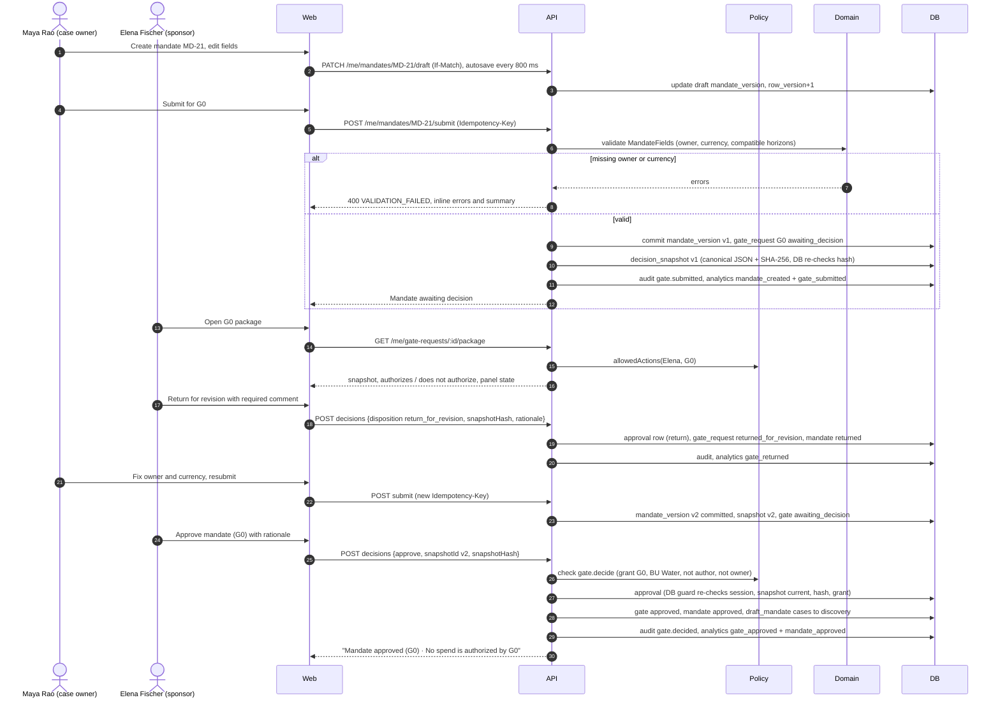

**Narrative.** Maya drafts mandate MD-21 with autosave (`If-Match` row versions). Submitting validates the
required fields (owner, currency from a fixed list, horizons), commits the mandate version, opens the G0
gate request and freezes snapshot v1. Elena sees the scoped panel ("What this authorizes: search and
assessment within this scope · What this does not authorize: no spend, no prospect outreach"). She returns
v1 with a required comment; the comment stays in history. Maya resubmits v2; Elena approves exactly v2.
**State changes:** `mandate.status` draft → awaiting_decision → returned → draft → awaiting_decision →
approved; `gate_request` draft → awaiting_decision → returned_for_revision → awaiting_decision → approved;
cases created with an inline mandate move draft_mandate → discovery. **Events:** `mandate_created`,
`gate_submitted`, `gate_returned`, `gate_approved`, `mandate_approved`. **Failure paths:** missing
owner/currency/incompatible horizon → 400 with inline errors; sponsor without a G0 grant → panel shows
"Request access" and the API returns `AUTHORITY_INSUFFICIENT`; Maya cannot approve
(`SELF_APPROVAL_PROHIBITED`); a decision against v1 after v2 exists → `SNAPSHOT_STALE`/hash mismatch;
double click → same `Idempotency-Key` replays the first response.

**Build status (Wave 1, 2026-10-09):** Partial. Implemented: `mandateMachine` and `gateRequestMachine`
(`packages/domain/src/me/lifecycle/runtime.ts`, `platform/workflow/runtime.ts`), G0 preconditions
(`me/gates/preconditions.ts`), policy (`platform/policy/policy-engine.ts`), snapshot builder
(`me/gates/snapshot-builder.ts`); MD-21 v1 returned and v2 approved are seeded through the real approval
guard (`packages/db/src/seed/start.ts`). G0 snapshots now name the mandate as `subject` (D-036). Not
started: mandate and gate endpoints (WS4a/WS4b), S02. New failure path: submitting MD-21 with a missing
owner lists `owner_set` and `currency_set` together (every failed guard is listed, D-046).

---

### WF-02 — Opportunity discovery → shortlist → convert

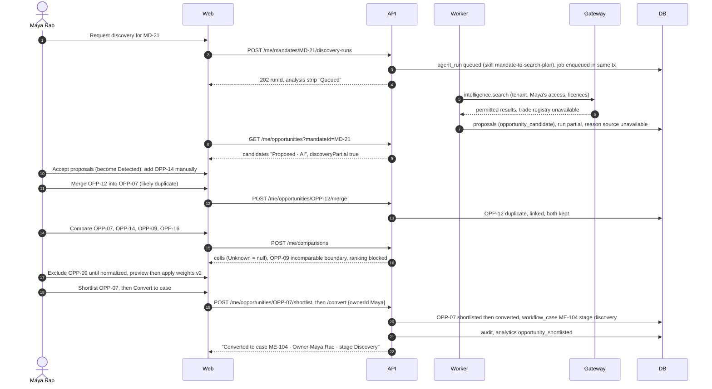

**Narrative.** Discovery is a bounded analysis run; its candidates are proposals shown as "Proposed · AI"
until Maya accepts them (Detected). A missing source makes the run `partial` and the list shows
"Discovery partial — 1 source unavailable. Results are not exhaustive." Maya merges the likely duplicate
(both records kept and linked), compares up to four candidates on a common unit (missing values are
Unknown, never 0; an incomparable boundary blocks ranking until excluded or normalized; weights are
versioned), shortlists OPP-07 and converts it. **State changes:** opportunity detected → shortlisted →
converted; OPP-12 detected → duplicate; dismissals need a reason. A new `workflow_case` starts in
Discovery because MD-21 is G0-approved. **Events:** `opportunity_shortlisted`. **Failure paths:** expired
market-data connection → banner "ask admin · upload instead"; convert before G0 → `PRECONDITIONS_UNMET`;
AI down → manual add still works; merge into a candidate of another mandate → `INVALID_TRANSITION`.

**Build status (Wave 1, 2026-10-09):** Partial. Implemented: `opportunityMachine` (shortlist, dismiss with reason, merge,
restore, convert) and the ranking engine (`packages/domain/src/me/comparison/ranking.ts`, D-057); MSW mocks
for `opportunities.list/get/shortlist/dismiss`. Not started: opportunity, comparison and conversion
endpoints (WS4a), discovery runs (WS5), S03/S04. Ranking semantics fixed: one non-excluded incomparable row
blocks the whole set ("Not ranked — boundary conflict in set") until excluded.

---

### WF-03 — Sizing calculation and lineage

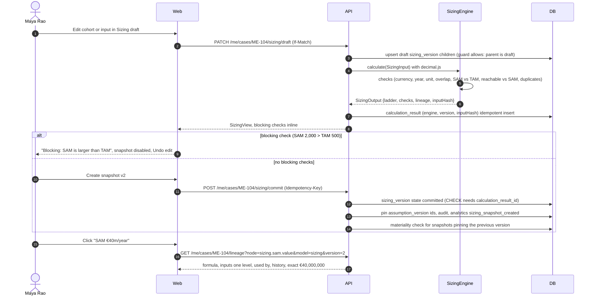

**Narrative.** All arithmetic is in the deterministic engine; the browser never computes money. The
draft recalculates on every save and shows blocking checks inline. Commit ("Create snapshot v2") is
possible only with an unblocked calculation result, enforced by a database CHECK; committed versions and
their children are immutable. The ladder narrows by sites then money: TAM 5,000 sites · €100m/year, SAM
(1,400 + 1,100 − 500) = 2,000 sites · €40m/year, reachable pool 500 sites (no money), SOM Base Year 3 100
customers · €2.0m annual revenue; upside capped at 120. Lineage opens on any figure. **State changes:**
sizing_version draft → committed. **Events:** `sizing_snapshot_created`; `assumption_changed` when an
input assumption is edited. **Failure paths:** duplicate cohort → calculation paused with Keep v1 / Keep
imported; restricted site list → aggregates only or "Unavailable under your access", no counts; mixed
currency/year/unit → blocking check; concurrent edit → 412 conflict banner; top-down outside range →
amber "Explain the gap before G1", never averaged.

**Build status (Wave 1, 2026-10-09):** Partial. Implemented: `SizingEngine` and lineage (`packages/domain/src/me/sizing/`,
golden + property tests); `aster-demo` commits sizing v2 from the real engine and aborts on any golden
mismatch (`packages/db/src/seed/outputs.ts`, D-053). Not started: sizing and lineage endpoints (WS4a), S06.
New failure paths (blocking checks): `TOO_MANY_COHORTS_FOR_AGGREGATE_METHOD`, `MISSING_INPUT` (overlap pair
or site IDs), `ANNUALIZATION_METHOD_MISSING`, `REACHABLE_EXCEEDS_SAM`, cross-check currency/year mismatch.
When SAM cannot be computed `ladder.sam.available` is false and the UI shows "Not available" (D-033).
"Used by" from SAM reaches SOM and economics through the reachable pool (D-056).

---

### WF-04 — Economics scenario recompute (draft vs snapshot)

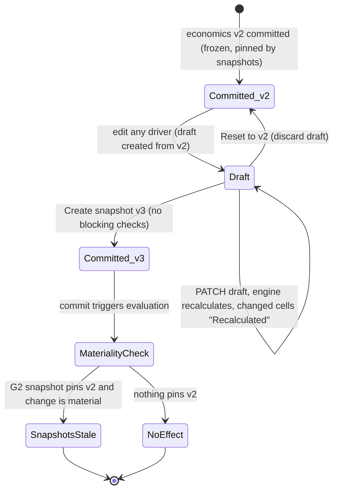

**Narrative.** Daniel or Maya edits price, adoption, margin, opex, capacity or one-time investment in a
draft. The engine recalculates the draft per scenario in fixed order (Downside · Base · Upside):
customers = min(floor(500 × adoption), 120) → revenue → gross contribution (× 60%) → contribution after
€600k opex. The approved snapshot never recalculates: S10 shows the frozen v2/v3 table. The €400k one-time
investment is a separate card ("Different time bases. Do not add."); cash flow and payback are "Not
available" with the missing inputs listed. "What must be true?" computes break-even customers (50).
Committing creates v3 and runs materiality: if a current G2 snapshot pins v2, that snapshot goes stale.
**Events:** `assumption_changed` (driver assumptions), none for drafts. **Failure paths:** missing opex
→ "Recommendation incomplete — opex scope missing" (commit blocked); currency/year mismatch → "Normalize
to EUR 2026"; finance review only lists what was checked and not checked; editing a committed version is
refused by the database.

**Build status (Wave 1, 2026-10-09):** Partial. Implemented: `EconomicsEngine` (`packages/domain/src/me/economics/engine.ts`)
with the PRD scenario table, separate one-time investment, Unavailable cash flow/payback and break-even 50;
materiality evaluator for the commit step. Not started: economics draft/commit endpoints (WS4a), S08. New
failure path: a missing one-time investment blocks the run ("Recommendation incomplete") while per-year
scenarios still show (D-058).

---

### WF-05 — Assumption dispute and validation experiment (threshold lock and amendment)

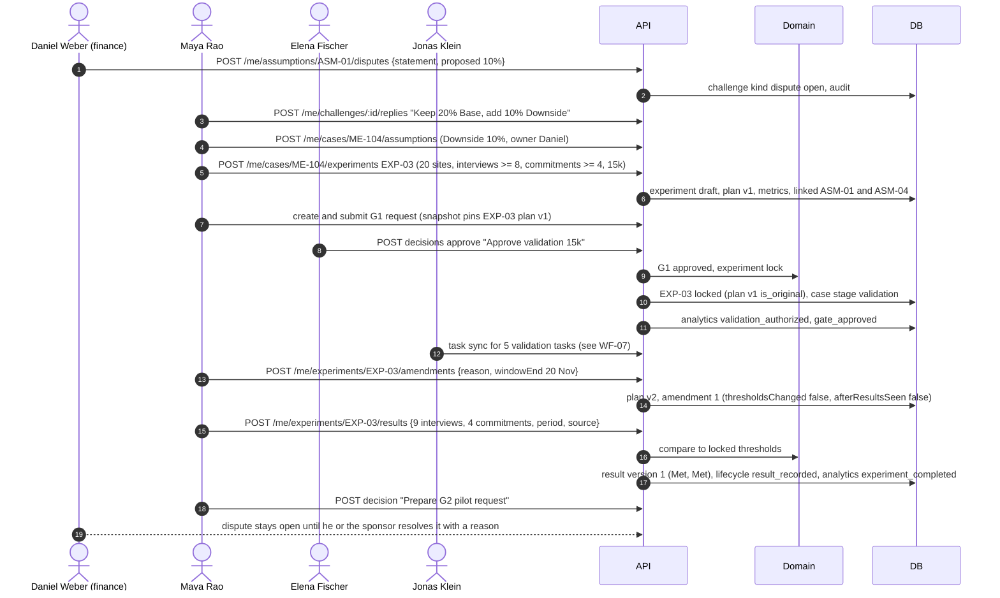

**Narrative.** A reviewer dispute is a first-class object ("Disputed by Daniel Weber"), not a comment. It
stays open until the disputing reviewer or the sponsor resolves it with a reason, and the dissent travels
into every later package. The experiment card's plan locks when G1 approves the snapshot containing it;
the locked plan is the pre-registered original. Any later change is an amendment with a reason, creating a
new plan version; the original threshold stays visible ("Original (pre-registered)"). Results are
append-only versions compared with the locked thresholds: 9 of 8 → Met, 4 of 4 → Met, with limitations
("Interviews do not validate conversion…"). **State changes:** challenge open; experiment draft → locked
→ running → result_recorded; assumption statuses Testing → Supported/Inconclusive by human update.
**Events:** `assumption_changed`, `validation_authorized`, `gate_approved`, `experiment_completed`.
**Failure paths:** editing a locked plan → `INVALID_TRANSITION` ("create an amendment"); amendment after
results seen is flagged on the card; result without period or source → 400; a failed threshold can never be
deleted (database refuses updates to result versions); before the window closes the result shows "Too
early to read".

**Build status (Wave 1, 2026-10-09):** Partial. Implemented: `experimentMachine` (lock on G1 via `followOnForGate`, amendment as
an unchanged transition with a required reason, result recording; "Too early to read" counts as recorded);
EXP-03 seeded with the original plan, amendment 1, results and VAL-1…5 confirmed. Not started: assumption,
dispute and experiment endpoints (WS4a/WS4b), S09.

---

### WF-06 — Gate request → snapshot → approval, and invalidation on material change

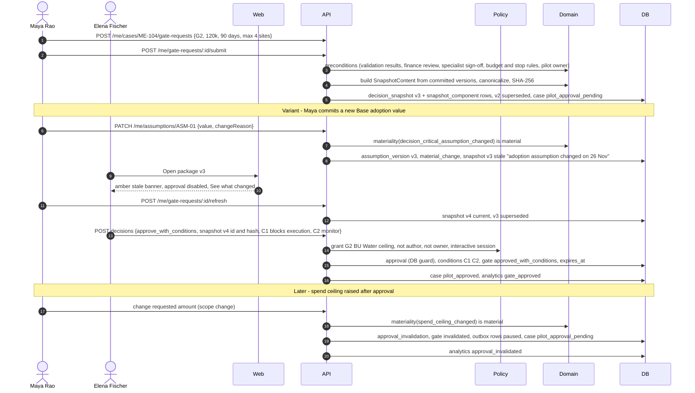

**Narrative.** Submitting freezes a snapshot from committed versions only, with a canonical hash the
database verifies, and indexes every pinned version. The approver sees exactly that snapshot with its
fingerprint, the authorizes/does-not-authorize boxes, reviewer positions, conditions and signed dissent.
A material change to anything pinned makes the snapshot stale before a decision (approval disabled until
"Refresh snapshot (creates v4)") or invalidates the approval after a decision (red ring on the rail,
"Approval for v4 no longer applies: spend ceiling changed. Pilot tasks paused."). Uncertain changes
escalate to the sponsor. Approvals unused by `expires_at` expire through a timer. **State changes:**
gate_request draft → awaiting_decision → stale → awaiting_decision → approved_with_conditions →
invalidated; snapshots current → stale/superseded; case validation → pilot_approval_pending →
pilot_approved → pilot_approval_pending. **Events:** `gate_submitted`, `gate_approved`,
`approval_invalidated`. **Failure paths:** author/owner approves → `SELF_APPROVAL_PROHIBITED` (UI: "You
authored this package and cannot approve it."); agent or service identity → `AGENT_IDENTITY_FORBIDDEN`;
amount above ceiling or no grant → `AUTHORITY_INSUFFICIENT` with routing reason; hash mismatch →
`SNAPSHOT_HASH_MISMATCH`; missing specialist sign-off → `PRECONDITIONS_UNMET` with "Why?" list; the
database refuses any of these even if the API were wrong.

**Build status (Wave 1, 2026-10-09):** Partial. Implemented: gate request and snapshot machines, policy engine (D-045), G1/G2
preconditions, snapshot builder, materiality evaluator (WS3) applied end to end by
`apps/api/src/platform/materiality.ts` (D-047), approval-expiry timer (`apps/worker/src/jobs/timers/`,
D-049), connected `ApprovalPanel` bound to the snapshot the page read (D-059). Not started: gate request,
snapshot, decision, position and materiality-resolution endpoints (WS4b), S10. Flow changes and new
failure paths:
- an unused G2 approval past `expires_at` → gate `expired`, `approval_invalidation(kind expired)`, pending
  outbox rows paused, case `pilot_approved → pilot_approval_pending` (`g2_expired`, D-035); executed
  approvals never expire;
- a decision on an older snapshot id → `SNAPSHOT_STALE`, even if that row still says current;
- an uncertain change (default for sources) → snapshots stale and escalated, approvals untouched until the
  sponsor resolves it; resolving as not material leaves stale snapshots stale;
- the invalidation follow-on moves the case only when the case machine allows it (G1 invalidation while the
  case is already past Validation moves nothing).

Update (2026-10-09) — material change and expiry as built:

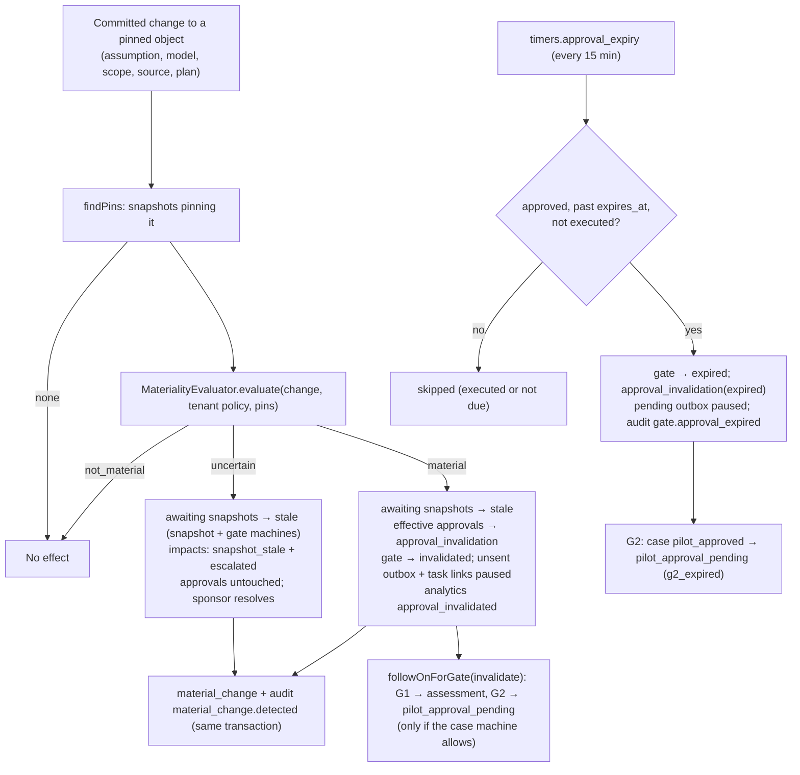

---

### WF-07 — Pilot activation → outbox → connector, partial failure and idempotent retry

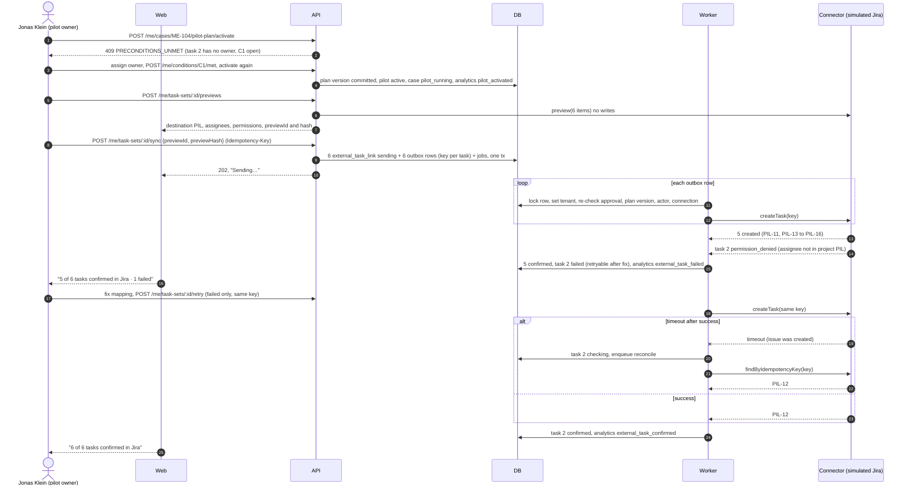

**Narrative.** Activation requires an effective, unexpired G2 approval, every blocking condition met and
every task owned. The dry-run preview is mandatory before the first write and binds the send to the plan
content by hash. One transaction writes the per-task sync rows, outbox rows with stable idempotency keys,
jobs and audit. The worker re-checks authorization at send time and records each task's outcome
separately; "Confirmed · PIL-11" only appears with a returned key. Retry sends only failed tasks with the
same keys; an ambiguous timeout is reconciled by searching for the key before any retry, so the simulator
never holds two issues for one key. **State changes:** pilot plan draft → active; case pilot_approved →
pilot_running; sync not_sent → in_preview → sending → confirmed / failed / checking / retry_scheduled.
**Events:** `pilot_activated`, `external_task_confirmed`, `external_task_failed`. **Failure paths:** expired
token → connection Expired, all unsent rows `paused_connector`, internal tasks continue, "Export CSV
instead"; approval invalidated → unsent rows "Paused — approval changed", confirmed tasks preserved; 5xx →
backoff up to 5 attempts then Failed with Retry; worker crash mid-send → sweep reclaims the leased row and
reconciles; double click on Create → same Idempotency-Key replays. Outbound prospect messages stay drafts:
there is no send endpoint.

**Build status (Wave 1, 2026-10-09):** Partial. Implemented: `syncMachine` with `approval_effective` and
`connector_connected` re-checks at send time and human `enqueue`/`manual_retry` guards; activation guard
lists open blocking conditions and unowned tasks together; invalidation and expiry pause unsent outbox rows
and their task links; migration 0002 makes `claim_outbox_batch()` and `list_tenant_ids()` work under
FORCE RLS (D-043). Not started: simulator over `sim`, outbox dispatch/reconcile/sweep, task-sync API and
fault suite (WS6), pilot plan endpoints (WS4b), S11. Convention fixed for WS6: outbox rows carry
`authorization_ref.gateRequestId`, `aggregate_type = 'external_task_link'`, `aggregate_id` = link id.

---

### WF-08 — Outcome review → revise/extend, scale gate blocked

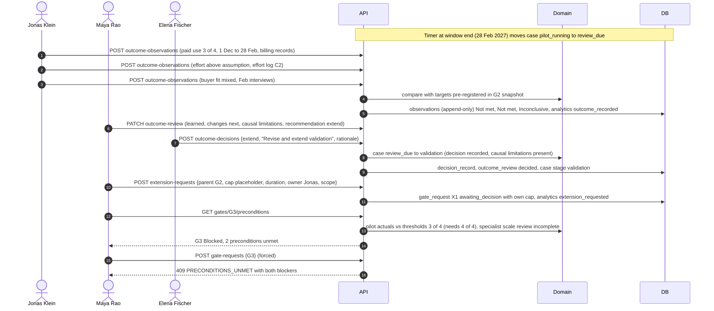

**Narrative.** Actuals carry a measurement period and source and are compared with the thresholds that
were pre-registered in the approved G2 snapshot (they cannot move). Corrections append a new version.
The review needs causal limitations before a decision. Elena records "Revise and extend validation"; the
case returns to Validation. The extension is a new gate request (X1) with its own cap (a placeholder,
because the PRD sets no amount) and never unblocks G3. The scale gate is blocked by two unmet
preconditions and the €400k one-time scale investment is not requested. Neutral styling: "Not met" is a
learning result, not a failure. **State changes:** case pilot_running → review_due → validation;
outcome_review incomplete → ready → decided; X1 draft → awaiting_decision. **Events:** `outcome_recorded`,
`extension_requested`; `scale_requested` only if G3 is ever submitted; `case_stopped` if Stop is chosen.
**Failure paths:** missing actuals → "Review incomplete — 1 metric has no data for Oct"; "scale" as a
review outcome → 400 (scale needs G3); G3 request → `PRECONDITIONS_UNMET`; no G3 approver configured →
"Authority gap" in S14.

**Build status (Wave 1, 2026-10-09):** Partial. Implemented: G3 and X preconditions (X never unblocks G3), the pilot-window
timer (`pilot_running → review_due` after the tenant-local window end), case follow-ons. Not started:
outcome, review and decision endpoints (WS4b), S12. Flow change (D-039, interim pending PQ-1): G3 lists
every unmet precondition — four on the honest step-28 facts, not two. X1 can be requested with the `€[cap]`
placeholder but cannot be approved until a real cap is set (D-040).

Update (2026-10-09) — scale gate as built:

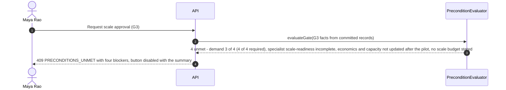

---

### WF-09 — Analysis run lifecycle with checkpoint and resume

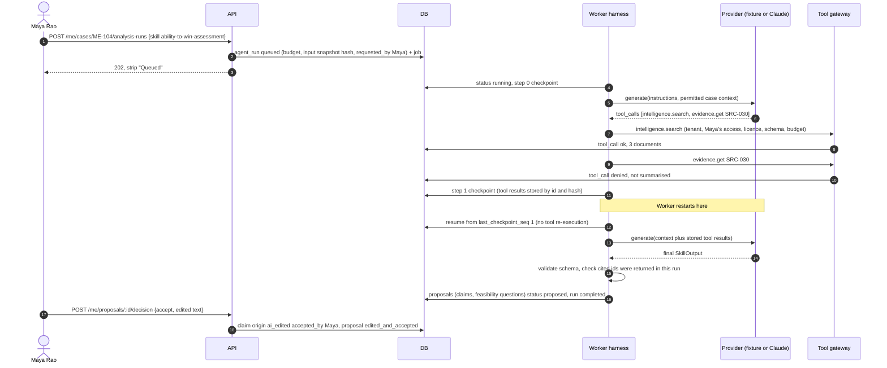

**Narrative.** Runs are asynchronous, bounded (5 minutes, 40 tool calls, token and cost caps) and act
with the requesting human's access, never more. Every step is checkpointed; a restart resumes from the last
checkpoint and reuses stored tool results. Restricted sources are denied by the gateway and never reach
the provider; the trace says "denied · not summarised". Output must validate against `SkillOutput`; a claim
citing an id that was not returned in this run is downgraded to Unknown. Proposals never overwrite human
edits; accepting writes the business record with provenance. **State changes:** run queued → running →
completed (or waiting_for_input, partial, failed, cancelled; partial/failed → queued on resume).
**Events:** none of the PRD §17 business events; run cost, time and errors are recorded separately
(`agent_run.usage`). **Failure paths:** provider error or missing fixture → failed with "Stopped — your work
is saved"; malformed output → one repair attempt then failed; budget exhausted → partial; injected
instructions in evidence → treated as data, no write tools exist; AI disabled → every screen still works
manually; the agent can never sign a review or decide a gate (database refuses agent identities).

**Build status (Wave 1, 2026-10-09):** Not started (WS5). Only the frozen interfaces exist (`packages/ai`) plus `runMachine`
(WS3) and the job catalogue entry; the worker task list (`apps/worker/src/tasks.ts`) is where WS5 registers
its run job.

---

### WF-10 — Evidence challenge and restricted-source handling

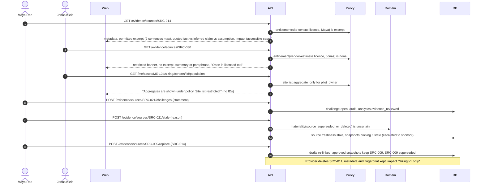

**Narrative.** Every read of source content checks the licence entitlement for the viewer: `excerpt`
shows permitted passages only; `aggregate_only` shows aggregates without identifying rows or counts that
reveal hidden data; `none` shows a restricted banner with no excerpt, summary or paraphrase anywhere —
including search results, exports, generated text and agent context. The S13 side panel separates quoted
fact, inferred claim (AI draft accepted by a human) and human assumption. Challenges are tracked to
resolution. Marking stale or replacing a source runs materiality: drafts re-link, approved snapshots keep
the original source, and pinned snapshots go stale pending the sponsor's classification. Deleted sources
keep provenance and impact under the retention policy. **State changes:** source freshness current →
stale / superseded; availability available → deleted_by_provider; challenge open → resolved.
**Events:** `evidence_reviewed`. **Failure paths:** request for a source in a case the viewer cannot see →
404 (no existence leak); impact lists only accessible cases ("Cases you cannot access are not listed or
counted"); upload with a duplicate hash links to the existing source; ingestion failure → "ingestion
failed" status, never fabricated content.

**Build status (Wave 1, 2026-10-09):** Implemented on the API side (WS1): `apps/api/src/modules/platform/evidence/`,
`apps/api/src/platform/entitlements.ts`, worker jobs `evidence.ingest` and `evidence.freshness`
(`apps/worker/src/jobs/evidence/`). Marking a pinned source stale or replacing it runs materiality through
the real evaluator (D-047; DB-tested). S13 is WS8d's; the web client still needs the multipart path for
uploads (D-051). Changes: uploads are `multipart/form-data` (`metadata` + one file); identical bytes return
the existing source; admins get 404 on source detail. New failure paths: upload without a file → 400;
licence from another tenant → 400; mark stale on a superseded source → 409 `INVALID_TRANSITION` ("mark its
replacement instead"); replacing a source with itself → 400; superseded or deleted replacement → 409;
ingestion `failed` on a missing object or hash mismatch and `partial` for binary files.
