# Key workflows — Growth OS · Market Expansion OS

A catalogue of the key workflows. Each has a stable ID (`WF-01`, `WF-02`, …), a diagram, and a short
narrative naming actors, components, state changes, events and failure paths. Later stages append new
workflows (`WF-11`, …) or add a dated "Update" note under an existing one; never renumber.

**Conventions.** Actors are the synthetic Aster personas (PRD §6). Components: **Web** (`apps/web`),
**API** (`apps/api` command pipeline), **Policy** (`PolicyEngine`), **Domain** (state machines and
engines in `packages/domain`), **DB** (Postgres with RLS and guard triggers), **Worker**
(`apps/worker`), **Gateway** (agent tool gateway), **Provider** (analysis provider, fixture by default),
**Connector** (`TaskConnector`, simulated Jira). Every state change writes an `audit_event` in the same
transaction; analytics events are the PRD §17 names. Architecture references: ARCHITECTURE.md §8–§14.

| ID | Workflow | Main PRD refs |
|---|---|---|
| WF-01 | Mandate → G0 | ME-01, ME-10, ME-11, S02 |
| WF-02 | Opportunity discovery → shortlist → convert | ME-02, ME-03, ME-04, S03, S04 |
| WF-03 | Sizing calculation and lineage | ME-05, ME-15, S06 |
| WF-04 | Economics scenario recompute (draft vs snapshot) | ME-07, ME-15, S08 |
| WF-05 | Assumption dispute and validation experiment (threshold lock and amendment) | ME-08, ME-09, S09 |
| WF-06 | Gate request → snapshot → approval, and invalidation on material change | ME-10, ME-11, §4, S10 |
| WF-07 | Pilot activation → outbox → connector, partial failure and idempotent retry | ME-12, ME-13, S11 |
| WF-08 | Outcome review → revise/extend, scale gate blocked | ME-14, §6, S12 |
| WF-09 | Analysis run lifecycle with checkpoint and resume | §8, ME-15, ME-16 |
| WF-10 | Evidence challenge and restricted-source handling | ME-02, ME-15, ME-16, S13 |


### Build status overview (end-to-end, 2026-10-09)

Every workflow now runs end to end on the **real stack**: the API, the worker and Vite with MSW off, against a
dedicated database reset and seeded per spec file (Playwright project `real`, decisions.md D-092). The Aster journey
(`apps/web/e2e/aster-journey.spec.ts`, all 30 BUILD_PLAN §8 steps) runs twice: once with analysis enabled and once
in the `real-ai-down` project with `ANALYSIS_ENABLED=false`. "Simulated" means the boundary is a stand-in that
honours the production interface: the Jira simulator and the fixture analysis provider.

| ID | End-to-end status | Journey steps | Proving specs (real stack) | Still simulated or open |
|---|---|---|---|---|
| WF-01 | Done end to end | 1, 5 (G0 on the rail), 29 | `aster-journey` (steps 1, 5, 29), `real/a11y` (S02), `real/cross-tenant` | PQ-14 (no committee persona) |
| WF-02 | Done end to end | 2–5 | `aster-journey` (steps 1–5), `real/missing-data` (Unknown cells, never 0) | Discovery runs on the fixture provider |
| WF-03 | Done end to end | 6–8 | `aster-journey` (steps 6–8), `real/duplicate-cohort`, `real/restricted-evidence` (site list aggregates) | PQ-17 (first models entered through the API, D-095), PQ-18 |
| WF-04 | Done end to end | 9, 16 | `aster-journey` (steps 9, 16), `real/missing-data` ("Not available —") | xlsx export (CR-WS4a-5) |
| WF-05 | Done end to end | 9–15 | `aster-journey` (steps 9–15), `real/stale-approval` (a value change on S09) | PQ-13 interim: tasks drafted from the locked plan (D-090) |
| WF-06 | Done end to end | 10–11, 17–20, 29 | `aster-journey` (steps 10–11, 17–20, 29), `real/stale-approval` (v3 stale → refresh v4), `real/pilot-sync` (invalidated after activation) | PQ-1 (G3 wording), PQ-19 |
| WF-07 | Done end to end (simulated Jira) | 12, 21–24 | `aster-journey` (steps 12, 21–24), `real/pilot-sync` (partial sync and zero-duplicate retries; invalidation pauses unsent; expired connector with CSV export) | Real Jira adapter; PQ-15 interim (next free `PIL-n`) |
| WF-08 | Done end to end | 25–28 | `aster-journey` (steps 25–28; step 28 with all four blockers per D-039) | PQ-1, PQ-2 (€[cap] placeholders), PQ-20 |
| WF-09 | Done end to end (fixture provider) | 2 (discovery output) | `aster-journey` (with analysis), `real/ai-down` and the `real-ai-down` project (whole journey by hand) | Live provider behind signed data terms |
| WF-10 | Done end to end | 2, 8 (lineage sources) | `real/restricted-evidence` (SRC-030: no excerpt anywhere; Jonas aggregates only), `real/a11y` (S13) | CR-WS5-1 |

Cross-cutting proofs: `real/cross-tenant` (404 for every persona, read or write), `real/a11y` (axe-clean on every
screen), `real/performance` (p95 ≤ 2 s on every seeded read) and the DB suites listed in decisions.md D-106.

### Build status overview (Wave 3 integrated, 2026-10-09)

Wave 3 delivered the back end: WS4a (discover and assess API), WS4b (decide, execute, review API), WS6 (simulated
connector, outbox worker, task sync) and WS5 (analysis harness, skills, evals). **All 146 endpoints have handlers.**
The screens still run on MSW in `pnpm dev:mock`; the API is proven by DB suites, four joint suites across the streams
(`apps/api/test/db/joint/`, D-080) and the API smoke test.

| ID | Status | API code | Proving tests | Open |
|---|---|---|---|---|
| WF-01 | Implemented | `me/mandates`, `me/gates`, `platform/directory`, `me/catalogue` | `mandates.db`, `gates.db` (G0), `directory.db` | — |
| WF-02 | Implemented | `me/opportunities`, `me/comparisons`, `analysis` (discovery) | `opportunities.db`, `comparisons.db`, `discovery.db`, joint `proposal-to-records` | — |
| WF-03 | Implemented | `me/sizing`, `me/lineage` | `sizing.db`, `lineage.db` | site list unseeded |
| WF-04 | Implemented | `me/economics`, `me/assumptions` | `economics.db`, `assumptions.db` | xlsx export (CR-WS4a-5) |
| WF-05 | Implemented | `me/assumptions`, `me/thesis`, `me/experiments` | `assumptions.db`, `thesis.db`, `experiments.db` | PQ-13 |
| WF-06 | Implemented | `me/gates`, `platform/materiality.ts`, `packages/db/src/approval.ts` | `gates.db`, `security/approval`, `agreement.db`, `package-views.db`, joint `assumption-pauses-writes` | PQ-1 |
| WF-07 | Implemented (simulated Jira) | `me/pilot`, `tasksync`, worker `jobs/outbox`, `packages/connectors` | `pilot.db`, `tasksync.db`, `connector-faults/*`, joint `pilot-to-simulator`, `g1-to-validation-send` | PQ-13, PQ-15 |
| WF-08 | Implemented | `me/outcomes`, `me/gates` (G3, X), `platform/reviews`, `platform/work`, `me/budget` | `outcomes.db`, `gates.db` (step 28), `reviews.db`, `work.db`, `budget.db` | PQ-2, readiness |
| WF-09 | Implemented (fixture provider) | `packages/ai`, worker `jobs/analysis`, `analysis`, `skills`, `evals` | `run.db`, `gateway.db`, `analysis.db`, `proposals.db`, evals smoke | live provider check |
| WF-10 | Implemented | `platform/evidence`, worker gateway access | evidence suites, `gateway.db` | CR-WS5-1 |

### Build status overview (Wave 2 integrated, 2026-10-09)

Wave 1 delivered the domain (WS2 engines, WS3 machines/policy/materiality/timers), the platform runtime
(WS1 pipeline, sessions, evidence, seed) and the web shell (WS7). Wave 2 delivered every screen (WS8a–d) against
contract-validated MSW mocks (D-060, D-061): each workflow below can be walked end to end in `pnpm dev:mock` and is
covered by Playwright + axe (36 e2e tests). The `me` API modules (WS4), analysis (WS5) and connector/outbox (WS6)
are Wave 3 (`docs/market-expansion/build/WAVE3.md`); the screens switch to them endpoint by endpoint with the same
client. 26 of 146 endpoints have handlers (two directory reads were added by D-068).

| ID | Status | Domain / API done | UI (Wave 2, against MSW) | Still to build |
|---|---|---|---|---|
| WF-01 | UI done · API partial | mandate + gate machines, G0 preconditions, policy, snapshot builder, seeded G0 history | S02 list, new, mandate + G0 panel (`screens/mandate/`) | mandate/gate API (WS4a/WS4b), `people.list` + `catalogue.scopeOptions` (WS4a) |
| WF-02 | UI done · API partial | opportunity machine, ranking engine (with `rank`) | S01, case list, S03, S04 (`screens/overview/`, `opportunities/`, `compare/`) | opportunity/comparison API (WS4a), discovery runs (WS5) |
| WF-03 | UI done · API partial | sizing engine, lineage builder, seeded sizing v2 | S06 + lineage drawer (`screens/sizing/`), domain engine in the browser (D-063) | sizing/lineage API (WS4a) |
| WF-04 | UI done · API partial | economics engine, materiality evaluator | S08 with live preview recompute (`screens/economics/`) | economics API (WS4a) |
| WF-05 | UI done · API partial | experiment machine (lock, amend, record), seeded EXP-03 | S05 claims and disputes, S09 register, dispute, EXP-03 (`screens/thesis/`, `validation/`) | assumption/experiment API (WS4a/WS4b) |
| WF-06 | UI done · API partial | gate/snapshot machines, policy, preconditions, snapshot builder, materiality, expiry timer | S10 package + panel, brief, variants (`screens/decisions/`, `brief/`), Reviews inbox | gates/snapshots/decisions API (WS4b) |
| WF-07 | UI done · API partial | sync machine, activation guards, pause on invalidation/expiry, outbox claim fix | S11 activation, preview, sync, retry, CSV (`screens/pilot/`), S09 validation tasks, My Work | connector simulator, dispatcher, task-sync API (WS6), pilot API (WS4b) |
| WF-08 | UI done · API partial | G3/X preconditions, pilot-window timer, case follow-ons | S12 actuals, recommendation, decision, extension, scale blocked (`screens/outcomes/`), History | outcomes/reviews API (WS4b) |
| WF-09 | UI partial · not started | run machine only | S05 analysis strip (run status, never a %), S14 Diagnostics trace from `?run=` | harness, providers, gateway, analysis API (WS5) |
| WF-10 | Implemented (API) · UI done | evidence API, entitlements, ingestion, freshness, materiality on stale/replace | S13 list and viewer (`screens/evidence/`), multipart client path (D-065) | S13 upload form; WS8d's evidence mocks switch to the API |

---

## Stage: Architecture (2026-10-09)

### WF-01 — Mandate → G0

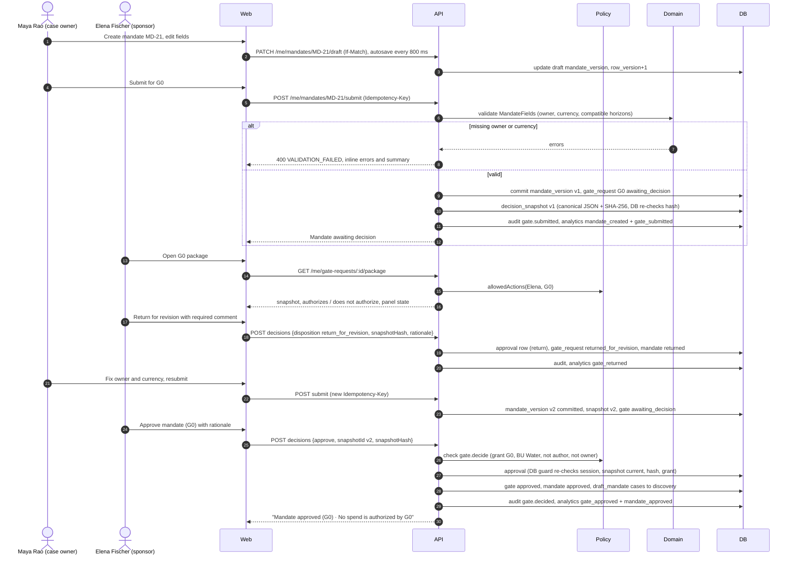

**Narrative.** Maya drafts mandate MD-21 with autosave (`If-Match` row versions). Submitting validates the
required fields (owner, currency from a fixed list, horizons), commits the mandate version, opens the G0
gate request and freezes snapshot v1. Elena sees the scoped panel ("What this authorizes: search and
assessment within this scope · What this does not authorize: no spend, no prospect outreach"). She returns
v1 with a required comment; the comment stays in history. Maya resubmits v2; Elena approves exactly v2.
**State changes:** `mandate.status` draft → awaiting_decision → returned → draft → awaiting_decision →
approved; `gate_request` draft → awaiting_decision → returned_for_revision → awaiting_decision → approved;
cases created with an inline mandate move draft_mandate → discovery. **Events:** `mandate_created`,
`gate_submitted`, `gate_returned`, `gate_approved`, `mandate_approved`. **Failure paths:** missing
owner/currency/incompatible horizon → 400 with inline errors; sponsor without a G0 grant → panel shows
"Request access" and the API returns `AUTHORITY_INSUFFICIENT`; Maya cannot approve
(`SELF_APPROVAL_PROHIBITED`); a decision against v1 after v2 exists → `SNAPSHOT_STALE`/hash mismatch;
double click → same `Idempotency-Key` replays the first response.

**Build status (Wave 1, 2026-10-09):** Partial. Implemented: `mandateMachine` and `gateRequestMachine`
(`packages/domain/src/me/lifecycle/runtime.ts`, `platform/workflow/runtime.ts`), G0 preconditions
(`me/gates/preconditions.ts`), policy (`platform/policy/policy-engine.ts`), snapshot builder
(`me/gates/snapshot-builder.ts`); MD-21 v1 returned and v2 approved are seeded through the real approval
guard (`packages/db/src/seed/start.ts`). G0 snapshots now name the mandate as `subject` (D-036). Not
started: mandate and gate endpoints (WS4a/WS4b), S02. New failure path: submitting MD-21 with a missing
owner lists `owner_set` and `currency_set` together (every failed guard is listed, D-046).

**UI status (Wave 2, 2026-10-09):** Done against MSW (WS8a). Code: `apps/web/src/screens/mandate/`
(`MandatesScreen`, `MandateNewScreen`, `MandateScreen`, `mocks.ts`, `mock-kit.ts`), the connected panel
`apps/web/src/app/connected/ApprovalPanel.tsx` (D-059, D-064). States: missing owner/currency and incompatible
horizon (summary links focus the field, Submit disabled with the reason), returned with the sponsor's comment,
awaiting, approved stamp ("No spend is authorized by G0"), sponsor without G0 authority (lock banner). Drafts
autosave with If-Match and handle `VERSION_CONFLICT`. Tests: `MandateScreen.test.tsx`, `e2e/mandate.spec.ts`.
Interim: owner pickers use the dev persona list and scope fields are read-only until `people.list` and
`catalogue.scopeOptions` land (D-068).

**Build status (Wave 3, 2026-10-09):** Implemented. API: `apps/api/src/modules/me/mandates/` (`mandates.*`: submission lists every
missing field together, G0 preconditions via the shared evaluator, snapshot with `subject: mandate`, resubmission after
a return supersedes the old snapshot), `apps/api/src/modules/me/gates/` (deciding G0 runs the mandate machine, sets
`g0_gate_request_id`, moves `cases.createDirect` cases out of Draft mandate), `apps/api/src/modules/platform/directory/` and
`apps/api/src/modules/me/catalogue/` (`people.list`, `catalogue.scopeOptions` for the owner and scope pickers, D-079). Tests:
`me/mandates/mandates.db.test.ts`, `me/gates/gates.db.test.ts` (G0 for MD-90 / ME-120, return → resubmit),
`platform/directory/directory.db.test.ts`, `apps/api/test/db/security/tenancy.test.ts`.

#### UI walkthrough (WF-01)

| Step | Who | Screen | Route |
|---|---|---|---|
| Open mandates | Maya | Mandate list | `/me/mandates` |
| Start a mandate from MD-21's scope | Maya | New mandate | `/me/mandates/new` |
| Edit the draft (autosave, inline errors, G0 checklist) | Maya | S02 Mandate | `/me/mandates/MD-22` |
| Submit for G0 (snapshot v1 + fingerprint) | Maya | S02 Mandate | `/me/mandates/MD-22` |
| Find the decision | Elena | Reviews inbox | `/reviews?tab=awaiting` |
| Return for revision with a comment, or approve | Elena | S02 approval panel | `/me/mandates/MD-22` |
| Resubmit v2 (the v1 decision stays history, D-064) | Maya | S02 Mandate | `/me/mandates/MD-22?version=2` |
| Approved → Go to opportunities | Maya | S03 Opportunities | `/me/opportunities?mandate=MD-21` |

---

### WF-02 — Opportunity discovery → shortlist → convert

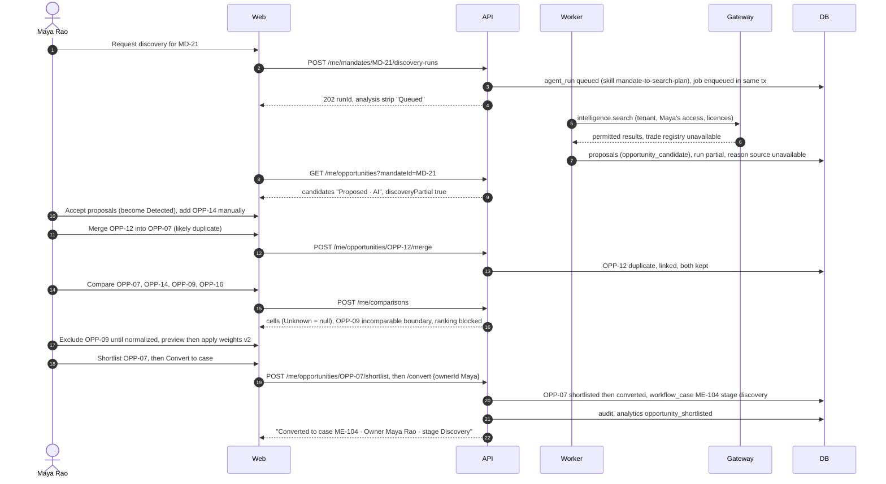

**Narrative.** Discovery is a bounded analysis run; its candidates are proposals shown as "Proposed · AI"
until Maya accepts them (Detected). A missing source makes the run `partial` and the list shows
"Discovery partial — 1 source unavailable. Results are not exhaustive." Maya merges the likely duplicate
(both records kept and linked), compares up to four candidates on a common unit (missing values are
Unknown, never 0; an incomparable boundary blocks ranking until excluded or normalized; weights are
versioned), shortlists OPP-07 and converts it. **State changes:** opportunity detected → shortlisted →
converted; OPP-12 detected → duplicate; dismissals need a reason. A new `workflow_case` starts in
Discovery because MD-21 is G0-approved. **Events:** `opportunity_shortlisted`. **Failure paths:** expired
market-data connection → banner "ask admin · upload instead"; convert before G0 → `PRECONDITIONS_UNMET`;
AI down → manual add still works; merge into a candidate of another mandate → `INVALID_TRANSITION`.

**Build status (Wave 1, 2026-10-09):** Partial. Implemented: `opportunityMachine` (shortlist, dismiss with reason, merge,
restore, convert) and the ranking engine (`packages/domain/src/me/comparison/ranking.ts`, D-057); MSW mocks
for `opportunities.list/get/shortlist/dismiss`. Not started: opportunity, comparison and conversion
endpoints (WS4a), discovery runs (WS5), S03/S04. Ranking semantics fixed: one non-excluded incomparable row
blocks the whole set ("Not ranked — boundary conflict in set") until excluded.

**UI status (Wave 2, 2026-10-09):** Done against MSW (WS8a). Code: `apps/web/src/screens/opportunities/`,
`screens/compare/`, `screens/overview/` (S01, case list). Discovery partial (trade registry unavailable), likely
duplicate (merge keeps both), "n of m candidates · not an exhaustive search", AI candidates "Proposed · AI",
keyboard `s` / `d` / `m` (never while typing), dismiss with a required reason, convert with a required owner
(blocked with "Mandate G0 approval is required" under an unapproved mandate). S04 blocks the ranking on an
incomparable boundary until excluded, previews weights ("Total 110% — must be 100%"), applies weights vN+1 and
shows "Rank 1 of 2 · Score 2.70 of 3" (D-067). Tests: `OpportunitiesScreen.test.tsx`, `CompareScreen.test.tsx`,
`compare-mocks.test.ts`, `e2e/discovery-journey.spec.ts` (steps 1–5).

**Build status (Wave 3, 2026-10-09):** Implemented. API: `apps/api/src/modules/me/opportunities/` (list with discovery health from the
discovery connections, D-074; shortlist, dismiss, merge, restore, convert with an optional title → ME-104 on
`aster-start`), `apps/api/src/modules/me/comparisons/` (ranking engine order and `rank`, Unknown cells null, growth-evidence quality),
`apps/api/src/modules/analysis/` (`opportunities.requestDiscovery` → `mandate-to-search-plan` run, partial with "1 source unavailable",
candidates as proposals; accepting one goes through `createOpportunityFromProposal`, D-076). Tests:
`me/opportunities/opportunities.db.test.ts` (steps 2, 3, 5), `me/comparisons/comparisons.db.test.ts` (step 4),
`analysis/discovery.db.test.ts` (step 2), `apps/api/test/db/joint/proposal-to-records.test.ts`.

#### UI walkthrough (WF-02)

| Step | Who | Screen | Route |
|---|---|---|---|
| Sign in and land | Maya | Login → S01 Overview | `/login` → `/me/overview` |
| Review candidates (partial discovery noted) | Maya | S03 Opportunities | `/me/opportunities?mandate=MD-21` |
| Shortlist, dismiss with a reason, merge a duplicate | Maya | S03 detail | `/me/opportunities?mandate=MD-21&selected=OPP-07` |
| Compare up to 4 candidates | Maya | S04 Compare | `/me/opportunities/compare?ids=OPP-07,OPP-16,OPP-14,OPP-09` |
| Exclude the incomparable boundary, apply weights | Maya | S04 Compare | `/me/opportunities/compare?ids=…&comparison=…&weights=2` |
| Select OPP-07 for assessment | Maya | S04 Compare | same |
| Convert OPP-07 to a case with an owner | Maya | S03 convert dialog → case | `/me/cases/ME-104/thesis` |

---

### WF-03 — Sizing calculation and lineage

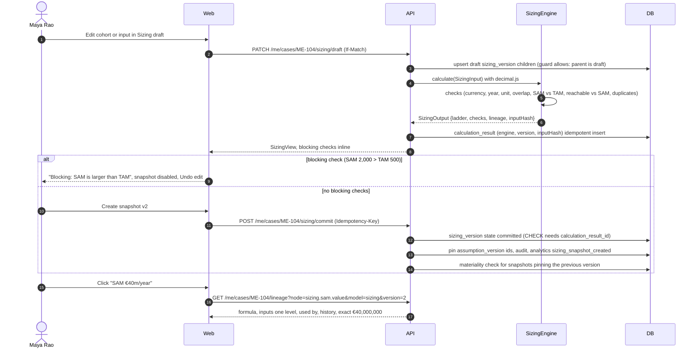

**Narrative.** All arithmetic is in the deterministic engine; the browser never computes money. The
draft recalculates on every save and shows blocking checks inline. Commit ("Create snapshot v2") is
possible only with an unblocked calculation result, enforced by a database CHECK; committed versions and
their children are immutable. The ladder narrows by sites then money: TAM 5,000 sites · €100m/year, SAM
(1,400 + 1,100 − 500) = 2,000 sites · €40m/year, reachable pool 500 sites (no money), SOM Base Year 3 100
customers · €2.0m annual revenue; upside capped at 120. Lineage opens on any figure. **State changes:**
sizing_version draft → committed. **Events:** `sizing_snapshot_created`; `assumption_changed` when an
input assumption is edited. **Failure paths:** duplicate cohort → calculation paused with Keep v1 / Keep
imported; restricted site list → aggregates only or "Unavailable under your access", no counts; mixed
currency/year/unit → blocking check; concurrent edit → 412 conflict banner; top-down outside range →
amber "Explain the gap before G1", never averaged.

**Build status (Wave 1, 2026-10-09):** Partial. Implemented: `SizingEngine` and lineage (`packages/domain/src/me/sizing/`,
golden + property tests); `aster-demo` commits sizing v2 from the real engine and aborts on any golden
mismatch (`packages/db/src/seed/outputs.ts`, D-053). Not started: sizing and lineage endpoints (WS4a), S06.
New failure paths (blocking checks): `TOO_MANY_COHORTS_FOR_AGGREGATE_METHOD`, `MISSING_INPUT` (overlap pair
or site IDs), `ANNUALIZATION_METHOD_MISSING`, `REACHABLE_EXCEEDS_SAM`, cross-check currency/year mismatch.
When SAM cannot be computed `ladder.sam.available` is false and the UI shows "Not available" (D-033).
"Used by" from SAM reaches SOM and economics through the reachable pool (D-056).

**UI status (Wave 2, 2026-10-09):** Done against MSW (WS8b). Code: `apps/web/src/screens/sizing/`
(`SizingScreen.tsx`, `view.ts`, `mocks.ts`, `mock-state.ts`), engine adapter `screens/sizing/engine/adapter.ts`
re-exporting `@growth-os/domain` (D-063), connected `LineageDrawer`. Measure ladder without a total row, signed
overlap `−500`, formula from the engine, input ledger with lineage, cross-check chart + table (never averaged),
draft edits with undo, duplicate-cohort resolution, restricted site list, compare versions, commit. Blocked
sizing hides ladder values (D-066). Tests: `SizingScreen.test.tsx`, `sizing/mocks.test.ts`, `engine.test.ts`
(fixture hashes), `e2e/assessment.spec.ts` (step 8 and variants).

**Build status (Wave 3, 2026-10-09):** Implemented. API: `apps/api/src/modules/me/sizing/` (draft inputs follow the assumption register
and are pinned at commit; one stored calculation per input hash; a blocked result is redacted with every rung flagged
`available: false`, D-081; commit runs materiality `model_version_changed`), `apps/api/src/modules/me/lineage/` (exact values, inputs one
level, "Used by" through the measure chain). Tests: `me/sizing/sizing.db.test.ts` (steps 6–8, blocked SAM > TAM,
v3 commit staling G2 v3), `me/lineage/lineage.db.test.ts` (step 8). Gap: `sizing.population` reads `platform.site`,
which Aster does not seed.

#### UI walkthrough (WF-03)

| Step | Who | Screen | Route |
|---|---|---|---|
| Open sizing (draft v2) | Maya | S06 Sizing | `/me/cases/ME-104/sizing` |
| Edit a draft input; undo | Maya | S06 ledger | `/me/cases/ME-104/sizing?input=input.annual_spend_per_site` |
| Blocking check: SAM > TAM or duplicate cohort (ladder hidden; keep one cohort) | Maya | S06 | `/me/cases/ME-104/sizing` |
| Commit sizing v2 | Maya | S06 | same |
| Lineage on SAM: exact value, inputs, used by | Daniel | S06 lineage drawer | `/me/cases/ME-104/sizing?input=sizing.sam.value&view=lineage` |
| Compare versions (dialog) | Maya | S06 | `/me/cases/ME-104/sizing` |

---

### WF-04 — Economics scenario recompute (draft vs snapshot)

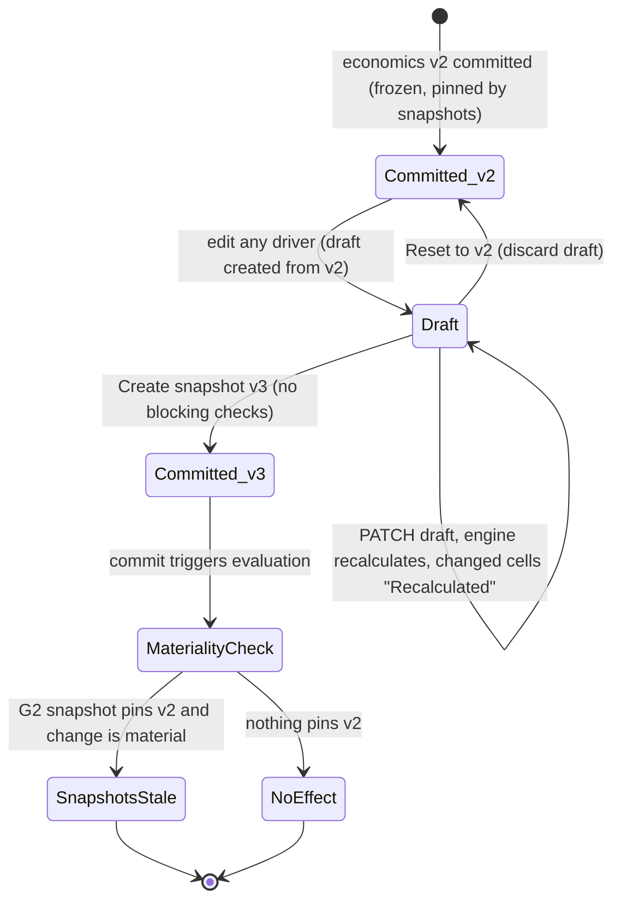

**Narrative.** Daniel or Maya edits price, adoption, margin, opex, capacity or one-time investment in a
draft. The engine recalculates the draft per scenario in fixed order (Downside · Base · Upside):
customers = min(floor(500 × adoption), 120) → revenue → gross contribution (× 60%) → contribution after
€600k opex. The approved snapshot never recalculates: S10 shows the frozen v2/v3 table. The €400k one-time
investment is a separate card ("Different time bases. Do not add."); cash flow and payback are "Not
available" with the missing inputs listed. "What must be true?" computes break-even customers (50).
Committing creates v3 and runs materiality: if a current G2 snapshot pins v2, that snapshot goes stale.
**Events:** `assumption_changed` (driver assumptions), none for drafts. **Failure paths:** missing opex
→ "Recommendation incomplete — opex scope missing" (commit blocked); currency/year mismatch → "Normalize
to EUR 2026"; finance review only lists what was checked and not checked; editing a committed version is
refused by the database.

**Build status (Wave 1, 2026-10-09):** Partial. Implemented: `EconomicsEngine` (`packages/domain/src/me/economics/engine.ts`)
with the PRD scenario table, separate one-time investment, Unavailable cash flow/payback and break-even 50;
materiality evaluator for the commit step. Not started: economics draft/commit endpoints (WS4a), S08. New
failure path: a missing one-time investment blocks the run ("Recommendation incomplete") while per-year
scenarios still show (D-058).

**UI status (Wave 2, 2026-10-09):** Done against MSW (WS8b). Code: `apps/web/src/screens/economics/`
(`EconomicsScreen.tsx`, `view.ts`, `mocks.ts`, `mock-builders.ts`, `engine/adapter.ts` over `@growth-os/domain`).
Driver edits recompute locally as a preview and the server's draft result replaces it (D-063); ▼●▲ scenario table
with "Recalculated" cells; recurring and one-time cards with "Do not add" between them; cash flow and payback
"Not available" with the missing inputs; capped upside; finance review; dispute form and thread (one register
with S09, D-061); Draft / Snapshot toggle (snapshots never recompute). Tests: `EconomicsScreen.test.tsx`,
`adapter.test.ts`, `e2e/assessment.spec.ts` (step 9).

**Build status (Wave 3, 2026-10-09):** Implemented. API: `apps/api/src/modules/me/economics/` (draft drivers and overrides, engine
results, what-must-be-true, commit with materiality, finance review request/sign with checked and not-checked lists,
CSV export with per-year and one-time sections apart; the scenario table uses the frozen display rules, D-072),
`apps/api/src/modules/me/assumptions/` (versions, disputes, replies, resolution). Tests: `me/economics/economics.db.test.ts` (steps 9,
16), `me/assumptions/assumptions.db.test.ts` (steps 9, 19). Deferred: xlsx export (CR-WS4a-5).

#### UI walkthrough (WF-04)

| Step | Who | Screen | Route |
|---|---|---|---|
| Open economics (draft v3 over snapshot v2) | Maya | S08 Economics | `/me/cases/ME-104/economics` |
| Edit a driver; see the recalculated cells | Maya | S08 | `/me/cases/ME-104/economics?input=adoption_rate.base` |
| Switch scenario | Maya | S08 | `/me/cases/ME-104/economics?scenario=downside` |
| Read the committed snapshot | Elena | S08 snapshot view | `/me/cases/ME-104/economics?version=2` |
| Dispute 20% adoption (the owner cannot) | Daniel | S08 dispute form | `/me/cases/ME-104/economics` |
| Request finance review; commit | Maya | S08 | same |

---

### WF-05 — Assumption dispute and validation experiment (threshold lock and amendment)

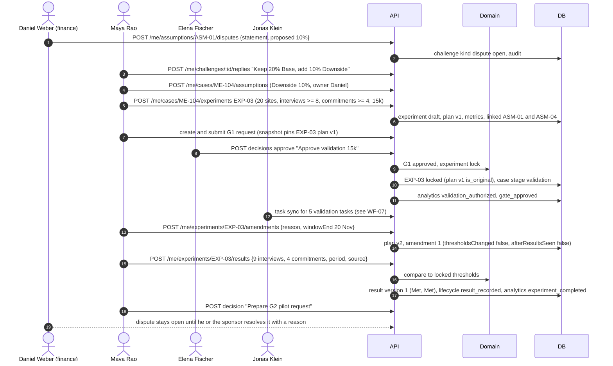

**Narrative.** A reviewer dispute is a first-class object ("Disputed by Daniel Weber"), not a comment. It
stays open until the disputing reviewer or the sponsor resolves it with a reason, and the dissent travels
into every later package. The experiment card's plan locks when G1 approves the snapshot containing it;
the locked plan is the pre-registered original. Any later change is an amendment with a reason, creating a
new plan version; the original threshold stays visible ("Original (pre-registered)"). Results are
append-only versions compared with the locked thresholds: 9 of 8 → Met, 4 of 4 → Met, with limitations
("Interviews do not validate conversion…"). **State changes:** challenge open; experiment draft → locked
→ running → result_recorded; assumption statuses Testing → Supported/Inconclusive by human update.
**Events:** `assumption_changed`, `validation_authorized`, `gate_approved`, `experiment_completed`.
**Failure paths:** editing a locked plan → `INVALID_TRANSITION` ("create an amendment"); amendment after
results seen is flagged on the card; result without period or source → 400; a failed threshold can never be
deleted (database refuses updates to result versions); before the window closes the result shows "Too
early to read".

**Build status (Wave 1, 2026-10-09):** Partial. Implemented: `experimentMachine` (lock on G1 via `followOnForGate`, amendment as
an unchanged transition with a required reason, result recording; "Too early to read" counts as recorded);
EXP-03 seeded with the original plan, amendment 1, results and VAL-1…5 confirmed. Not started: assumption,
dispute and experiment endpoints (WS4a/WS4b), S09.

**UI status (Wave 2, 2026-10-09):** Done against MSW (WS8b S05, WS8c S09). Code: `apps/web/src/screens/thesis/`
(claims accept / discard / challenge, signed disagreements, blockers with status, D-068),
`apps/web/src/screens/validation/` (`AssumptionRegister`, `DisputePanel`, `ExperimentCard`, `NewExperimentForm`,
`G1Request`, `ValidationTasks`, `register.ts`, `mocks.ts`), shared journey state `screens/decisions/mock-state.ts`.
Register (table and 2×2, no combined score), dispute thread with "Resolve with reason" (disputer or sponsor only),
EXP-03 with pre-registered thresholds, "Plan locked at G1", Amendment 1 with the original struck through,
append-only results ("Met · 9 of 8"), decision taken. Tests: `ValidationScreen.test.tsx`, `register.test.ts`,
`ThesisScreen.test.tsx`, `e2e/validate-decide.spec.ts` (steps 10–11, 13–14), `e2e/assessment.spec.ts` (S05).

**Build status (Wave 3, 2026-10-09):** Implemented. API: `apps/api/src/modules/me/assumptions/` and `challenges.*` (dispute, reply,
resolve by the disputing reviewer or sponsor), `apps/api/src/modules/me/thesis/` (claims with kinds, AI drafts accepted or discarded by
a person, blocker status, D-081), `apps/api/src/modules/me/experiments/` (create, draft edits until the G1 lock, amendments as new plan
versions with a reason, append-only results with period and source, materiality on amendments and results, D-086).
Tests: `me/assumptions/assumptions.db.test.ts`, `me/thesis/thesis.db.test.ts`, `me/experiments/experiments.db.test.ts`
(steps 10, 13, 14). Open: who authors validation tasks (PQ-13).

#### UI walkthrough (WF-05)

| Step | Who | Screen | Route |
|---|---|---|---|
| Review claims and disagreements | Maya | S05 Thesis | `/me/cases/ME-104/thesis` |
| Open the disputed adoption assumption | Maya | S09 register → dispute | `/me/cases/ME-104/validation?assumption=ASM-01` |
| Reply; resolve with a reason (Daniel or Elena) | Daniel | S09 dispute | same |
| Create EXP-03 with pre-registered thresholds | Maya | S09 new experiment | `/me/cases/ME-104/validation` |
| Submit G1 · Approve validation €15k (see WF-06) | Maya | S09 G1 card | same |
| Amend the window with a reason (original struck through) | Maya | S09 EXP-03 | `/me/cases/ME-104/validation?experiment=EXP-03` |
| Record results and the decision taken | Jonas, Maya | S09 EXP-03 | `/me/cases/ME-104/validation?experiment=EXP-03` |
| See the register as a 2×2 | anyone | S09 | `/me/cases/ME-104/validation?view=2x2` |

---

### WF-06 — Gate request → snapshot → approval, and invalidation on material change

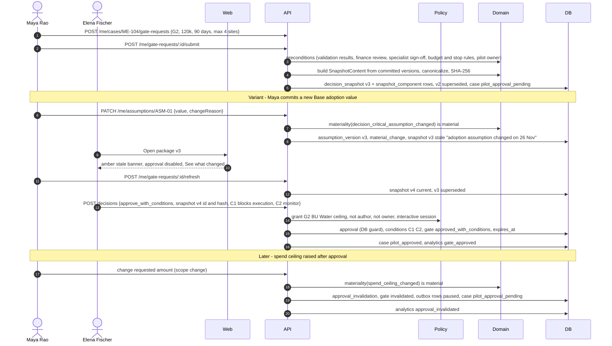

**Narrative.** Submitting freezes a snapshot from committed versions only, with a canonical hash the
database verifies, and indexes every pinned version. The approver sees exactly that snapshot with its
fingerprint, the authorizes/does-not-authorize boxes, reviewer positions, conditions and signed dissent.
A material change to anything pinned makes the snapshot stale before a decision (approval disabled until
"Refresh snapshot (creates v4)") or invalidates the approval after a decision (red ring on the rail,
"Approval for v4 no longer applies: spend ceiling changed. Pilot tasks paused."). Uncertain changes
escalate to the sponsor. Approvals unused by `expires_at` expire through a timer. **State changes:**
gate_request draft → awaiting_decision → stale → awaiting_decision → approved_with_conditions →
invalidated; snapshots current → stale/superseded; case validation → pilot_approval_pending →
pilot_approved → pilot_approval_pending. **Events:** `gate_submitted`, `gate_approved`,
`approval_invalidated`. **Failure paths:** author/owner approves → `SELF_APPROVAL_PROHIBITED` (UI: "You
authored this package and cannot approve it."); agent or service identity → `AGENT_IDENTITY_FORBIDDEN`;
amount above ceiling or no grant → `AUTHORITY_INSUFFICIENT` with routing reason; hash mismatch →
`SNAPSHOT_HASH_MISMATCH`; missing specialist sign-off → `PRECONDITIONS_UNMET` with "Why?" list; the
database refuses any of these even if the API were wrong.

**Build status (Wave 1, 2026-10-09):** Partial. Implemented: gate request and snapshot machines, policy engine (D-045), G1/G2
preconditions, snapshot builder, materiality evaluator (WS3) applied end to end by
`apps/api/src/platform/materiality.ts` (D-047), approval-expiry timer (`apps/worker/src/jobs/timers/`,
D-049), connected `ApprovalPanel` bound to the snapshot the page read (D-059). Not started: gate request,
snapshot, decision, position and materiality-resolution endpoints (WS4b), S10. Flow changes and new
failure paths:
- an unused G2 approval past `expires_at` → gate `expired`, `approval_invalidation(kind expired)`, pending
  outbox rows paused, case `pilot_approved → pilot_approval_pending` (`g2_expired`, D-035); executed
  approvals never expire;
- a decision on an older snapshot id → `SNAPSHOT_STALE`, even if that row still says current;
- an uncertain change (default for sources) → snapshots stale and escalated, approvals untouched until the
  sponsor resolves it; resolving as not material leaves stale snapshots stale;
- the invalidation follow-on moves the case only when the case machine allows it (G1 invalidation while the
  case is already past Validation moves nothing).

**UI status (Wave 2, 2026-10-09):** Done against MSW (WS8c, WS8a). Code: `apps/web/src/screens/decisions/`
(`DecisionsScreen`, `PackageArticle`, `DecisionPanel`, `PrepareRequest`, `mocks.ts`, `mock-data.ts`,
`mock-state.ts`), `screens/brief/BriefScreen.tsx`, `screens/reviews/`. Read-only versioned package from the frozen
snapshot content; the panel sends the id + hash of the version rendered; approving a package approves its
proposed conditions (D-067). Variants: stale (refresh creates v4, "See what changed"), self-approval,
unauthorized reviewer, G1 history, superseded v3, invalidated, expired, withdrawn; printable decision brief.
Tests: `DecisionsScreen.test.tsx`, `decisions/mocks.test.ts`, `app/shell.test.tsx` (connected panel, D-064),
`e2e/validate-decide.spec.ts` (steps 17–20 and variants).

**Build status (Wave 3, 2026-10-09):** Implemented. API: `apps/api/src/modules/me/gates/` (preconditions from the shared
`caseGateState`, D-072; create, submit, refresh with supersede, withdraw, package with read receipts and
`changesSince`, D-078; snapshot diff; decide in the D-073 order with conditions C1/C2; positions, dissent, conditions
met; material changes and resolution), `apps/api/src/platform/materiality.ts` (tenant time zone, D-077),
`packages/db/src/approval.ts` (one approval-effectiveness rule, D-075). Tests: `me/gates/gates.db.test.ts` (steps 10,
11, 17, 19, 20, 28), `apps/api/test/db/security/approval.test.ts` (steps 18, 29), `me/gates/agreement.db.test.ts`,
`me/gates/package-views.db.test.ts`, `platform/materiality.db.test.ts`,
`apps/api/test/db/joint/assumption-pauses-writes.test.ts`.

#### UI walkthrough (WF-06)

| Step | Who | Screen | Route |
|---|---|---|---|
| Prepare the G2 request (budget, window, scope, conditions) | Maya | S10 prepare | `/me/cases/ME-104/decisions?gate=G2` |
| Submit for decision (freezes snapshot v3) | Maya | S10 | same |
| Find the decision | Elena | Reviews inbox | `/reviews?tab=awaiting` |
| Read the package | Elena | S10 package | `/me/cases/ME-104/decisions?gate=G2&version=3` |
| A material change makes v3 stale (approval disabled; "See what changed") | Maya → Elena | S09 → S10 | `/me/cases/ME-104/validation` → `/me/cases/ME-104/decisions?gate=G2&version=3` |
| Compare a version with an earlier one | anyone | S10 | `/me/cases/ME-104/decisions?gate=G2&version=3&compare=2` |
| Refresh to v4 (v3 superseded) | Maya | S10 | `/me/cases/ME-104/decisions?gate=G2` |
| Approve pilot €120k · 90 days with C1 + C2 | Elena | S10 panel | `/me/cases/ME-104/decisions?gate=G2&version=4` |
| Print the decision brief | anyone | Decision brief | `/me/cases/ME-104/brief?gate=G2&version=4` |
| G1 history | anyone | S10 | `/me/cases/ME-104/decisions?gate=G1` |

Update (2026-10-09) — material change and expiry as built:

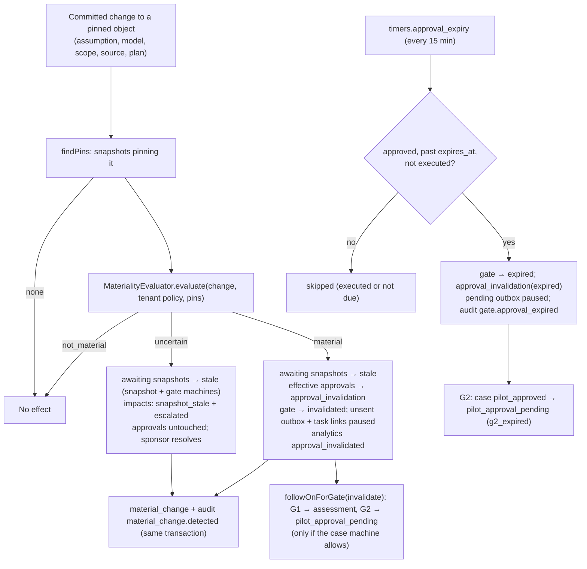

---

### WF-07 — Pilot activation → outbox → connector, partial failure and idempotent retry

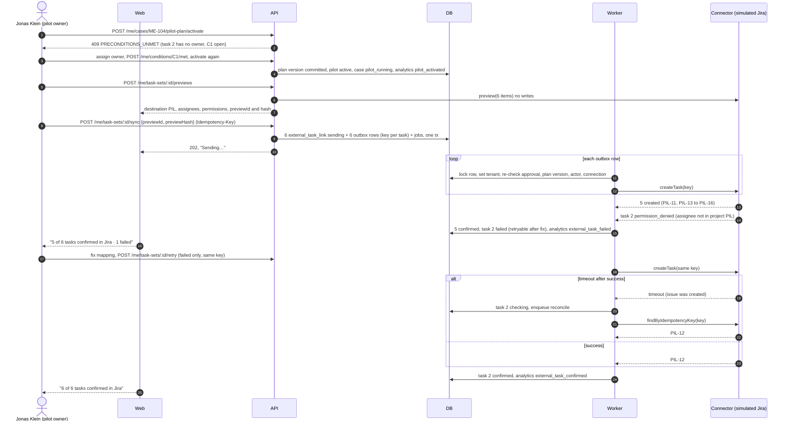

**Narrative.** Activation requires an effective, unexpired G2 approval, every blocking condition met and
every task owned. The dry-run preview is mandatory before the first write and binds the send to the plan
content by hash. One transaction writes the per-task sync rows, outbox rows with stable idempotency keys,
jobs and audit. The worker re-checks authorization at send time and records each task's outcome
separately; "Confirmed · PIL-11" only appears with a returned key. Retry sends only failed tasks with the
same keys; an ambiguous timeout is reconciled by searching for the key before any retry, so the simulator
never holds two issues for one key. **State changes:** pilot plan draft → active; case pilot_approved →
pilot_running; sync not_sent → in_preview → sending → confirmed / failed / checking / retry_scheduled.
**Events:** `pilot_activated`, `external_task_confirmed`, `external_task_failed`. **Failure paths:** expired
token → connection Expired, all unsent rows `paused_connector`, internal tasks continue, "Export CSV
instead"; approval invalidated → unsent rows "Paused — approval changed", confirmed tasks preserved; 5xx →
backoff up to 5 attempts then Failed with Retry; worker crash mid-send → sweep reclaims the leased row and
reconciles; double click on Create → same Idempotency-Key replays. Outbound prospect messages stay drafts:
there is no send endpoint.

**Build status (Wave 1, 2026-10-09):** Partial. Implemented: `syncMachine` with `approval_effective` and
`connector_connected` re-checks at send time and human `enqueue`/`manual_retry` guards; activation guard
lists open blocking conditions and unowned tasks together; invalidation and expiry pause unsent outbox rows
and their task links; migration 0002 makes `claim_outbox_batch()` and `list_tenant_ids()` work under
FORCE RLS (D-043). Not started: simulator over `sim`, outbox dispatch/reconcile/sweep, task-sync API and
fault suite (WS6), pilot plan endpoints (WS4b), S11. Convention fixed for WS6: outbox rows carry
`authorization_ref.gateRequestId`, `aggregate_type = 'external_task_link'`, `aggregate_id` = link id.

**UI status (Wave 2, 2026-10-09):** Done against MSW (WS8d S11, WS8c validation tasks, WS8a My Work). Code:
`apps/web/src/screens/pilot/` (`PilotScreen.tsx`, `mocks.ts`), `screens/validation/ValidationTasks.tsx`,
`screens/my-work/`, journey state `screens/history/journey.ts`. Pinned baseline (G2 v3 + fingerprint), budget
meter, internal status and external sync in separate columns, activation blockers in server order (owner, then
C1), dry-run preview (destination, assignees, permissions), the server's honest summary ("5 of 6 tasks confirmed
in Jira · 1 failed (permission)"), "Retry 1 failed task" (failed ids only), "Checking" → "Confirmed" after
reconcile, expired connector with CSV export, approval invalidated (sent kept, unsent paused), message drafts
"not authorized to send". Never "Synced" (D-066). My Work changes internal status with `tasks.update` (never the
sync status, never a gate). Tests: `pilot/mocks.test.ts`, `PilotScreen.test.tsx`, `MyWorkScreen.test.tsx`,
`mocks/precedence.test.ts`, `e2e/ws8d-execute-review.spec.ts` (steps 21–24, variants),
`e2e/validate-decide.spec.ts` (VAL tasks), `e2e/work-and-reviews.spec.ts`.

**Build status (Wave 3, 2026-10-09):** Implemented (simulated Jira; a live connector is not in the MVP). API:
`apps/api/src/modules/me/pilot/` (`pilot.activate` lists unowned tasks and open blocking conditions together, commits the plan
version, locks the task set authorized by G2, opens the outcome review, D-087; scope change runs materiality),
`apps/api/src/modules/tasksync/` (`taskSync.get/preview/send/retry/exportCsv`, dev fault routes), worker
`apps/worker/src/jobs/outbox/` (`outbox.dispatch`, `outbox.reconcile`, `outbox.sweep`: claim → call → record with a
lease, reconcile before every re-send, re-check at claim, D-083), `packages/connectors/src/simulated/` (D-084),
`packages/db/src/approval.ts`. Tests: `me/pilot/pilot.db.test.ts` (steps 21–22, scope change),
`tasksync/tasksync.db.test.ts` (step 12), `apps/api/test/connector-faults/{partial,timeout,expired-token,crash,concurrent-retry,invalidated}.test.ts`
(steps 22–24 and variants), `apps/api/test/db/joint/pilot-to-simulator.test.ts` (steps 21–23, no stand-ins),
`apps/api/test/db/joint/g1-to-validation-send.test.ts` (step 12 from a G1 decision),
`apps/worker/src/jobs/timers/timers.db.test.ts` (expiry pauses queued links). Open: validation tasks have no authoring
endpoint (PQ-13); the retried task takes the next free key (PQ-15).

**As built (Wave 3).** The flow above holds with these differences:

```mermaid
sequenceDiagram
  autonumber
  actor Jonas as Jonas Klein (pilot owner)
  participant API
  participant DB
  participant Worker
  participant Sim as Simulated Jira (sim schema)
  Jonas->>API: POST /me/cases/ME-104/pilot-plan/activate
  API->>DB: plan version committed + current, task set (owner = plan version, authorized by G2), outcome review v1
  Jonas->>API: POST /me/task-sets/:id/previews
  API->>DB: task_sync_preview (content hash, 30 min) + links in_preview with their stable keys
  Jonas->>API: POST /me/task-sets/:id/sync {previewId, previewHash}
  API->>DB: lock task set, 6 links sending + 6 outbox rows (authorization_ref.gateRequestId = G2) + jobs, one tx
  loop each due row (dispatch job or minute sweep)
    Worker->>DB: tx 1 lock row, re-check connection, approval (shared rule), plan current, sender role; lease 60 s
    alt attempts > 0 or Checking
      Worker->>Sim: findByIdempotencyKey(key) first
    end
    Worker->>Sim: createTask(key) outside any transaction
    Worker->>DB: tx 3 record Confirmed (key) or Failed / Checking / retry_scheduled, audit + analytics
  end
  Note over Worker,DB: sweep moves expired leases to Checking, searches paused-while-Checking rows once, resumes paused_connector after reconnect
  Jonas->>API: POST /me/task-sets/:id/retry (failed only, same keys, payload from the fixed mapping)
  Worker->>Sim: createTask(same key) → next free key (PIL-n)
```

#### UI walkthrough (WF-07)

| Step | Who | Screen | Route |
|---|---|---|---|
| Validation tasks: preview, then "Create 5 tasks in Jira" → Confirmed · VAL-n | Maya | S09 tasks | `/me/cases/ME-104/validation` |
| Open the approved plan (activation blocked: owner, then C1) | Jonas | S11 Pilot | `/me/cases/ME-104/pilot` |
| Assign the owner; mark C1 met; activate | Jonas | S11 | same |
| Preview external tasks (dry run) | Jonas | S11 preview | `/me/cases/ME-104/pilot?view=preview` |
| Create 6 tasks → partial failure → retry the failed one | Jonas | S11 | `/me/cases/ME-104/pilot` |
| Open one task | Jonas | S11 task | `/me/cases/ME-104/pilot?task=PIL-11` |
| Work from the task brief; mark in progress / done; report a blocker | Jonas | My Work | `/my-work?tab=tasks` |

---

### WF-08 — Outcome review → revise/extend, scale gate blocked

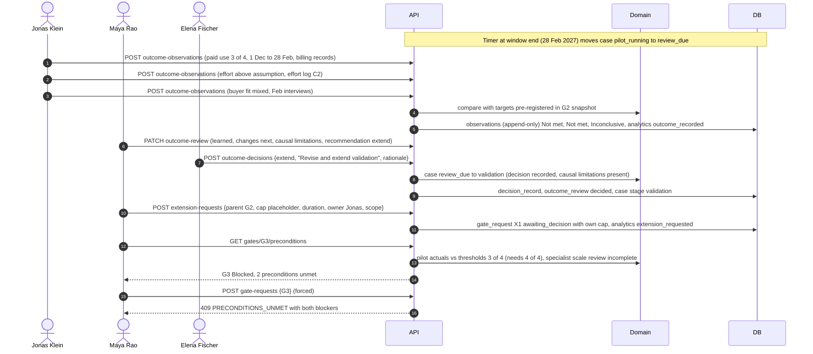

**Narrative.** Actuals carry a measurement period and source and are compared with the thresholds that
were pre-registered in the approved G2 snapshot (they cannot move). Corrections append a new version.
The review needs causal limitations before a decision. Elena records "Revise and extend validation"; the
case returns to Validation. The extension is a new gate request (X1) with its own cap (a placeholder,
because the PRD sets no amount) and never unblocks G3. The scale gate is blocked by two unmet
preconditions and the €400k one-time scale investment is not requested. Neutral styling: "Not met" is a
learning result, not a failure. **State changes:** case pilot_running → review_due → validation;
outcome_review incomplete → ready → decided; X1 draft → awaiting_decision. **Events:** `outcome_recorded`,
`extension_requested`; `scale_requested` only if G3 is ever submitted; `case_stopped` if Stop is chosen.
**Failure paths:** missing actuals → "Review incomplete — 1 metric has no data for Oct"; "scale" as a
review outcome → 400 (scale needs G3); G3 request → `PRECONDITIONS_UNMET`; no G3 approver configured →
"Authority gap" in S14.

**Build status (Wave 1, 2026-10-09):** Partial. Implemented: G3 and X preconditions (X never unblocks G3), the pilot-window
timer (`pilot_running → review_due` after the tenant-local window end), case follow-ons. Not started:
outcome, review and decision endpoints (WS4b), S12. Flow change (D-039, interim pending PQ-1): G3 lists
every unmet precondition — four on the honest step-28 facts, not two. X1 can be requested with the `€[cap]`
placeholder but cannot be approved until a real cap is set (D-040).

**UI status (Wave 2, 2026-10-09):** Done against MSW (WS8d). Code: `apps/web/src/screens/outcomes/`
(`OutcomesScreen.tsx`, `mocks.ts`), `screens/history/HistoryScreen.tsx`. Actuals with period and source and the
neutral result glyph (never red, D-066), recommendation marked "RECOMMENDATION · NOT A DECISION", the sponsor's
decision, "Request extension €[cap]" with its own cap (the placeholder is allowed, D-068), the X request after a
reload (`extensionRequest`), "Request scale approval" disabled with the unmet G3 preconditions. Tests:
`OutcomesScreen.test.tsx`, `AdminScreen.test.tsx` (History), `e2e/ws8d-execute-review.spec.ts` (steps 25–28, 30).

**Build status (Wave 3, 2026-10-09):** Implemented. API: `apps/api/src/modules/me/outcomes/` (append-only observations with period
and source compared with the approved G2 snapshot's targets, a stated result only for non-numeric thresholds, D-081;
review draft with If-Match on `rowVersion`; decision via the case machine; `outcomes.requestExtension` → X1 with the
€[cap] placeholder when the cap is null, the only `extension_requested`, D-071; `extensionRequest` on the review),
`apps/api/src/modules/me/gates/` (G3 refused while unmet, four blockers, D-039), `apps/api/src/modules/platform/reviews/`, `apps/api/src/modules/platform/work/`
(task `rowVersion`), `apps/api/src/modules/me/budget/`. Tests: `me/outcomes/outcomes.db.test.ts` (steps 25–27), `me/gates/gates.db.test.ts`
(step 28), `platform/reviews/reviews.db.test.ts`, `platform/work/work.db.test.ts`, `me/budget/budget.db.test.ts`.
Gap: `readiness` is always empty (no table).

#### UI walkthrough (WF-08)

| Step | Who | Screen | Route |
|---|---|---|---|
| Record actuals (period + source) | Jonas | S12 Outcomes | `/me/cases/ME-104/outcomes?metric=paid_use_continuation` |
| Recommend "Revise and extend validation" (not a decision) | Maya | S12 | `/me/cases/ME-104/outcomes` |
| Record the decision | Elena | S12 decision dialog | same |
| Request extension X1 with its own cap and scope | Maya | S12 extension form | same |
| Scale stays blocked (G3 preconditions listed) | anyone | S12 G3 card | same |
| Audit trail of the journey | anyone | History | `/me/cases/ME-104/history?object=gate_request` |

Update (2026-10-09) — scale gate as built:

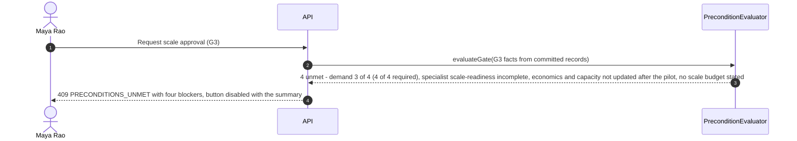

---

### WF-09 — Analysis run lifecycle with checkpoint and resume

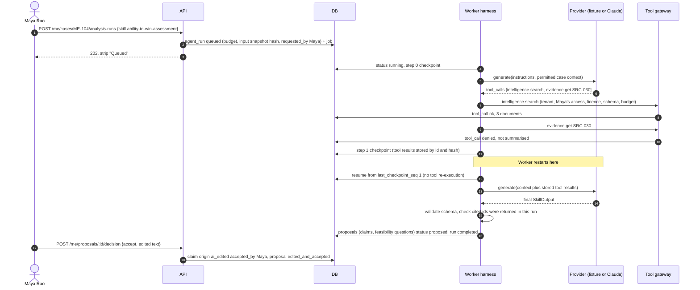

**Narrative.** Runs are asynchronous, bounded (5 minutes, 40 tool calls, token and cost caps) and act
with the requesting human's access, never more. Every step is checkpointed; a restart resumes from the last
checkpoint and reuses stored tool results. Restricted sources are denied by the gateway and never reach
the provider; the trace says "denied · not summarised". Output must validate against `SkillOutput`; a claim
citing an id that was not returned in this run is downgraded to Unknown. Proposals never overwrite human
edits; accepting writes the business record with provenance. **State changes:** run queued → running →
completed (or waiting_for_input, partial, failed, cancelled; partial/failed → queued on resume).
**Events:** none of the PRD §17 business events; run cost, time and errors are recorded separately
(`agent_run.usage`). **Failure paths:** provider error or missing fixture → failed with "Stopped — your work
is saved"; malformed output → one repair attempt then failed; budget exhausted → partial; injected
instructions in evidence → treated as data, no write tools exist; AI disabled → every screen still works
manually; the agent can never sign a review or decide a gate (database refuses agent identities).

**Build status (Wave 1, 2026-10-09):** Not started (WS5). Only the frozen interfaces exist (`packages/ai`) plus `runMachine`
(WS3) and the job catalogue entry; the worker task list (`apps/worker/src/tasks.ts`) is where WS5 registers
its run job.

**UI status (Wave 2, 2026-10-09):** Partial against MSW (WS8b, WS8d). Code: `apps/web/src/screens/thesis/`
(analysis strip: `RunStatusTag`, polls while in flight, never a percentage; request analysis),
`screens/admin/AdminScreen.tsx` (Diagnostics: the only place with agent / tool / token terms; run trace from
`?run=`). The run itself, its checkpoints and proposals wait for WS5. Tests: `ThesisScreen.test.tsx`,
`AdminScreen.test.tsx`.

**Build status (Wave 3, 2026-10-09):** Implemented with the fixture provider; the Claude provider is tested only
against a mocked client. Code: `packages/ai/src/` (harness, fixture and Claude providers, tool gateway with seven
read-only tools, skill loader, output checks, untrusted wrapping), `apps/worker/src/jobs/analysis/` (`analysis.run`,
Postgres run store with atomic step + checkpoint commits, DB-backed tool handlers with the requester's access),
`apps/api/src/modules/analysis/` (nine endpoints; `AnalysisRun.output`, D-081), `skills/*` (ten skills with fixtures, schemas, evals),
`evals/` (smoke: 20 cases, 14 suites). Tests: `apps/worker/src/jobs/analysis/run.db.test.ts` (checkpoint and resume
after a restart reuse tool results; budget → partial; provider error → failed "Stopped — your work is saved"),
`apps/worker/src/jobs/analysis/gateway.db.test.ts` (SRC-030 denied · not summarised; injected instructions do
nothing), `analysis/analysis.db.test.ts` (AI down), `analysis/proposals.db.test.ts` (step 26: recommendation is not a
decision), `analysis/discovery.db.test.ts`, `apps/api/test/db/joint/proposal-to-records.test.ts`, `pnpm evals:smoke`.

**As built (Wave 3).** Differences from the diagram above: the request answers 202 with the job enqueued in the same
transaction; the worker rebuilds the provider request from the persisted checkpoint every turn and commits each step
atomically with it (a cancelled run refuses the commit); a tool budget reached ends the run `partial`, while time,
cost or token budgets end it `failed` and resumable; accepting a claim adds an **AI draft** claim through WS4a's
writer and a person still accepts it as a fact (D-076).

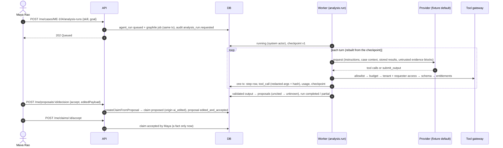

#### UI walkthrough (WF-09)

| Step | Who | Screen | Route |
|---|---|---|---|
| Request analysis; watch the strip (Working → Partial → Done) | Maya | S05 Thesis | `/me/cases/ME-104/thesis?run=…` |
| Accept, discard or challenge an AI claim | Maya | S05 claims | `/me/cases/ME-104/thesis?claim=…` |
| Inspect the run trace (business copy everywhere else) | Admin | S14 Diagnostics | `/admin/diagnostics?run=…` |

---

### WF-10 — Evidence challenge and restricted-source handling

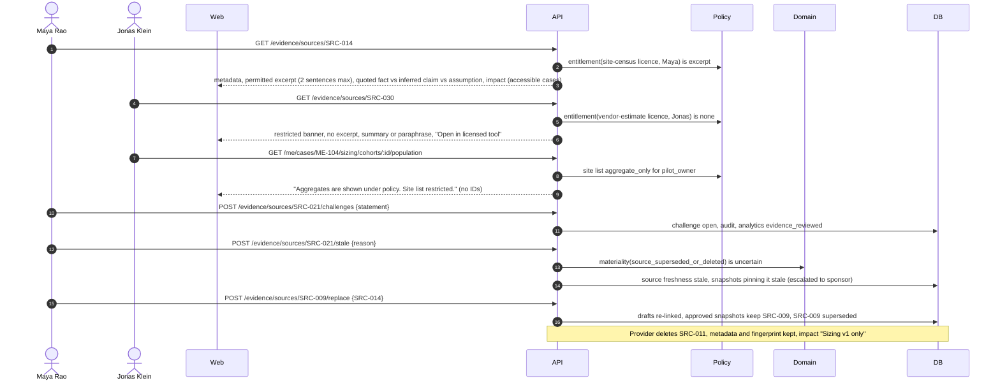

**Narrative.** Every read of source content checks the licence entitlement for the viewer: `excerpt`
shows permitted passages only; `aggregate_only` shows aggregates without identifying rows or counts that
reveal hidden data; `none` shows a restricted banner with no excerpt, summary or paraphrase anywhere —
including search results, exports, generated text and agent context. The S13 side panel separates quoted
fact, inferred claim (AI draft accepted by a human) and human assumption. Challenges are tracked to
resolution. Marking stale or replacing a source runs materiality: drafts re-link, approved snapshots keep
the original source, and pinned snapshots go stale pending the sponsor's classification. Deleted sources
keep provenance and impact under the retention policy. **State changes:** source freshness current →
stale / superseded; availability available → deleted_by_provider; challenge open → resolved.
**Events:** `evidence_reviewed`. **Failure paths:** request for a source in a case the viewer cannot see →
404 (no existence leak); impact lists only accessible cases ("Cases you cannot access are not listed or
counted"); upload with a duplicate hash links to the existing source; ingestion failure → "ingestion
failed" status, never fabricated content.

**Build status (Wave 1, 2026-10-09):** Implemented on the API side (WS1): `apps/api/src/modules/platform/evidence/`,
`apps/api/src/platform/entitlements.ts`, worker jobs `evidence.ingest` and `evidence.freshness`
(`apps/worker/src/jobs/evidence/`). Marking a pinned source stale or replacing it runs materiality through
the real evaluator (D-047; DB-tested). S13 is WS8d's; the web client still needs the multipart path for
uploads (D-051). Changes: uploads are `multipart/form-data` (`metadata` + one file); identical bytes return
the existing source; admins get 404 on source detail. New failure paths: upload without a file → 400;
licence from another tenant → 400; mark stale on a superseded source → 409 `INVALID_TRANSITION` ("mark its
replacement instead"); replacing a source with itself → 400; superseded or deleted replacement → 409;
ingestion `failed` on a missing object or hash mismatch and `partial` for binary files.

**UI status (Wave 2, 2026-10-09):** Done against MSW (WS8d); the web multipart path for uploads is done (D-065),
the upload form is not. Code: `apps/web/src/screens/evidence/` (`EvidenceScreen.tsx`, `mocks.ts`),
`apps/web/src/lib/api-client.ts` (`MULTIPART_ENDPOINT_IDS`). Permitted excerpt in Source Serif with the licence
boundary; restricted ("Restricted source · no excerpt shown", Request access, nothing leaks); aggregate-only;
deleted with provenance and fingerprint; superseded with "Open SRC-014"; stale; fact / inference / assumption
panel; Challenge, Mark stale, Replace, Inspect impacted cases ("Cases you cannot access are not listed or
counted."). Tests: `EvidenceScreen.test.tsx`, `lib/api-client.test.ts`, `e2e/ws8d-execute-review.spec.ts` (S13).

**Build status (Wave 3, 2026-10-09):** Implemented. API as in Wave 1 (`apps/api/src/modules/platform/evidence/`); the analysis
gateway now applies the same entitlement rules in the worker (`apps/worker/src/jobs/analysis/access.ts`; a shared module
is CR-WS5-1, deferred with a parity test to write). Tests: the evidence DB suites,
`apps/worker/src/jobs/analysis/gateway.db.test.ts`.

#### UI walkthrough (WF-10)

| Step | Who | Screen | Route |
|---|---|---|---|
| Browse sources for the case | Maya | S13 list | `/evidence?case=ME-104` |
| Read a permitted excerpt with its licence boundary | Maya | S13 viewer | `/evidence/SRC-014?case=ME-104` |
| Restricted source: no excerpt; request access | Maya | S13 viewer | `/evidence/SRC-030` |
| Deleted by the provider: provenance and fingerprint kept | Maya | S13 viewer | `/evidence/SRC-011` |
| Challenge; mark stale (materiality runs on the server); replace | Maya | S13 actions | `/evidence/SRC-014` |
| Inspect impacted cases (inaccessible ones not counted) | Maya | S13 impact | same |
| Connections and authority gaps (admins cannot approve) | Admin | S14 | `/admin/connections`, `/admin/authority` |

## End-to-end journey map (2026-10-09)

The 30 acceptance steps of BUILD_PLAN §8, with the workflow each exercises, the screen route, the main API endpoints
(all under `/api/v1`) and the spec that proves it. `aster-journey` is `apps/web/e2e/aster-journey.spec.ts` on the
real stack; `real/*` are the alternate-path specs under `apps/web/e2e/real/`. Case routes are
`/me/cases/ME-104/…`; analytics and audit rows are asserted through the e2e database helpers.

| # | Step | WF | Screen route | API endpoints | Proving spec |
|---|---|---|---|---|---|
| 1 | Maya logs in through the persona picker | WF-01 | `/login` → `/me/overview` | `POST /auth/dev-login`, `GET /me/overview` | `aster-journey` steps 1–5 |
| 2 | Opportunities for MD-21: discovery partial, OPP-07 proposed, OPP-12 likely duplicate | WF-02, WF-09 | `/me/opportunities` | `GET /me/opportunities`, `GET /me/mandates/:ref` | `aster-journey` steps 1–5 |
| 3 | Merge OPP-12 into OPP-07; shortlist OPP-07 | WF-02 | `/me/opportunities` | `POST /me/opportunities/:ref/merge`, `POST /me/opportunities/:ref/shortlist` | `aster-journey` steps 1–5 |
| 4 | Compare four; exclude Austrian breweries; Unknown never 0 | WF-02 | `/me/opportunities/compare` | `POST /me/comparisons`, `PUT /me/comparisons/:id/exclusions/:opportunityId`, `GET /me/comparisons/:id/ranking-preview` | `aster-journey` steps 1–5, `real/missing-data` |
| 5 | Convert OPP-07 to ME-104; G0 Approved on the rail | WF-02, WF-01 | `/me/cases/ME-104/thesis` | `POST /me/opportunities/:ref/convert`, `GET /me/cases/:caseRef` | `aster-journey` steps 1–5 |
| 6 | Start assessment; sizing ladder and SOM formula | WF-03 | `/me/cases/ME-104/sizing` | `POST /me/cases/:caseRef/transitions`, `PATCH /me/cases/:caseRef/sizing/draft`, `POST …/sizing/draft/calculate` | `aster-journey` steps 6–8 |
| 7 | Variant: TAM 500 blocks with SAM > TAM; undo | WF-03 | `/me/cases/ME-104/sizing` | `POST …/sizing/draft/calculate` | `aster-journey` steps 6–8 |
| 8 | Commit sizing v2; lineage on SAM | WF-03, WF-10 | `/me/cases/ME-104/sizing` (lineage drawer) | `POST …/sizing/commit`, `GET /me/cases/:caseRef/lineage` | `aster-journey` steps 6–8 |
| 9 | Daniel disputes 20% adoption; scenario table and money cards | WF-04, WF-05 | `/me/cases/ME-104/economics` | `GET /me/cases/:caseRef/economics`, `POST /me/assumptions/:id/disputes`, `POST /me/cases/:caseRef/dissent` | `aster-journey` step 9 |
| 10 | Create EXP-03; submit G1 (v1 hashed) | WF-05, WF-06 | `/me/cases/ME-104/validation` | `POST /me/cases/:caseRef/experiments`, `POST /me/cases/:caseRef/gate-requests`, `POST /me/gate-requests/:id/submit` | `aster-journey` steps 10–12 |
| 11 | Elena approves validation €15k; EXP-03 locked; tasks drafted | WF-06, WF-05 | `/reviews` → `/me/cases/ME-104/decisions?gate=G1` | `GET /reviews`, `POST /me/gate-requests/:id/decisions` | `aster-journey` steps 10–12 |
| 12 | Preview and create VAL-1…VAL-5 | WF-07 | `/me/cases/ME-104/validation` | `POST /me/task-sets/:id/previews`, `POST /me/task-sets/:id/sync` | `aster-journey` steps 10–12 |
| 13 | Amend the window to 20 Nov | WF-05 | `/me/cases/ME-104/validation` | `POST /me/experiments/:id/amendments` | `aster-journey` steps 13–16 |
| 14 | Record 9 interviews / 4 commitments | WF-05 | `/me/cases/ME-104/validation` | `POST /me/experiments/:id/start`, `POST /me/experiments/:id/results` | `aster-journey` steps 13–16 |
| 15 | Lena signs the specialist review (pilot scope) | WF-05 | `/me/cases/ME-104/feasibility` | `POST /me/cases/:caseRef/feasibility/:dimension/reviews` | `aster-journey` steps 13–16 |
| 16 | Daniel signs the finance review | WF-04 | `/me/cases/ME-104/economics` | `POST /me/cases/:caseRef/economics/finance-reviews`, `POST /me/model-reviews/:id/sign` | `aster-journey` steps 13–16 |
| 17 | Prepare and submit G2; dissent in the package | WF-06 | `/me/cases/ME-104/decisions?gate=G2` | `POST /me/cases/:caseRef/gate-requests`, `POST /me/gate-requests/:id/submit`, `GET /me/gate-requests/:id/package` | `aster-journey` steps 17–18 |
| 18 | Maya cannot approve her own package | WF-06 | `/me/cases/ME-104/decisions?gate=G2` | `POST /me/gate-requests/:id/decisions` → `SELF_APPROVAL_PROHIBITED` | `aster-journey` steps 17–18 |
| 19 | Base adoption change makes v2 stale; refresh creates v3 (v4 on aster-demo) | WF-06, WF-05 | `/me/cases/ME-104/validation` → `…/decisions?gate=G2` | `PATCH /me/assumptions/:id` (new version), `POST /me/gate-requests/:id/refresh` | `aster-journey` steps 19–20, `real/stale-approval` |
| 20 | Elena approves the pilot with C1 and C2; expiry shown | WF-06 | `/me/cases/ME-104/decisions?gate=G2` | `POST /me/gate-requests/:id/decisions` | `aster-journey` steps 19–20 |
| 21 | Activation blocked: missing owner, then open C1 | WF-07 | `/me/cases/ME-104/pilot` | `POST /me/cases/:caseRef/pilot-plan/activate` → `PRECONDITIONS_UNMET` | `aster-journey` steps 21–24 |
| 22 | Owner set, C1 met, activate; 5 of 6 confirmed, 1 failed (permission) | WF-07 | `/me/cases/ME-104/pilot` | `PATCH /me/tasks/:id`, `POST /me/conditions/:id/met`, `POST …/pilot-plan/activate`, `POST /me/task-sets/:id/previews`, `POST /me/task-sets/:id/sync`, `PUT /dev/simulator/faults` | `aster-journey` steps 21–24, `real/pilot-sync` |
| 23 | Fix the mapping; retry 1 failed task; exactly 6 issues | WF-07 | `/me/cases/ME-104/pilot` | `PUT /admin/connector-mappings/:id`, `POST /me/task-sets/:id/retry`, `GET /dev/simulator/issues` | `aster-journey` steps 21–24, `real/pilot-sync` |
| 24 | Timeout after success: Checking → Confirmed, no duplicate | WF-07 | `/me/cases/ME-104/pilot` | `PUT /dev/simulator/faults`, worker `outbox.reconcile` | `aster-journey` steps 21–24 |
| 25 | Jonas records actuals: Not met · Not met · Inconclusive | WF-08 | `/me/cases/ME-104/outcomes` | `POST /me/cases/:caseRef/outcome-observations` | `aster-journey` steps 25–28 |
| 26 | Maya's recommendation (not a decision) with causal limitations | WF-08 | `/me/cases/ME-104/outcomes` | `PATCH /me/cases/:caseRef/outcome-review` | `aster-journey` steps 25–28 |
| 27 | Elena decides Revise and extend; Maya requests the extension (€[cap]) | WF-08, WF-06 | `/me/cases/ME-104/outcomes` | `POST /me/cases/:caseRef/outcome-decisions`, `POST /me/cases/:caseRef/extension-requests` | `aster-journey` steps 25–28 |
| 28 | "Request scale approval" disabled with all four G3 blockers (D-039) | WF-08 | `/me/cases/ME-104/outcomes` | `GET /me/cases/:caseRef/gates/:gateCode/preconditions`, `POST …/gate-requests` → `PRECONDITIONS_UNMET` (four blockers) | `aster-journey` steps 25–28 |
| 29 | Admin: authority gap, tool-only diagnostics, cannot approve | WF-01, WF-06, WF-09 | `/admin/health` (authority and diagnostics sections) | `GET /admin/authority-grants`, `GET /admin/diagnostics/runs/:id`, `POST /me/gate-requests/:id/decisions` → `FORBIDDEN` | `aster-journey` steps 29–30 |
| 30 | History: every step once, in audit order, with actor and version | all | `/me/cases/ME-104/history` | `GET /me/cases/:caseRef/history` | `aster-journey` steps 29–30 |

Alternate paths (BUILD_PLAN §8): missing data → `real/missing-data`; restricted evidence → `real/restricted-evidence`;
expired connector, partial sync and approval invalidated after activation → `real/pilot-sync`; duplicate cohort →
`real/duplicate-cohort`; stale approval → `real/stale-approval`; AI down → `real/ai-down` and the `real-ai-down`
project (whole journey); cross-tenant → `real/cross-tenant`; accessibility → `real/a11y`; p95 → `real/performance`.
