# Market Expansion OS — Architecture

**Status:** Frozen at the architecture stage (decisions.md D-031) · **Date:** 9 October 2026
**Inputs:** [PRD](../PRD.md) (source of truth), [UX research](../design/UX_RESEARCH.md), the approved
prototype (`design/market-expansion/prototype`), and the sister-app plan [EXECUTION_PLAN](../../EXECUTION_PLAN.md).
**Companion documents:** [DATA_MODEL](./DATA_MODEL.md) · [API](./API.md) · [FRONTEND](./FRONTEND.md) ·
[BUILD_PLAN](./BUILD_PLAN.md) · decisions log [`/decisions.md`](../../../decisions.md) · workflows
[`/artifacts.md`](../../../artifacts.md).

---

## 0. Summary

1. **One modular monolith** in a pnpm TypeScript monorepo: a React SPA, a Fastify API, a background
   worker, and pure packages for contracts and domain logic. One Postgres 16 database is the system of
   record. No microservices, no graph database, no generic app builder (PRD §16).
2. **Two layers in every part of the code:** Growth OS shared primitives (`platform`) and Market
   Expansion (`me`). The boundary is a database schema, a folder name and a lint rule.
3. **Deterministic code owns authority.** State machines, gate preconditions, policy, materiality,
   snapshot hashing, sizing and economics are pure, tested functions. The database repeats the critical
   approval checks so an application bug cannot create a bypass.
4. **Approvals bind to an exact snapshot.** A decision package is canonical JSON with a SHA-256 hash that
   the database re-verifies. An approval references `(snapshot_id, snapshot_hash)`. A material change makes
   pending snapshots stale and invalidates approvals; nothing is silently rewritten.
5. **The agent drafts, people decide.** One bounded analysis agent with versioned skills, a read-only tool
   gateway, budgets and checkpoints. It writes proposals only. The default provider is a deterministic
   fixture; a Claude provider is enabled by configuration.
6. **External writes go through a transactional outbox** with stable idempotency keys, an authorization
   re-check at send time, and reconcile-before-retry. A simulated Jira-like connector with fault injection
   stands in for the real tool behind the same interface.

## 1. Scope

In scope for the MVP (PRD §10): mandate and G0; discovery and comparison; evidence-backed sizing; fit and
feasibility; scenario economics; assumption register and experiments; G0–G3 plus scoped extensions;
pilot planning and one task connector with CSV export fallback; manual outcome entry and review; audit and
analytics; one bounded analysis agent. P1 items (ME-18 cross-app handoff, ME-19 portfolio allocation, ME-20
change monitoring) have reserved seams but no implementation.

## 2. System context

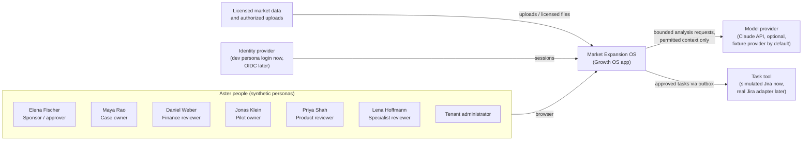

## 3. Containers

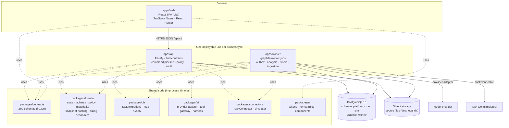

- **apps/api** serves every endpoint in the frozen registry. It never calls the model provider or the task
  tool directly; it writes outbox rows and enqueues jobs in the same transaction.
- **apps/worker** runs jobs from `graphile-worker` (Postgres-backed). It is the only process that calls the
  task connector and the model provider.
- **Object storage** holds source files (originals) addressed by content hash. Dev uses `.data/objects`.
  Only permitted excerpts are ever stored in the database or sent to a browser or model.

## 4. Modular monolith boundaries

PRD §16 names the shared Growth OS primitives: tenant/identity, enterprise context references,
evidence/provenance, decisions/approvals, actions, outcome reviews and agent runs. Market definitions,
entry theses, sizing, experiments and pilots are app-specific.

| Concern | Growth OS shared (`platform`) | Market Expansion (`me`) |
|---|---|---|
| Tenancy, identity, sessions | `tenant`, `business_unit`, `app_user`, `session`, `role_assignment` | — |
| Authority and policy | `authority_grant`, `policy` (gate, materiality, expiry, retention, run budget) | Gate **definitions** G0–G3, X: preconditions, labels (`packages/domain/src/me/gates`) |
| Enterprise context | `product`, `segment`, `company`, `site` | `market_boundary` |
| Case | `workflow_case` envelope (owner, sponsor, stage, version) | Case **stage** values and transitions; `mandate`, `opportunity`, `comparison`, `thesis_version` |
| Evidence | `license`, `source_entitlement`, `source`, `evidence_passage`, `claim`, `claim_evidence_link`, `challenge` | — |
| Assumptions | `assumption`, `assumption_version` | Input keys used by sizing/economics |
| Analysis models | `calculation_result` (engine output record) | `sizing_*`, `cohort*`, `economics_*`, `feasibility_*`, `model_review` |
| Validation | — | `experiment*` |
| Decisions | `gate_request`, `decision_snapshot`, `snapshot_component`, `approval`, `approval_invalidation`, `condition`, `reviewer_position`, `dissent`, `material_change*`, `review_request` | Snapshot **content** builder per gate |
| Actions | `task_set`, `milestone`, `task`, `task_dependency`, `task_sync_preview`, `external_task_link`, `outbox_message`, `connection`, `connector_mapping` | `pilot_plan*`, `budget_entry`, `scope_change_request`, `message_draft` |
| Outcomes | `outcome_target`, `outcome_observation`, `decision_record` | `outcome_review` |
| Agent runs | `agent_run`, `agent_run_step`, `tool_call`, `proposal` | Skills (`skills/*`) and proposal handlers |
| Audit and analytics | `audit_event`, `analytics_event`, `idempotency_record`, `comment` | Event emission points |

**Rules (enforced):**

1. Code under any `platform/` folder (domain, API) and `packages/connectors` must not import `me` code —
   ESLint `no-restricted-imports` (D-008). The database mirrors this: `platform` DDL never references `me`
   except the declared `workflow_case.mandate_id` FK.
2. `packages/contracts` and `packages/domain` are pure: no `pg`, `kysely`, `fastify` or provider SDK.
3. `packages/ai` cannot import `@growth-os/db` or `@growth-os/connectors`: the agent has no write path.
4. A future app (Competitive Response) adds an `cr` schema and `cr/` folders and reuses `platform`. Shared
   primitives are generalized only after a second app proves reuse (PRD §10 "platform APIs follow proven
   reuse").

## 5. Technology stack

| Concern | Choice | Why | Rejected |
|---|---|---|---|
| Language | TypeScript 5.7 on Node 22, end to end | One type system for UI, API, worker, contracts and engines; Zod validates at every boundary | Python backend (splits domain types) |
| Monorepo | pnpm 10 workspaces; internal packages ship TS source; Bundler module resolution | Fast installs, strict dependency graph, no build step between packages | Nx/Turborepo (not needed at this size) |
| Database | PostgreSQL 16 | Transactions across state, audit and outbox; RLS; `sha256()` in SQL for hash checks; one system to run | Document DB (weak for versioned relational snapshots); graph DB (PRD §16 says no) |
| DB access | Kysely + hand-written SQL migrations; types generated by `kysely-codegen` | SQL-first: RLS, triggers and CHECKs are first-class; typed queries without an ORM | Prisma/Drizzle (RLS and triggers become second-class) |
| API | Fastify 5 + Zod schemas from `@growth-os/contracts` | Fast, small, schema-first; one registry drives routes, client and tests | NestJS (heavier), GraphQL (aggregate-level authz harder) |
| Jobs | graphile-worker 0.16 (Postgres) | Transactional enqueue (`graphile_worker.add_job` inside the business transaction), retries, cron, no extra infrastructure | Temporal (operational cost not justified yet); custom queue |
| Decimal math | decimal.js; numerics as strings end to end | No float drift in money; reproducible golden tests | JS numbers |
| Hashing | RFC 8785 canonical JSON subset + SHA-256 (Web Crypto; Postgres `sha256`) | Same bytes and hash in API and DB | Ad-hoc `JSON.stringify` |
| Frontend | React 18 SPA, Vite 6, React Router 6, TanStack Query 5, TanStack Table, Radix primitives, lucide-react | Dense accessible tables and dialogs; deep links; cache with polling | Next.js (no SSR need; separate API anyway) |
| Fonts and tokens | Geist, Geist Mono, Source Serif 4; CSS custom properties ported from the prototype | Matches the approved design one to one | — |
| AI | Provider adapter: fixture (default) or Claude API via env; structured output validated by Zod | Works offline and deterministically in CI; provider swappable | Agent frameworks with hidden state |
| Tests | Vitest (unit, db), Playwright + axe (e2e, a11y) | Fast, TypeScript-native | Jest |
| Lint/format | ESLint 9 flat config + typescript-eslint, Prettier | Boundary rules in lint | — |
| Observability | pino logs (Fastify) with redaction; OpenTelemetry API for traces; correlation ids | Correlate UI → API → job → connector/provider | — |

## 6. Request lifecycle (command pipeline)

Every state-changing endpoint follows the same steps (implemented once in `apps/api/src/platform`):

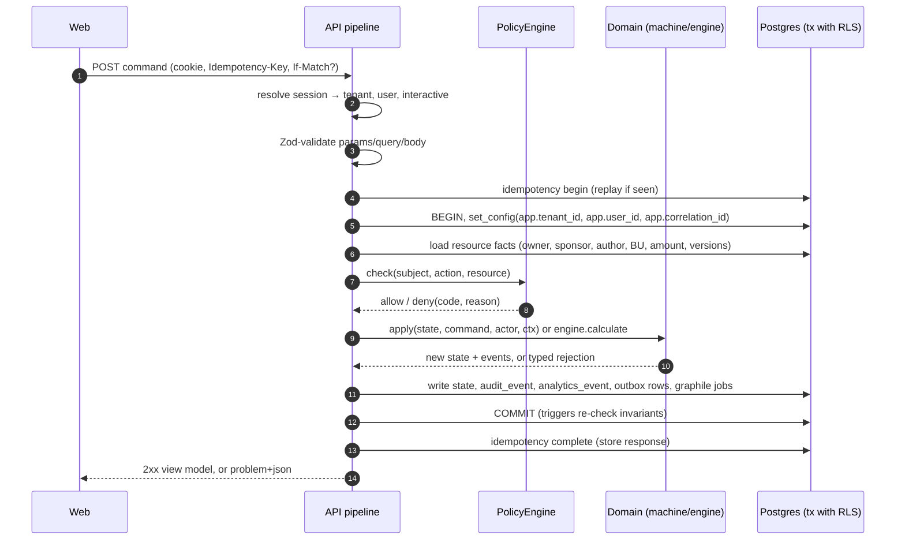

Reads use the same session, tenant transaction and policy check, then serializers apply field and
aggregate redaction (§11).

## 7. Tenancy, authentication and authorization

### 7.1 Tenancy and RLS

Shared multi-tenant deployment in one EU region for the pilot (D-003). Every `platform`/`me` row has
`tenant_id`; RLS policies compare it to `app.tenant_id`, which `withTenant()` sets with `SET LOCAL`
semantics at the start of each transaction. No tenant set → no rows. App roles are `NOBYPASSRLS` and do not
own tables. The worker reaches across tenants only through two `SECURITY DEFINER` functions that return ids
(DATA_MODEL §5). Tenant isolation tests run on every endpoint (release gate "tenant access adversarial").

### 7.2 Authentication for the pilot

- `AUTH_MODE=dev` (default in development): `/login` lists the six Aster personas — Elena Fischer, Maya
  Rao, Daniel Weber, Jonas Klein, Priya Shah, Lena Hoffmann — plus the tenant administrator for admin
  screens. Choosing one creates an interactive `platform.session` and an httpOnly cookie. There are no
  passwords. The routes do not exist in any other mode.
- Production pilots use OIDC with the customer IdP (SSO/SCIM is a pre-contract decision, PRD §13). The
  `session` table and `interactive` flag are unchanged; only the login route differs.
- Service principals (`kind = service`) and the agent principal (`kind = agent`) never hold interactive
  sessions. `human` endpoints reject them.

### 7.3 Authorization model

Four inputs decide every check: **role** (what kind of work), **scope** (business unit, case), **delegated
authority** (gate × business unit × ceiling) and **resource facts** (owner, author, named reviewer,
licence). The policy engine is pure and table-driven (`packages/domain/src/platform/policy`).

**Roles** (`RoleCode`): sponsor, case_owner, pilot_owner, commercial_reviewer, product_reviewer,
finance_reviewer, specialist_reviewer, investment_committee, read_only_reviewer, tenant_admin.

**Policy table** (frozen as `ROLE_ACTIONS`; ✓ = allowed within scope; *self* = only the named person;
*grant* = also needs an authority grant):

| Action | Sponsor | Case owner | Pilot owner | Commercial | Product | Finance | Specialist | Inv. committee | Read-only | Admin | Agent |
|---|---|---|---|---|---|---|---|---|---|---|---|
| Read case, brief, source metadata | ✓ | ✓ | ✓ | ✓ | ✓ | ✓ | ✓ | ✓ | ✓ | — | via gateway |
| Read source excerpt | licence | licence | licence | licence | licence | licence | licence | licence | licence | — | licence + run scope |
| Edit mandate / case / model drafts | — | ✓ | plan only | — | — | economics draft | — | — | — | — | — (proposals) |
| Commit model versions | — | ✓ | — | — | — | — | — | — | — | — | — |
| Edit / dispute assumptions | dispute | ✓ | — | dispute | dispute | dispute | — | — | — | — | — |
| Resolve dispute | ✓ | — | — | — | — | *self* | — | — | — | — | — |
| Sign feasibility / finance review | — | — | *self* | *self* | *self* | *self* | *self* | — | — | — | never |
| Submit / withdraw gate request | — | ✓ | — | — | — | — | — | — | — | — | never |
| **Decide gate** | *grant* | never | never | never | never | never | never | *grant* | never | never | never |
| Record reviewer position on snapshot | ✓ | — | ✓ | ✓ | ✓ | ✓ | ✓ | ✓ | — | — | never |
| Resolve uncertain materiality | ✓ | — | — | — | — | — | — | ✓ | — | — | never |
| Activate pilot, send tasks | — | — | ✓ | — | — | — | — | — | — | — | never |
| Record outcomes | — | ✓ | ✓ | — | — | — | — | — | — | — | never |
| Outcome decision, stop case | ✓ | — | — | — | — | — | — | ✓ | — | — | never |
| Start analysis, decide proposals | — | ✓ | — | — | — | — | — | — | — | — | — |
| Configure roles, grants, policies, connections | — | — | — | — | — | — | — | — | — | ✓ | — |
| Read audit, diagnostics | — | — | — | — | — | — | — | — | — | ✓ | — |

**Delegated authority.** `authority_grant(user, gate_code, business_unit, ceiling_amount, currency,
valid_from, valid_to)`. A gate decision needs a grant that matches the gate, the case's business unit, an
amount ≤ ceiling in the same currency, and today's date. A missing grant is an "Authority gap" in S14
(e.g. no G3 approver in BU Water). Ceilings are tenant policy; the PRD sets none, so the Aster fixture uses
clearly marked placeholders and the UI shows "up to €[limit]".

**Invariants no configuration can change:** agents and services never decide, sign or record outcomes;
admins configure but never approve (configuring a grant for oneself is refused); the package author and
the case owner never approve their own gate; task ownership never grants approval; approval of a stale or
different snapshot is impossible.

**Enforcement points:** (1) RLS by tenant; (2) `PolicyEngine.check` in every handler; (3) serializer
redaction of restricted fields and aggregates; (4) authorization re-check at outbox send time; (5) database
triggers for approval invariants.

## 8. State machines

All machines are frozen transition tables in `packages/domain` (`platform/workflow/machines.ts`,
`me/lifecycle/machines.ts`). Guards are named keys; unknown guards fail closed. Business stage, gate status,
run status and sync status are separate fields and never substitute for each other.

### 8.1 Opportunity

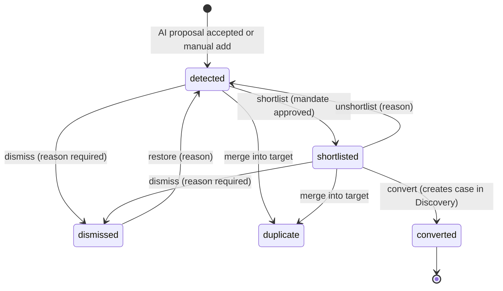

### 8.2 Expansion case stage

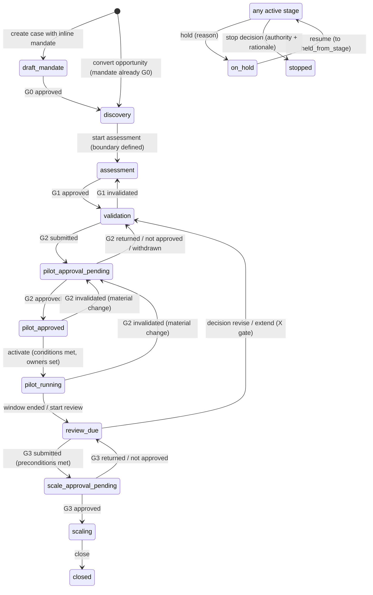

Gate-driven moves are `system` transitions triggered by gate events, never by task completion. An
approved pilot authorizes its scope and budget only; it never moves the case past G3.

### 8.3 Gates G0–G3 and extensions

| Gate | Preconditions (deterministic keys) | Decision owner | Output | Button label |
|---|---|---|---|---|
| G0 Scope approved | sponsor, objective, constraints, owner, currency and horizon | Sponsor | Approved mandate | "Approve mandate (G0)" |
| G1 Validate thesis | evidence inventory, comparable sizing (committed sizing, no blocking checks), material unknowns listed, feasibility blockers listed | Sponsor approves validation spend; case owner + reviewers prepare | Validation plan approval; locks experiment plans | "Approve validation €15k" |
| G2 Pilot investment | validation results recorded, finance review signed, specialist sign-off covering the pilot scope, budget and stop rules, accountable pilot owner | Authorized investment approver | Approved pilot snapshot, revision, or no-go | "Approve pilot €120k · 90 days" |
| G3 Scale / enter market | pilot actuals vs pre-registered thresholds met, readiness reassessment (specialist scale scope), updated economics and capacity, approved scale budget | Investment committee / sponsor | Scale authorization, extension or stop | "Authorize scale" |
| X Extension | parent gate reviewed, own cap set, accountable owner | Sponsor within authority | Scoped extension; does not unblock G3 | "Approve extension €[cap]" |

**Gate request lifecycle** (shared primitive):

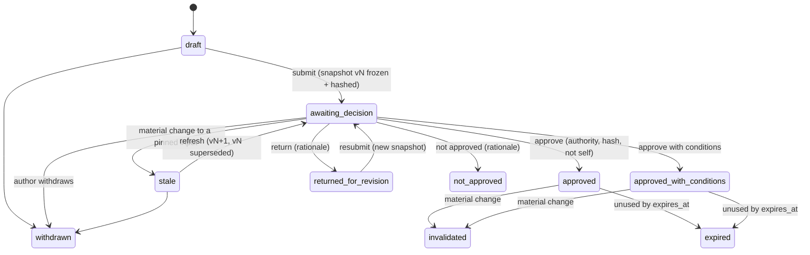

Display status (`GateStatus`) adds `not_started`, `preconditions_open (n of m)`, `ready_to_submit`,
`blocked` (G3 with unmet preconditions after review) and `superseded` (older snapshots). Abstain and
delegate are recorded approvals that do not move the gate. Multi-approver policies count effective
approvals until `requiredApprovals` is reached.

### 8.4 Experiment

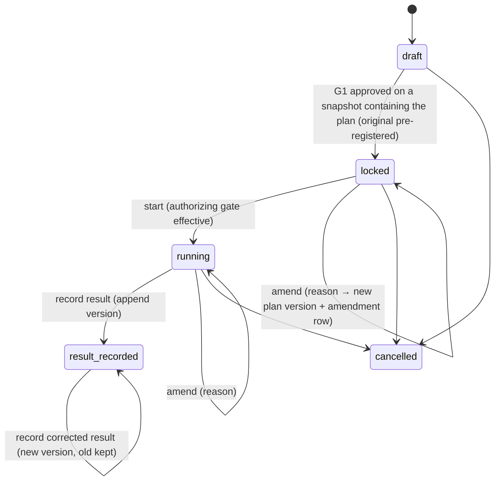

A threshold result never disappears: results are append-only versions, amendments keep the original
plan visible ("Original (pre-registered)"), and an amendment after results were seen is flagged.

### 8.5 External task sync (per task and destination)

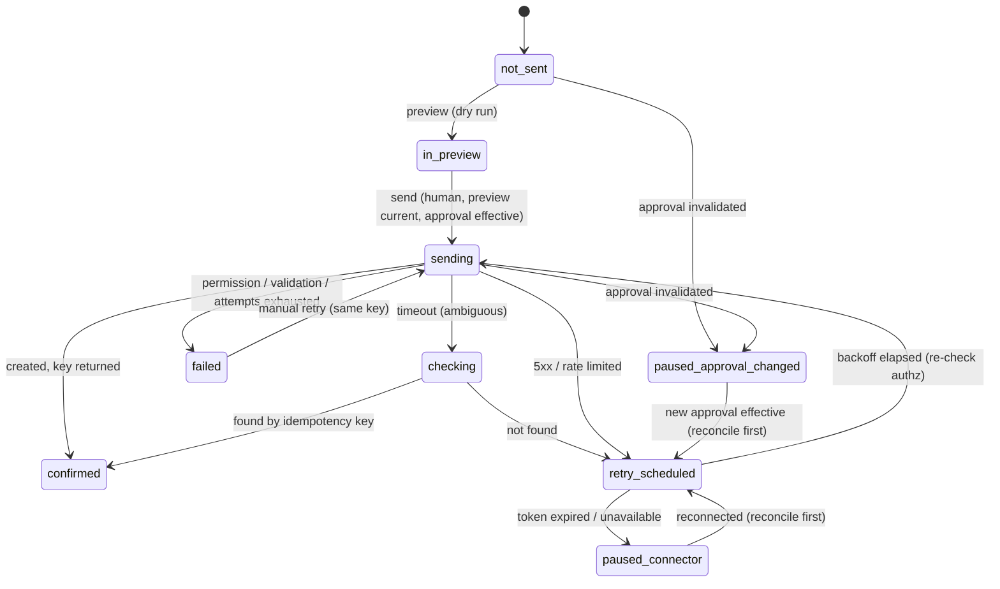

### 8.6 Analysis run

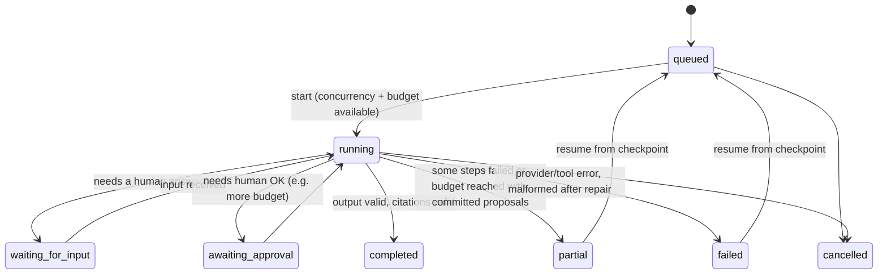

Business copy (analysis strip only): Queued · Working: checking sources… · Needs your input · Partial
results · Done · Stopped — your work is saved. No percentages.

## 9. Versioning, snapshots, materiality

### 9.1 Versions

Versioned objects (mandate, thesis, sizing, economics, pilot plan) have one mutable draft and immutable
committed versions; experiments have plan versions and result versions; assumptions version on every value
change. Drafts autosave with `If-Match`. "Create snapshot vN" on S06/S08 commits a model version. Commit
requires an unblocked engine result. Committed versions pin the exact `assumption_version` rows they used.

### 9.2 Decision snapshots

When a gate request is submitted or refreshed, the API builds `SnapshotContent` from **committed**
versions only (never drafts): ask, scope, authorizes / does-not-authorize, recommendation, alternatives
(including No entry), evidence summary, assumptions with values and dispute flags, validation results with
limitations, economics table text from the committed engine output, sizing summary, sign-offs and reviewer
positions, budget and stop rules, proposed conditions, dissent in the reviewer's words, known limitations,
blockers, pre-registered outcome targets, and a `components` list of every pinned version id. It is
canonicalized (RFC 8785 subset) and hashed with SHA-256; the database checks the hash. The fingerprint
shown in the UI is the first 8 hex characters, uppercase, grouped `XXXX·XXXX`. Snapshot versions are
numbered per case ("Snapshot v3"). Submitting a new version supersedes the previous one; superseded and
stale snapshots stay readable forever.

### 9.3 Materiality and invalidation

Only commits trigger evaluation (drafts never do). The default policy (tenant-configurable, versioned):

| Change | Class | Effect on current snapshot (awaiting decision) | Effect on effective approval |
|---|---|---|---|
| Geography, product, segment of mandate/scope | material | stale | invalidated |
| Spend ceiling / requested amount | material | stale | invalidated |
| Decision-critical assumption value (new version) | material | stale | invalidated |
| Non-critical assumption value | uncertain | stale (escalate) | escalate; invalidate only if classified material |
| New committed sizing/economics version pinned by the snapshot | material | stale | invalidated |
| Source pinned by the snapshot superseded, stale or deleted | uncertain | stale (escalate) | escalate |
| Specialist sign-off scope narrowed or revoked | material | stale | invalidated |
| Pilot plan task set, owners or destination changed after approval | material | — | invalidated for unsent tasks |
| Comments, notes, formatting, replies | not material | none | none |
| Anything not listed | uncertain | stale (escalate to sponsor) | escalate |

Effects run in the same transaction as the change: write `material_change` and `material_change_impact`,
set snapshots `stale` with a business-language reason ("adoption assumption changed on 26 Nov"), insert
`approval_invalidation` rows, move gate requests to `invalidated`, pause unsent outbox rows and
`external_task_link` rows (`paused_approval_changed`), move the case back per §8.2, and emit
`approval_invalidated`. Executed external writes are preserved and shown. Approvals also **expire** if
unused by `expires_at` (policy default 14 days; "Expires if unused by 11 Dec 2026"); a timer job applies it.

## 10. Deterministic engines

Engines live in `packages/domain/src/me`, are pure, use decimal.js, and return typed `Money` with
`measure` and `timeBasis`. Same input → same output and same `inputHash`. Results are stored in
`platform.calculation_result` keyed by `(engine, engine_version, input_hash)`.

### 10.1 Sizing (`SizingEngine`)

| Step | Rule |
|---|---|
| Market unit | Boundary declares unit (annual spend on the product), population unit (site), geography, segment, currency, price year, includes (hardware/software/services/replacement), annualization method |
| Checks (blocking) | currency mismatch; price-year mismatch; population-unit mismatch (sites vs companies); overlap < 0; overlap > smaller cohort; SAM > TAM; reachable > SAM; rate outside [0,1]; capacity < 0; duplicate cohort (same rule and source, or high shared-ID ratio); one-time spend without annualization method; aggregate method with ≠ 2 active cohorts |
| TAM | TAM sites × annual spend per site → `annual_market_spend`, per year. Aster: 5,000 × €20,000 = €100,000,000/year |
| SAM | aggregate: cohort A + cohort B − overlap; site-list: |union of site IDs|. Aster: 1,400 + 1,100 − 500 = 2,000 → €40,000,000/year |
| Reachable pool | count only, never money. Aster: 500 sites |
| SOM | per scenario: customers = min(floor(reachable × adoption), capacity); revenue = customers × price, `annual_revenue` "at end of year N". Aster base: 100 → €2,000,000; upside 150 → capped 120 → €2,400,000 |
| Cross-check | top-down range vs bottom-up value → within / outside range; never averaged or blended |
| Lineage | a node per figure with formula text, formula with values, one-level inputs, count of assumptions it depends on |

### 10.2 Economics (`EconomicsEngine`)

Per scenario in fixed order (downside, base, upside): customers (as above) → annual revenue = customers ×
price → gross contribution = revenue × margin → contribution after incremental opex = gross − opex. Aster:
50 → €1.0m → €0.60m → €0 (true break-even, rendered "€0k (break-even)"); 100 → €2.0m → €1.2m → €600k;
120 (capped) → €2.4m → €1.44m → €840k. The €400k one-time scale-entry investment is a separate `Money`
(`one_time`). **No function adds, subtracts or compares one-time and per-year money**; the `Money` schema
rejects a mislabelled time basis and the engine API has no such operation. Cash flow and payback are always
`Unavailable` in the MVP, listing the missing inputs (acquisition ramp, retention, cash timing, partner
margin, FX and base-year policy). "What must be true?": customers = ceil((target + opex) ÷ (price ×
margin)) = 50 for break-even. Exclusions text is always returned. Missing cost input → blocking
`MISSING_INPUT` and "Recommendation incomplete".

### 10.3 Comparison ranking

Score = Product fit × w₁ + Channel access × w₂ + Evidence coverage × w₃ (ratings 1–3 by named reviewers,
weights sum to 100, versioned). Any Unknown → "Not ranked — n inputs missing". Incomparable boundary →
excluded from ranking until normalized, still shown. Size is not used while candidates are not sized on a
common boundary.

### 10.4 Display precision

Engines return exact values; `packages/ui/src/format` renders them by the research rules (€100m/year,
€2.0m, €1.44m, €600k, −500, 20%, "Not available — reason"). Exact values appear in the ledger. Tested
against the fixture's `expectedDisplay`.

## 11. Evidence, provenance and licensing

- **Source** rows hold origin, publisher, URI or file, content hash, published and retrieved dates,
  licence, ingestion status, availability (available / restricted / deleted_by_provider / unavailable) and
  freshness (current / ageing / stale / superseded). Originals sit in object storage by hash.
- **Ingestion** (worker `evidence.ingest`): sanitize (strip scripts, hidden text, active content), hash,
  store, extract permitted passages up to the licence excerpt limit. Re-uploading the same hash links to the
  existing source. Failures set `ingestion_status = failed` and never fabricate content (ME-02).
- **Claims** carry an epistemic kind (evidence, assumption, scenario, actual, inference_ai, unknown) and a
  provenance origin (human, ai, ai_edited). An evidence claim must link to a source; AI claims stay
  `proposed` until a human accepts them. Quoted fact, inferred claim and human assumption are separate
  (S13).
- **Entitlements** per licence and principal: `excerpt`, `aggregate_only`, `none`. Checked on **every**
  read of excerpts, search, exports, model context and embeddings (none in MVP). Restricted sources show no
  excerpt, summary or paraphrase anywhere ("Open in licensed tool"). Restricted site lists show aggregates
  only when policy allows, otherwise "Unavailable under your access" with no counts.
- **Aggregates and counts:** computed only over rows the viewer may see; hidden cases and sources are never
  counted ("Cases you cannot access are not listed or counted").
- **Challenges and staleness:** challenge a source or claim; mark stale (runs materiality); replace
  (re-links drafts only; approved snapshots keep the original source); deleted sources keep provenance and
  impact.
- **Freshness** recomputes daily: ageing after a policy threshold (Aster: 41 days shows "Ageing"),
  superseded when a newer edition replaces it.

## 12. AI subsystem

### 12.1 Shape

One bounded analysis agent (PRD §8). A run = one skill + one goal + a budget, acting for the requesting
human. Runs execute in the worker (`analysis.run`), never in the request path; the API returns 202.

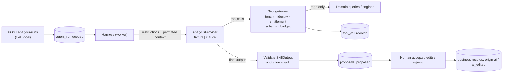

### 12.2 Skills

Ten skill bundles under `skills/` (PRD §8 list): `mandate-to-search-plan`, `market-boundary-definition`,
`bottom-up-sizing`, `cohort-deduplication`, `ability-to-win-assessment`, `scenario-economics`,
`assumption-prioritization`, `validation-experiment-design`, `pilot-plan`, `outcome-review`. Each has
`skill.yaml` (version, allowed tools, allowed proposal types, budget, model = configuration),
`instructions.md`, `fixtures/` (scripted turns for the fixture provider) and `evals/`. Skills confer no
permissions.

### 12.3 Tool gateway

Read-only or deterministic tools only: `intelligence.search`, `evidence.get`, `portfolio.get_product`,
`crm.get_authorized_accounts` (returns `connector_unavailable` in MVP), `sizing.calculate`,
`economics.calculate`, `work.preview_tasks`. Every call checks tenant, the requesting human's access,
licence entitlement, argument schema and budget, and writes a `tool_call` record with redacted args and
hashes. **There are no write tools.** `workflow.request_gate`, `work.create_approved_tasks` and
`outcomes.record` from the PRD's illustrative list are human commands; the agent can only propose them.

### 12.4 Output handling

Structured output must parse as `SkillOutput` (summary, proposals, unknowns, notChecked). Every cited
evidence id must have been returned to this run; otherwise the claim is downgraded to `unknown`. Numbers
must come from engine tool calls. Malformed output gets one repair attempt, then the run fails with an
error (never synthetic evidence). Proposals are stored with `status = proposed`; accepting writes the
business record with `origin = ai` or `ai_edited`. Regeneration never overwrites human edits: it creates a
new proposal that supersedes the pending one.

### 12.5 Budgets, checkpoints, resume

Default per-run budget: 5 minutes wall time (PRD §13), 40 tool calls, token and cost caps; per-case monthly
cost cap; tenant concurrency. Each step is checkpointed in `agent_run_step`; resume restarts from the last
checkpoint and reuses committed tool results. Budget exhausted → `partial` or `failed` with "Stopped — your
work is saved". The whole product works with AI disabled.

### 12.6 Prompt-injection controls

Source text is sanitized, stored, and passed only inside `<evidence id=… trust="untrusted">` data blocks
with a rule that it is data, not instructions. Restricted content never enters context. Tool names are an
allowlist; unknown tools are rejected. Even a successful injection cannot act: no write tools, proposals
need humans, and the database refuses agent approvals. Evals include injection cases with a zero-tolerance
threshold.

### 12.7 Providers and configuration

`ANALYSIS_PROVIDER=fixture` (default) replays scripted turns from `skills/<skill>/fixtures`; missing
fixture → error. `ANALYSIS_PROVIDER=claude` requires `ANTHROPIC_API_KEY` and `ANALYSIS_MODEL`; the model
name is configuration and is recorded per run (`agent_run.model_config`), never written in code. Use
zero-data-retention settings where available; traces store ids and hashes, not prompt text with
restricted values.

## 13. Outbox and task connector

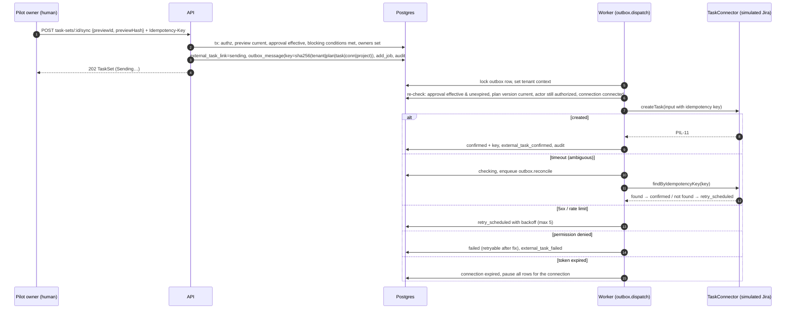

- **TaskConnector** (`packages/connectors`): `health`, `preview` (no writes), `createTask` (idempotent by
  key, stored on the external record), `findByIdempotencyKey`. Errors are typed: `timeout_ambiguous`,
  `transient`, `rate_limited`, `permission_denied`, `validation`, `token_expired`, `unavailable`.
- **Simulated connector** stores issues in `sim.external_issue` with `UNIQUE (connection_id,
  idempotency_key)` and allocates Jira-like keys (`PIL-11`, `VAL-1`). Fault rules in `sim.fault_rule`:
  timeout-after-success, 5xx, permission failure, expired token, rate limit. A real Jira adapter implements
  the same interface (issue property + label for the key; JQL search for reconcile).
- **Honest sync:** internal task status and external sync status are separate. "Confirmed · KEY" appears
  only with a key. Partial success shows per-task status ("5 of 6 tasks confirmed in Jira · 1 failed");
  retry sends only failed rows with the same keys. Expired connector → internal tasks stay active, CSV
  export fallback. Approval changed → "Paused — approval changed".
- **Crash safety:** a cron sweep (`outbox.sweep`) claims rows whose lease expired via
  `platform.claim_outbox_batch`, so a worker crash mid-send results in reconcile, not a duplicate.
- Task authorization never authorizes prospect communications: message drafts have no send endpoint.

## 14. Audit and analytics

- **Audit (ME-17):** every state change, evidence correction, approval, external write and admin change
  writes one `audit_event` in the same transaction: actor, actor kind and role, action, object type/id/
  version, case, before/after hash, business summary, authorization context (rule, grant), correlation id.
  Append-only by trigger and privileges. The History tab and admin audit read it.
- **Analytics (PRD §17):** exactly the 20 events (`mandate_created` … `case_stopped`), emitted from the same
  transaction into `platform.analytics_event` and flushed by the worker. The envelope carries the
  tenant-scoped case id, actor role, object version, timestamp, stage and correlation id. Properties are a
  closed, per-event whitelist (`AnalyticsProps` with `.strict()`), so restricted text, account details or
  confidential financial inputs cannot be added by accident.
- **Derived measures:** mandate-to-thesis (G0 approval → first reviewer-accepted thesis version), gate
  waiting time (valid submission → disposition; withdrawn and invalidated submissions tracked separately),
  run cost and corrections reported separately from business outcomes.

## 15. Observability, security and NFRs

| Area | Design |
|---|---|
| Logging | pino structured JSON; redaction of cookies, auth headers, request bodies; never log restricted values; log scrub test in CI |
| Tracing | correlation id from browser → API → job → connector/provider; OpenTelemetry spans around DB, provider and connector calls |
| Metrics | request latency p50/p95 per endpoint, job lag, outbox age, run cost/time, eval scores |
| Health | `/healthz` (process), readiness checks DB and job queue |
| Performance (PRD §13) | interactive reads p95 ≤ 2 s at pilot scale; analysis acknowledged immediately; bounded brief ≤ 5 min |
| Degradation | provider down → manual path; connector down → internal tasks + CSV export; finance source down → "Not available — …"; discovery source down → "Discovery partial" |
| Encryption | TLS in transit; managed Postgres and object storage encryption at rest (production); secrets in a secret manager, referenced by `secret_ref` |
| Least privilege | API role cannot claim outbox rows; worker is the only caller of provider and connector; agent package cannot import db/connectors |
| Input safety | Zod at every boundary; upload sanitization; no URL fetching in MVP (no SSRF surface) |
| Accessibility | WCAG 2.2 AA target; axe checks in e2e; status text with colour; tables for charts |
| Data residency, SSO/SCIM, backups/RPO/RTO, pen test | Pre-production decisions (PRD §13); listed as open risks in BUILD_PLAN |

## 16. Testing strategy and release gates

| Level | Tool | Location | Runs |
|---|---|---|---|
| Unit (pure) | Vitest | `packages/*/src/**/*.test.ts` | `pnpm test` (every push) |
| Database guards and RLS | Vitest + local Postgres | `packages/db/test`, `apps/api/test/db` | `pnpm test:db` |
| API integration | Vitest + Fastify inject + Postgres | `apps/api/test` | `pnpm test:db` |
| Connector faults | Vitest + simulator | `packages/connectors`, `apps/worker` | `pnpm test:db` |
| E2E and accessibility | Playwright + axe | `apps/web/e2e` | `pnpm test:e2e` |
| AI evaluations | eval runner | `evals/`, `skills/*/evals` | `pnpm evals:smoke` (CI, fixture), nightly with Claude |

**PRD §10 release gates mapped to suites (all must be green for the design-partner release):**

| Release gate | Suite | What it proves |
|---|---|---|
| Evidence rights confirmed | `security/entitlements` + manual licence sign-off | restricted sources never appear in excerpts, search, exports, model context or traces; aggregates do not leak counts |
| Approval bypass tests pass | `security/approval` (API) + `packages/db/test/guards.test.ts` (DB) | agent/service cannot decide; author/owner cannot approve; stale or different snapshot rejected; hash mismatch rejected; missing or insufficient authority rejected; admin cannot approve; expired/invalidated approval cannot execute |
| Calculations verified against fixtures | `domain/golden` (`packages/domain/src/me/golden.test.ts`) + property tests | Aster numbers exactly; determinism; no cross-measure sums; blocking checks |
| Tenant access adversarial tests pass | `security/tenancy` | cross-tenant read/write on every endpoint returns 404; RLS without context returns nothing |
| Task retries cause no duplicates | `integration/connector-faults` | timeout-after-success, 5xx, permission, expired token, worker crash mid-send, concurrent retry clicks → one external issue per key |
| Operators complete primary workflow | `e2e/aster-journey` | BUILD_PLAN §8 acceptance script end to end |
| Manual operation when AI fails | `e2e/ai-down` | provider forced to fail; full journey completes |
| Missing-data and failure paths | `e2e/variants` | restricted evidence, expired connector, duplicate cohort, stale approval, partial sync, SAM > TAM, missing owner |
| AI quality | `evals` | ≥ 95% expert-valid citations; 100% provenance or explicit unknown; 0 successful injections; 0 restricted leakage |
| Accessibility | `e2e/a11y` | axe clean on all screens; keyboard paths for gates and sync |
| Design partners repeat use and paid commitment | Business gate | Not a software test |

## 17. Deviations from the suggested layout

- Added **`packages/connectors`** so WS6 owns the connector interface and simulator without touching
  `packages/ai` (the agent must not see write paths) or the API.
- **`evals/` is a workspace package** so the runner can import `@growth-os/ai`.
- Folder name **`platform`** (not `shared`) everywhere for Growth OS primitives, matching the database
  schema and the lint rules.
- Internal packages export TypeScript source (no per-package build) with Bundler resolution; apps bundle
  for production (D-002).
