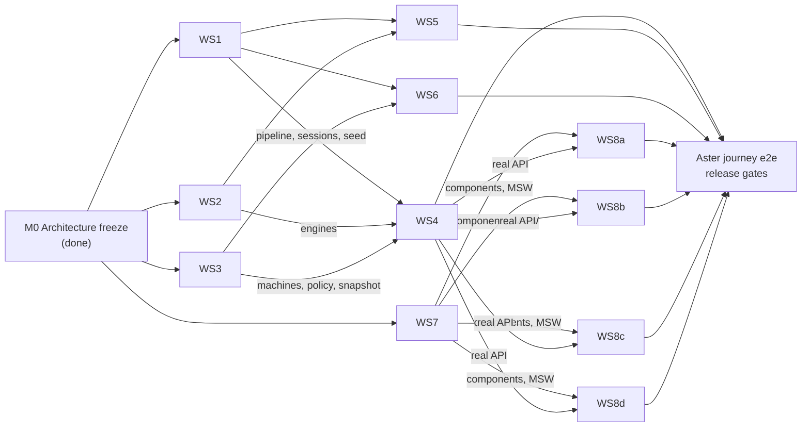

# Market Expansion OS — Build Plan (handoff to the Principal Engineer)

**Status:** Ready for build · architecture frozen (decisions.md D-031) · **Date:** 9 October 2026
**Read first:** [ARCHITECTURE](./ARCHITECTURE.md), [DATA_MODEL](./DATA_MODEL.md), [API](./API.md),
[FRONTEND](./FRONTEND.md), [`/CLAUDE.md`](../../../CLAUDE.md), [`/decisions.md`](../../../decisions.md),
[`/artifacts.md`](../../../artifacts.md).

---

## 1. What already exists (frozen contracts in code)

| Path | State | Notes |
|---|---|---|
| `packages/contracts` | **Frozen, complete** | Zod schemas for entities, enums with exact labels, engine IO, 143 endpoints with screen and PRD mapping, errors, events. Tests pass. |
| `packages/db/migrations/0001_init.sql` | **Frozen, applied and tested** | 99 tables, RLS, guards. `packages/db/test/guards.test.ts` proves approval, hash, RLS and append-only rules. |
| `packages/db/src` | Working | migration runner, `withTenant()`, generated Kysely types. `db:seed` is a stub (WS1). |
| `packages/domain` | Interfaces + frozen tables | transition tables, policy table, gate definitions, canonical hashing (implemented, tested); engines, policy engine, materiality and machines are TODO stubs. Golden tests are `it.todo`. |
| `packages/ai` | Interfaces | provider adapter, fixture/Claude provider stubs, tool gateway, harness contract. |
| `packages/connectors` | Interfaces | `TaskConnector`, typed errors, idempotency key function (implemented), simulator stub. |
| `packages/ui` | Tokens + format rules + prop contracts | `tokens.css` complete (light/dark); `format.ts` implemented and tested; components to build. |
| `fixtures/aster` | **Frozen, complete** | Every PRD §6 number, golden expectations, journey moments. |
| `apps/api` | Skeleton | registers every endpoint; returns `500 INTERNAL "Not implemented yet: <id>"` until a module handler lands. |
| `apps/worker` | Skeleton | job catalogue and crontab. |
| `apps/web` | Skeleton | frozen route table, typed client, placeholder screens. |
| `skills/*`, `evals/` | Skeleton | 10 skill bundles (yaml + instructions), 14 eval suites declared. |

`pnpm install && pnpm typecheck && pnpm lint && pnpm test` pass. `pnpm db:up && pnpm db:migrate && pnpm test:db`
pass on the local PostgreSQL 16 cluster.

## 2. Workstreams, ownership and dependencies

Ownership is by path. A stream may **read** anything; it **writes** only its paths. Shared registry files
(marked †) are append-only one-liners; resolve merge conflicts by keeping both lines.
`packages/contracts`, `packages/db/migrations/0001_init.sql` and `fixtures/aster` change only through a
change request (decisions.md "Architecture freeze").

| Stream | Scope | Owns (writes) | Depends on |
|---|---|---|---|
| **WS1 Platform / DB / identity** | seed runner; dev login + sessions; `withTenant` usage; idempotency store; audit + analytics writers; evidence ingestion, entitlements, freshness; object storage; CI pipeline; observability | `packages/db/src/**`, `packages/db/test/**`, new migrations `packages/db/migrations/0002_*.sql`+, `apps/api/src/platform/**`, `apps/api/src/modules/platform/{auth,evidence,search,comments,admin,audit}/**`, `apps/worker/src/jobs/{evidence,analytics}/**`, `scripts/**`, `.github/**` | contracts, migration |
| **WS2 Domain engines** | sizing, economics, ranking; golden + property tests; lineage builder | `packages/domain/src/me/{sizing,economics,comparison}/**`, `packages/domain/src/me/golden.test.ts` | contracts, fixtures |
| **WS3 Workflow and authz** | state machine runtime; policy engine; precondition evaluator; materiality evaluator; snapshot builder; timer jobs (expiry, pilot window) | `packages/domain/src/platform/{workflow,policy,materiality}/**`, `packages/domain/src/me/{lifecycle,gates}/**`, `apps/worker/src/jobs/timers/**` | contracts |
| **WS4 API modules** | every `me` and shared handler not owned by WS1/WS5/WS6; command pipeline usage; response serializers with redaction; API integration tests | `apps/api/src/modules/me/**`, `apps/api/src/modules/platform/{reviews,work}/**`, `apps/api/test/**`, `apps/api/src/modules/index.ts` † | WS1 pipeline (week 1), WS2, WS3 |
| **WS5 AI / analysis** | harness, fixture provider, Claude provider, tool gateway + handlers, skills content, proposals API, eval runner and cases | `packages/ai/**`, `skills/**`, `evals/**`, `apps/worker/src/jobs/analysis/**`, `apps/api/src/modules/analysis/**` | WS1 (runs table access), WS2 (calc tools) |
| **WS6 Connector / outbox** | simulator over `sim` schema; outbox dispatch, reconcile, sweep; authz re-check at send; task-sync API (preview/send/retry/export); dev fault endpoints; fault-injection suite | `packages/connectors/**`, `apps/worker/src/jobs/outbox/**`, `apps/api/src/modules/tasksync/**`, `apps/api/test/connector-faults/**` | WS1, WS3 (approval effectiveness) |
| **WS7 Frontend shell and design system** | components from `contracts.ts`; AppShell, CaseLayout, GateRail, ApprovalPanel, ledger family; api client helpers, drafts, idempotency, query invalidation; MSW mocks; Playwright + axe harness; `/design-system` page | `packages/ui/**`, `apps/web/src/{app,lib,mocks}/**`, `apps/web/src/main.tsx`, `apps/web/e2e/support/**`, `apps/web/src/screens/registry.ts` † | contracts, fixtures |
| **WS8a Screens: portfolio and discovery** | S01 Overview, S02 Mandate, S03 Opportunities, S04 Compare, My Work, Reviews inbox, login picker content | `apps/web/src/screens/{overview,mandate,opportunities,compare,my-work,reviews}/**`, their e2e specs | WS7 components; API or MSW |
| **WS8b Screens: assessment** | S05 Thesis, S06 Sizing, S07 Feasibility, S08 Economics | `apps/web/src/screens/{thesis,sizing,feasibility,economics}/**` | WS7 |
| **WS8c Screens: validate and decide** | S09 Validation, S10 Decisions, decision brief | `apps/web/src/screens/{validation,decisions,brief}/**` | WS7 |
| **WS8d Screens: execute, review, support** | S11 Pilot, S12 Outcomes, S13 Evidence, S14 Admin, History tab | `apps/web/src/screens/{pilot,outcomes,evidence,history,admin}/**` | WS7 |

**Dependency order (critical path):**

WS1, WS2, WS3 and WS7 start on day 1 in parallel. WS8 streams start on day 1 against MSW mocks built
from the fixture and switch to the real API endpoint by endpoint (the client is the same). WS5 and WS6
start their pure parts (harness, simulator) on day 1 and integrate when WS1's tenant runtime lands.

## 3. Milestones (demoable outcomes)

Each milestone ends with a demo on the Aster fixture and its CI suites green. Dates are for the PE to
estimate; the order is fixed.

### M1 — Walking skeleton (manual, no AI)
- WS1: seed `aster-start`; dev login for six personas; sessions; idempotency store; audit writer; CI.
- WS3: case, mandate, opportunity and gate-request machines; policy engine with role table; snapshot
  builder + hash; G0 preconditions.
- WS4: auth, `/me`, mandates, opportunities (shortlist/dismiss/merge/convert), cases header, G0 decision.
- WS7: shell, login, CaseLayout, GateRail, status components, ApprovalPanel v1, autosave hook.
- WS8a: S02 Mandate, S03 Opportunities, S01 Overview (cases table, decisions awaiting).
- **Demo:** Maya drafts MD-21, submits; Elena returns it with a comment; Maya fixes owner and currency
  and resubmits; Elena clicks "Approve mandate (G0)" on snapshot v2; Maya shortlists OPP-07 and converts
  it to ME-104 (stage Discovery). Every step is in `audit_event`. A sponsor cannot approve a snapshot that
  changed; Maya cannot approve.
- **Suites:** `security/tenancy` (first endpoints), `security/approval` (G0), DB guards.

### M2 — Assessment
- WS2: sizing and economics engines; golden tests on; property tests (determinism, no cross-measure sum,
  blocking checks); ranking.
- WS1: evidence upload and ingestion, entitlements on excerpt/search/export, freshness job.
- WS3: materiality evaluator (assumption and model commits).
- WS4: thesis/claims, sizing, lineage, feasibility, economics, assumptions/disputes, comparisons, evidence.
- WS8a: S04 Compare. WS8b: S05–S08. WS8d: S13 Evidence.
- **Demo:** ME-104 ladder shows €100m/year, €40m/year, 500 sites, €2.0m annual revenue (Base · Year 3)
  with lineage drawers; SAM > TAM and duplicate cohort variants block commit; Daniel disputes 20%
  adoption; economics scenario table matches the PRD; restricted vendor estimate shows no excerpt.

### M3 — Validate and decide
- WS3: G1/G2 preconditions; stale/refresh; invalidation; approval expiry timer; conditions.
- WS4: experiments (lock on G1, amend, append results), gate requests/snapshots/decisions/positions/
  dissent, review requests, material changes.
- WS8c: S09 Validation, S10 Decisions, decision brief. WS8a: Reviews inbox.
- **Demo:** G1 "Approve validation €15k" locks EXP-03; amendment 1 extends the window with the original
  visible; results 9 interviews / 4 commitments → Met; Lena signs "pilot only: up to 4 sites, 90 days";
  G2 package v3 with dissent; Maya edits Base adoption → v3 stale, approval disabled → refresh to v4;
  Elena approves "Approve pilot €120k · 90 days" with C1 (blocking) and C2 (monitor).

### M4 — Execute
- WS6: simulator with fault rules; outbox dispatch/reconcile/sweep; authz re-check at send; task-sync API;
  fault-injection suite (zero duplicates).
- WS4: pilot plan draft/activate, tasks, budget entries, scope change, message drafts (no send).
- WS8d: S11 Pilot. WS8a: My Work.
- **Demo:** activation blocked by missing owner and by open C1; Jonas previews 6 tasks for project PIL and
  creates them; permission fault on task 2 → "5 of 6 tasks confirmed in Jira · 1 failed"; fix mapping →
  "Retry 1 failed task" → 6 of 6 with no duplicates; timeout-after-success reconciles to Confirmed;
  expired token pauses sync, CSV export works; invalidating G2 pauses unsent tasks.

### M5 — Review, AI and hardening
- WS4/WS8d: outcomes (actuals with period and source), decision "Revise and extend validation",
  extension request X1 with placeholder cap, G3 blocked; S12; S14 Admin incl. diagnostics; History tab.
- WS5: harness, fixture provider, gateway tools, all 10 skills with fixture scripts, proposals UI hooks,
  evals smoke in CI, Claude provider behind env.
- All: e2e Aster journey + variants + ai-down + a11y; security suites; performance check (p95 ≤ 2 s
  reads on seeded data); log-scrub test.
- **Demo:** full acceptance script (§8) and every alternate path, with AI disabled and with the fixture
  provider.

## 4. CI commands each stream must keep green

| Command | What it runs | Required for |
|---|---|---|
| `pnpm lint` | ESLint incl. boundary rules | all |
| `pnpm typecheck` | `tsc` in every workspace | all |
| `pnpm test` | unit project (no DB) | all |
| `pnpm format:check` | Prettier | all |
| `pnpm db:up && pnpm db:migrate && pnpm test:db` | DB guards, API integration, connector faults | WS1, WS3, WS4, WS6 (and WS5 once runs touch the DB) |
| `pnpm evals:smoke` | eval suites with the fixture provider | WS5; any change to `skills/**` |
| `pnpm --filter @growth-os/web build` | production bundle | WS7, WS8* |
| `pnpm test:e2e` | Playwright journey, variants, a11y | WS7, WS8*, release |

The CI workflow (`.github/workflows/ci.yml`, WS1 maintains) runs all of the above with a Postgres 16
service.

## 5. Conventions every stream follows

- Read `/CLAUDE.md`. Never-rules there are release blockers.
- Contracts first: import types and schemas from `@growth-os/contracts`; never redefine an enum or a
  response shape locally.
- All writes go through the command pipeline inside `withTenant()`, write audit in the same transaction,
  and emit the PRD §17 analytics event where the transition table lists one.
- Numbers: decimal strings + decimal.js; format only with `packages/ui/format`.
- Every handler test includes a cross-tenant attempt and an unauthorized-role attempt.
- New tables or columns: a new migration file (never edit `0001_init.sql`), then `pnpm db:codegen`, then
  update DATA_MODEL.md (appendix regenerated) — through a change request if it alters a frozen contract.

## 6. Definition of done (per feature)

1. Matches the prototype screen and copy, including all variant states in FRONTEND.md §7.
2. Uses frozen contracts; request and response validated by Zod in tests.
3. Domain logic unit-tested; transitions and policy covered for every role that can and cannot act.
4. Audit event and analytics event asserted in an integration test; no restricted text in either.
5. Cross-tenant and unauthorized attempts return 404 / 403 with the right code.
6. Works with `ANALYSIS_PROVIDER=fixture` and with AI disabled.
7. Keyboard path and axe check pass; statuses have text + glyph; charts have tables.
8. Idempotency-Key / If-Match behaviour tested where the endpoint declares it.
9. Lint, typecheck, unit, db and e2e suites green; docs updated if behaviour or a contract changed.
10. Demo on the Aster fixture.

## 7. Seed profiles

`pnpm db:seed aster-start` (journey start: approved MD-21, detected opportunities, people, authority,
policies, licences, sources, connections) and `pnpm db:seed aster-demo` (history up to 26 Nov 2026: G2 v3
awaiting decision) both read `fixtures/aster`. Seeded rows are marked illustrative (`tenant.illustrative =
true`) so the UI shows "Illustrative data — synthetic".

## 8. End-to-end acceptance script — the Aster journey (PRD §15)

Runs as `apps/web/e2e/aster-journey.spec.ts` against a fresh `aster-start` seed with
`ANALYSIS_PROVIDER=fixture` and the simulated task tool. Each step asserts UI copy, API state, audit and
analytics. Times follow the fixture journey moments.

| # | Persona | Action | Expected |
|---|---|---|---|
| 1 | Maya | Log in via persona picker | Lands on Overview (operator); illustrative-data bar visible |
| 2 | Maya | Open Opportunities for MD-21 | "Discovery partial — 1 source unavailable" (trade registry); OPP-07 "Proposed · AI"; OPP-12 "Likely duplicate of OPP-07" |
| 3 | Maya | Merge OPP-12 into OPP-07; shortlist OPP-07 (`s`) | OPP-12 Duplicate (kept, linked); OPP-07 Shortlisted; `opportunity_shortlisted` emitted |
| 4 | Maya | Compare OPP-07, OPP-14, OPP-09, OPP-16 | Austrian breweries blocks ranking (company counts, 2024 prices) until excluded; Unknown cells shown, never 0; OPP-14 "Not ranked — 1 input missing" |
| 5 | Maya | Convert OPP-07 (owner Maya) | Case ME-104, stage Discovery; rail G0 Approved (5 Oct) |
| 6 | Maya | Start assessment; open Sizing | Ladder: TAM 5,000 sites · €100m/year; SAM 2,000 · €40m/year; Reachable 500 · "—"; SOM Base Year 3 · 100 customers · €2.0m annual revenue; formula `(1,400 + 1,100 − 500) × €20,000`; no total row |
| 7 | Maya | Variant: edit TAM to 500 | "Blocking: SAM is larger than TAM"; commit disabled; undo restores |
| 8 | Maya | Commit sizing v2; open lineage on SAM | Exact €40,000,000; inputs one level; used by SOM, economics |
| 9 | Daniel | Open Economics; dispute 20% adoption with 10% proposal | Dispute thread "Disputed by Daniel Weber"; Downside 10% assumption; scenario table €1.0m/€2.0m/€2.4m; €0.60m/€1.20m/€1.44m; €600k ×3; €0k (break-even)/€600k/€840k; €400k one-time separate; cash flow and payback "Not available"; `assumption_changed` emitted |
| 10 | Maya | Validation: create EXP-03 (20 sites, ≥ 8 interviews, ≥ 4 commitments, €15k); submit G1 | G1 snapshot v1 hashed; preconditions met (comparable sizing committed) |
| 11 | Elena | Reviews › Awaiting: "Approve validation €15k" | Authorizes / does not authorize boxes; approve with rationale → stage Validation; EXP-03 plan locked; `validation_authorized`, `gate_approved` |
| 12 | Maya | Preview validation tasks → create 5 tasks in Jira (ME-VAL) | Preview shows destination, assignees, permission; then "Confirmed · VAL-1…VAL-5" |
| 13 | Maya | Amend EXP-03 window to 20 Nov (reason) | Amendment 1; original window struck through as "Original (pre-registered)" |
| 14 | Maya | Record results 9 interviews / 4 commitments with period and source | Met · 9 of 8; Met · 4 of 4; limitations shown; `experiment_completed` |
| 15 | Lena | Sign specialist review "pilot only: up to 4 sites, 90 days" | Feasibility row Signed · pilot scope; G2 blocker resolved |
| 16 | Daniel | Sign finance review (checked / not checked lists) | Finance supports with conditions |
| 17 | Maya | Prepare G2 package (pilot €120k, 90 days, Jonas owner, stop rules, C1 proposed); submit | Snapshot v3 with fingerprint; dissent section shows Daniel's words; stage Pilot approval pending; `gate_submitted` |
| 18 | Maya | Try to approve G2 | Not offered; "You authored this package and cannot approve it." API returns `SELF_APPROVAL_PROHIBITED` if forced |
| 19 | Maya | Variant: change Base adoption (new version) | v3 Stale: "This snapshot is out of date: adoption assumption changed…"; approval disabled; refresh creates v4 (v3 superseded) |
| 20 | Elena | Approve "Approve pilot €120k · 90 days" on v4 with C1 (blocks execution) and C2 (monitor) | Approved with conditions; stage Pilot approved; expiry date shown; `gate_approved` |
| 21 | Jonas | Pilot: activate with task 2 unowned | Activation blocked: missing owner; then blocked by open C1 until marked met |
| 22 | Jonas | Assign owner, mark C1 met, activate; preview 6 tasks (PIL); create with permission fault on task 2 | "5 of 6 tasks confirmed in Jira · 1 failed (permission)"; `external_task_failed` |
| 23 | Jonas | Fix mapping; "Retry 1 failed task" | 6 of 6 confirmed; simulator has exactly 6 issues (one per key); `external_task_confirmed` ×6 |
| 24 | Jonas | Variant: timeout-after-success on a send | Status Checking → Confirmed after reconcile; no duplicate |
| 25 | Jonas | Record actuals: 3 of 4 paid use (billing), effort above assumption (effort log), buyer fit mixed | Not met · Not met · Inconclusive with periods and sources; `outcome_recorded` |
| 26 | Maya | Outcomes: recommendation "Revise and extend validation" with causal limitations | Recommendation card marked "not a decision" |
| 27 | Elena | Record decision Revise and extend; Maya requests extension €[cap] (placeholder) | Decision recorded; stage Validation; X1 Awaiting decision; `extension_requested` |
| 28 | Maya | Try "Request scale approval" | Disabled: "G3 preconditions unmet: demand threshold 3 of 4 (4 of 4 required); specialist scale-readiness review incomplete; economics and capacity not updated after the pilot; no scale budget stated"; the "Why?" list shows all four blockers; API `PRECONDITIONS_UNMET` with four `blockers` (interim per decisions.md D-039, open product question PQ-1) |
| 29 | Admin | S14: authority matrix shows "No G3 approver… Authority gap"; diagnostics show tool events only | Admin cannot approve any gate (`FORBIDDEN`) |
| 30 | Any | History tab | Every step above appears once in audit order with actor and version |

**Alternate paths (own specs):** missing data (finance source unavailable → "Not available —"), restricted
evidence (SRC-030 no excerpt anywhere; site list aggregates only for Jonas), expired connector (export
CSV, internal tasks continue), duplicate cohort (keep v1 / keep imported), stale approval (§8 step 19),
partial task sync (§8 step 22), approval invalidated after activation (spend ceiling change → unsent tasks
paused, sent tasks preserved), AI down (journey completes manually), cross-tenant attempts (404).

## 9. Risks and open decisions for the PE

| Risk / decision | Impact | Mitigation / owner |
|---|---|---|
| Licensed intelligence API and rights unknown (PRD §3, §14) | Discovery quality | MVP uses authorized uploads + licence table; adapter added when rights are confirmed |
| Real Jira edition and auth (OAuth 3LO vs service account) | WS6 adapter | Simulator first; Jira adapter behind the same interface after a sandbox spike |
| Approval ceilings, committees and expiry are customer policy | Gate UX | Placeholders in fixture; policies editable in S14 |
| Extension cap and duration not in PRD | X gate | Placeholders "€[cap]", "[duration] days"; PM to confirm |
| Upside adoption value not in PRD | Fixture | 30% chosen (any ≥ 24% reaches the cap); D-025 |
| Hosting, residency, SSO/SCIM, backups, pen test (PRD §13) | Production readiness | Pre-contract decisions; dev login is pilot-only |
| Model provider data terms | AI enablement | Fixture default; Claude only with ZDR settings and signed terms |
| Materiality too strict or loose | Approval churn | Versioned policy table; uncertain → escalate; review with design partners |
| Schedule pressure on 11 parallel streams | Integration bugs | Frozen contracts + MSW + weekly integration demo; never cut approval integrity, idempotency, redaction, audit, engine determinism, manual path or evals |
