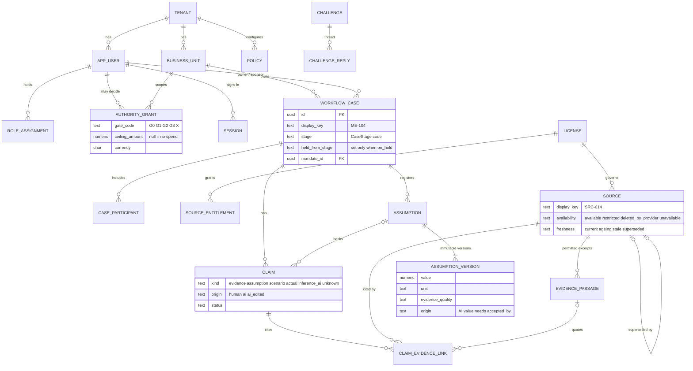
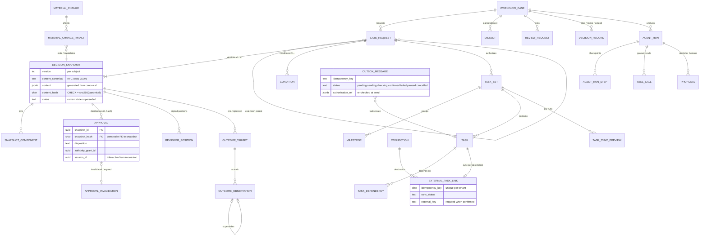
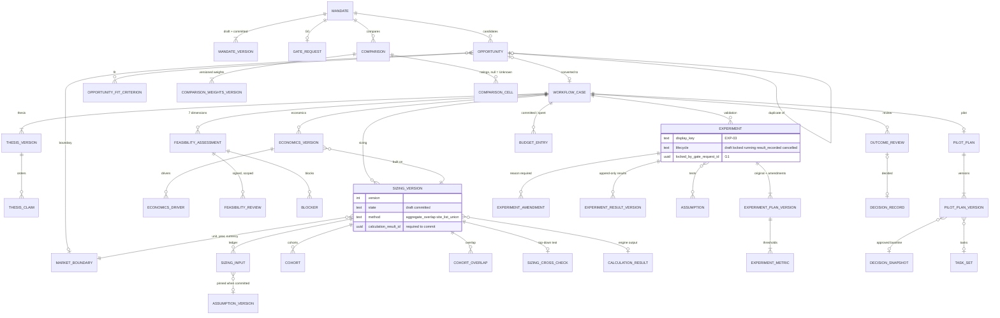

# Market Expansion OS — Data Model

**Status:** Frozen at the architecture stage (decisions.md D-031) · **Date:** 9 October 2026
**Source of truth:** [`packages/db/migrations/0001_init.sql`](../../../packages/db/migrations/0001_init.sql). The
column reference in the appendix is generated from the migrated database, so this document and the SQL
cannot drift. TypeScript row types are generated into `packages/db/src/generated/db.ts` with `pnpm db:codegen`.
API shapes are separate view models in `packages/contracts` (they are not table rows).

---

## 1. Principles

1. **Postgres is the system of record.** Business state, gates, approvals, tasks, agent runs and audit all
   live here. Agent memory is never a record (PRD §8).
2. **Three schemas = the module boundary.**
   - `platform` holds Growth OS shared primitives (PRD §9 "Shared" rows and §16): tenancy, identity,
     authority, policy, enterprise context, evidence and provenance, assumptions, the case envelope, gates,
     snapshots and approvals, tasks and the outbox, outcomes, agent runs, audit, analytics.
   - `me` holds Market Expansion objects: mandate, opportunity, comparison, market boundary, thesis,
     sizing, feasibility, economics, experiments, pilot plan, budget, outcome review.
   - `sim` is the simulated external task tool. It behaves like a remote system: no tenant RLS.
   `platform` DDL never references `me`, with one declared exception: the case envelope's
   `workflow_case.mandate_id → me.mandate` FK, which is added in the `me` section of the migration.
3. **Every table has `tenant_id`** (except `platform.tenant` and `sim.*`) and is protected by row-level
   security. The app roles cannot bypass RLS.
4. **Immutability is enforced by the database**, not only by code: append-only tables have triggers and
   revoked privileges; committed versions and their child rows cannot change; snapshot content is hashed
   and the database re-checks the hash.
5. **Money is `numeric(18,2)`, rates `numeric(24,8)` with a `[0,1]` check, counts `integer`.** The pg
   driver returns numerics as strings; nothing passes through a float (D-010).
6. **Enumerations are `text` + `CHECK`.** Codes match `@growth-os/contracts` enums exactly; labels live in
   the contracts label maps.
7. **Versioning pattern (D-011).** A versioned object has one mutable `draft` row and any number of
   immutable `committed` rows, with `UNIQUE(parent, version)` and a partial unique index allowing one draft.
   Child rows (inputs, cohorts, drivers) are guarded by `platform.guard_child_of_committed`.
8. **Human-readable keys** (`ME-104`, `OPP-07`, `EXP-03`, `SRC-014`, `MD-21`, `ME-104-G2`) are
   `display_key` columns, unique per tenant, allocated from `platform.display_key_counter`.

## 2. Entity-relationship diagrams

The model has 99 tables. The diagrams show the main entities and relationships in three views. Audit
columns (`created_at`, `created_by`, `row_version`) and `tenant_id` are omitted from the diagrams.

### 2.1 Platform: identity, authority, case envelope, evidence, assumptions

### 2.2 Platform: gates, snapshots, approvals, execution, outcomes, agent runs

### 2.3 Market Expansion (`me`)

## 3. Versioning, snapshots and immutability

| Object | Mutable while | Immutable when | Enforced by |
|---|---|---|---|
| `me.mandate_version`, `me.thesis_version`, `me.sizing_version`, `me.economics_version`, `me.pilot_plan_version` | `state = 'draft'` (one per parent) | `state = 'committed'` | `platform.guard_committed_version` trigger; partial unique index for one draft |
| Children: `me.sizing_input`, `me.cohort`, `me.cohort_overlap`, `me.sizing_cross_check`, `me.economics_driver`, `me.thesis_claim` | parent is draft | parent committed (insert, update, delete all refused) | `platform.guard_child_of_committed(parent, fk)` |
| `me.sizing_version` / `me.economics_version` commit | — | needs `calculation_result_id` | `CHECK (state = 'draft' OR calculation_result_id IS NOT NULL)` |
| `platform.assumption_version` | never (insert only) | always | trigger + revoked UPDATE/DELETE |
| `platform.decision_snapshot` | only `status`, `stale_*`, `superseded_by_snapshot_id` | content, hash, version, gate request, subject | `platform.guard_snapshot` trigger; `CHECK content_hash = sha256(content_canonical)` |
| `platform.approval` | never | always; invalidation is a separate row in `approval_invalidation` | trigger + privileges; composite FK `(snapshot_id, snapshot_hash)` |
| `me.experiment_plan_version` | experiment `lifecycle = 'draft'` | once locked; changes become `me.experiment_amendment` + a new plan version | `me.guard_experiment_plan` |
| `me.experiment_result_version`, `platform.outcome_observation` | never | always; corrections append a new version (`supersedes_id`) | trigger + privileges |
| `platform.audit_event`, `platform.tool_call`, `platform.calculation_result`, `platform.dissent`, `platform.decision_record`, `me.feasibility_review`, `me.budget_entry`, `me.comparison_weights_version`, `me.market_boundary`, `platform.outcome_target`, `platform.snapshot_component`, `me.experiment_amendment`, `me.experiment_decision` | never | always | `platform.forbid_mutation` + revoked UPDATE/DELETE |

**Snapshot hashing.** The API builds `SnapshotContent` (contracts `entities/gate.ts`), canonicalizes it
with `canonicalize()` (RFC 8785 subset: sorted keys, no whitespace, integers only, money as decimal
strings) and inserts `content_canonical` with `content_hash = sha256_hex(utf8(canonical))`. The database
computes the same hash in a CHECK and rejects a mismatch. `content` is a generated `jsonb` column for
querying. `snapshot_component` indexes every pinned version so the materiality evaluator can find affected
snapshots with one indexed lookup.

## 4. Approval invariants in the database (defence in depth)

`platform.guard_approval_insert` refuses an approval row unless:

- the snapshot belongs to the gate request, is `current`, and the gate request is `awaiting_decision`;
- the approver is `kind = 'human'` and the `session_id` is that approver's own interactive, unexpired,
  unrevoked session (no service or agent identity, no borrowed session);
- for `approve` / `approve_with_conditions`: the approver is not the snapshot author and not the case
  owner, and the `authority_grant_id` is a valid, unrevoked grant of that approver (the composite FK
  `(snapshot_id, snapshot_hash)` guarantees the hash is the snapshot's hash).

Ceiling and business-unit matching stay in the policy engine (they need policy context). The DB guard
exists so an application bug cannot create a bypass. `packages/db/test/guards.test.ts` proves each rule.

## 5. Row-level security

- `ALTER TABLE … ENABLE ROW LEVEL SECURITY` and `FORCE ROW LEVEL SECURITY` on every `platform`/`me` table.
- Policy `tenant_isolation`: `USING (tenant_id = platform.current_tenant_id()) WITH CHECK (same)`;
  `platform.tenant` uses `tenant_self` on `id`.
- `platform.current_tenant_id()` reads `app.tenant_id` set with `SET LOCAL` (via `set_config(…, true)`) by
  `withTenant()` at the start of each transaction. Unset → `NULL` → no rows (fail closed).
- Roles: `me_owner` owns objects and runs migrations; `me_app` (API) and `me_worker` (jobs) are
  `NOBYPASSRLS`, own nothing, and lack UPDATE/DELETE on append-only tables.
- Cross-tenant work by the worker goes only through two `SECURITY DEFINER` functions that return ids:
  `platform.list_tenant_ids()` and `platform.claim_outbox_batch(batch, lease)`. The worker then sets the
  tenant context per item. `me_app` cannot execute them.
- RLS isolates tenants. Resource-level access inside a tenant (business unit, case participation, licence
  entitlement, named reviewer) is enforced by the policy engine and serializers (ARCHITECTURE.md §7).

## 6. Key relationships (PRD §9)

| PRD relationship | Implementation |
|---|---|
| Mandate owns opportunities | `me.opportunity.mandate_id` |
| Shortlisted opportunity creates a case | `me.opportunity.converted_case_id`; `workflow_case.origin_type = 'opportunity'`, `origin_id` |
| Case has versioned thesis, sizing/economics, assessments, experiments and plans | `me.*_version` per case; `me.feasibility_*`, `me.experiment*`, `me.pilot_plan*` |
| Gate approval references one immutable snapshot | `platform.approval (snapshot_id, snapshot_hash)` composite FK |
| Tasks reference the approved plan | `platform.task_set.authorizing_gate_request_id`; `me.pilot_plan_version.task_set_id`, `baseline_snapshot_id` |
| Outcome observations reference targets and baseline | `platform.outcome_target.snapshot_id`; `platform.outcome_observation.target_id` |
| Evidence supports many claims; access rechecked at retrieval | `platform.claim_evidence_link`; entitlement checked per read (§7 of ARCHITECTURE) |
| Source facts vs model interpretations stored distinctly | `platform.evidence_passage` (permitted excerpt) vs `platform.claim` (`kind`, `origin`) vs `platform.proposal` |
| AppHandoff (P1) | Not in MVP schema. `workflow_case.origin_type = 'handoff'` is reserved; a `platform.app_handoff` table is added by change request with ME-18 |

## 7. Indexing strategy

Indexes cover the read paths behind the 2-second target (PRD §13): case lists by stage and owner,
open gate requests, review requests per reviewer, tasks per owner, outbox readiness, audit per case and per
object, analytics by event name, materiality lookups via `snapshot_component`, and evidence lookups by
source. All tenant-scoped indexes lead with `tenant_id`. Partial unique indexes enforce "one draft" and "one
active policy" rules.

## 8. Retention and deletion

Approval history, audit, snapshots and decisions are retained under the tenant retention policy
(`platform.policy` kind `retention`); the PRD requires deletion procedures that stay compatible with
approval history (§13). A deleted source keeps its metadata row (`availability = 'deleted_by_provider'`,
`deleted_at`, `content_sha256`) and its object is removed from storage, so provenance and impact remain
visible (S13). Hard deletion of tenant data is an offline, audited procedure owned by WS1 and is out of the
MVP API.

---

## Wave 4 additions — migration `0006_product_decisions.sql` (D-122 … D-138)

Additive only. Four new tenant-scoped tables (RLS forced, explicit grants because 0001's loop only covered the tables
that existed then), 22 new nullable or defaulted columns on 9 existing tables, three guard triggers, two NOT VALID
licence constraints and seven indexes. No existing column, constraint, trigger or policy changed. Appendix A
predates 0004–0006; this section is the reference for 0006 (generated from the migrated schema).

| Decision | Table / column | Rule enforced in the database |
|---|---|---|
| D-123 | `platform.authority_grant.doa_reference` | non-empty when present |
| D-124 | `platform.committee_member` | humans only; one live holder per seat per BU; an admin never seats themselves |
| D-124 | `platform.approval.committee_seat` | one of chair/finance/operations; one decision per seat per snapshot (`approval_one_per_seat_idx`) |
| D-126 | `platform.outcome_target.measure_type` | one of demand, delivery_effort, buyer_fit, spend, other |
| D-129 | `platform.license.rights_*`, `term_ends_on`, `on_expiry_action`, `expired_at` | `license_fail_closed`: permissions above metadata only need a written confirmation and no expiry; `license_confirmation_complete` (NOT VALID: binds new and changed rows) |
| D-130 | `platform.tenant_ai_setting` | live analysis on only with addendum reference + date and eval run reference + time |
| D-132 | `me.sizing_input.basis_text`, `me.feasibility_assessment.question_detail`, `platform.milestone.due_on/evidence_expected`, `platform.task.budget_*` | task budget amount ≥ 0 and its currency together |
| D-128 | `platform.task.removed_at/removed_by` | `task_removal_guard`: a sent task cannot be removed; removal is final; never a DELETE |
| D-133 | `me.budget_entry.reference/task_id/reverses_entry_id/reversal_reason` | `budget_entry_reversal_guard`: same gate, kind, amount, currency; a reversal is never reversed; one reversal per entry; reason required |
| D-135 | `platform.connection_credential`, `platform.connector_oauth_state` | ciphertext only; state stored as a hash and used once |

#### `me.budget_entry` (new columns)

| Column | Type | Null | Default / reference |
|---|---|---|---|
| `reference` | text | yes |  |
| `task_id` | uuid | yes | → `platform.task` |
| `reverses_entry_id` | uuid | yes | → `me.budget_entry` |
| `reversal_reason` | text | yes |  |

#### `me.feasibility_assessment` (new columns)

| Column | Type | Null | Default / reference |
|---|---|---|---|
| `question_detail` | text | yes |  |

#### `me.sizing_input` (new columns)

| Column | Type | Null | Default / reference |
|---|---|---|---|
| `basis_text` | text | yes |  |

#### `platform.approval` (new columns)

| Column | Type | Null | Default / reference |
|---|---|---|---|
| `committee_seat` | text | yes |  |

#### `platform.authority_grant` (new columns)

| Column | Type | Null | Default / reference |
|---|---|---|---|
| `doa_reference` | text | yes |  |

#### `platform.committee_member`

PK (id) · Unique live seat `committee_member_one_live_seat_idx` (tenant_id, business_unit_id, seat) WHERE revoked_at IS NULL · Index `committee_member_user_idx` · Checks: valid_to ≥ valid_from, entered_by ≠ user_id · Trigger committee_member_guard (humans only) · RLS `tenant_isolation`

| Column | Type | Null | Default / reference |
|---|---|---|---|
| `id` | uuid | no | default `gen_random_uuid()` |
| `tenant_id` | uuid | no | → `platform.tenant` |
| `business_unit_id` | uuid | no | → `platform.business_unit` |
| `user_id` | uuid | no | → `platform.app_user` |
| `seat` | text | no |  |
| `valid_from` | date | no |  |
| `valid_to` | date | yes |  |
| `doa_reference` | text | yes |  |
| `entered_by` | uuid | no | → `platform.app_user` |
| `created_at` | timestamptz | no | default `now()` |
| `revoked_at` | timestamptz | yes |  |

#### `platform.connection_credential`

PK (connection_id) · ciphertext and key id only (AES-256-GCM in the application) · RLS `tenant_isolation` · me_worker SELECT, UPDATE (token refresh)

| Column | Type | Null | Default / reference |
|---|---|---|---|
| `connection_id` | uuid | no | → `platform.connection` |
| `tenant_id` | uuid | no | → `platform.tenant` |
| `kind` | text | no | default `'oauth2_3lo'::text` |
| `access_token_ciphertext` | bytea | no |  |
| `refresh_token_ciphertext` | bytea | yes |  |
| `key_id` | text | no |  |
| `token_expires_at` | timestamptz | no |  |
| `scopes` | text[] | no | default `'{}'::text[]` |
| `site_url` | text | no |  |
| `cloud_id` | text | no |  |
| `account_id` | text | yes |  |
| `account_display_name` | text | yes |  |
| `authorized_by` | uuid | no | → `platform.app_user` |
| `authorized_at` | timestamptz | no | default `now()` |
| `refreshed_at` | timestamptz | yes |  |
| `revoked_at` | timestamptz | yes |  |

#### `platform.connector_oauth_state`

PK (state_hash = sha256(state)) · Index `connector_oauth_state_expiry_idx` · single use (`used_at`) · RLS `tenant_isolation`

| Column | Type | Null | Default / reference |
|---|---|---|---|
| `state_hash` | char(64) | no |  |
| `tenant_id` | uuid | no | → `platform.tenant` |
| `connection_id` | uuid | no | → `platform.connection` |
| `user_id` | uuid | no | → `platform.app_user` |
| `created_at` | timestamptz | no | default `now()` |
| `expires_at` | timestamptz | no |  |
| `used_at` | timestamptz | yes |  |

#### `platform.license` (new columns)

| Column | Type | Null | Default / reference |
|---|---|---|---|
| `rights_document_ref` | text | yes |  |
| `rights_confirmed_on` | date | yes |  |
| `rights_recorded_by` | uuid | yes | → `platform.app_user` |
| `term_ends_on` | date | yes |  |
| `on_expiry_action` | text | no | default `'remove_content_keep_metadata'::text` |
| `expired_at` | timestamptz | yes |  |

#### `platform.milestone` (new columns)

| Column | Type | Null | Default / reference |
|---|---|---|---|
| `due_on` | date | yes |  |
| `evidence_expected` | text | yes |  |

#### `platform.outcome_target` (new columns)

| Column | Type | Null | Default / reference |
|---|---|---|---|
| `measure_type` | text | yes |  |

#### `platform.task` (new columns)

| Column | Type | Null | Default / reference |
|---|---|---|---|
| `budget_amount` | numeric(18,2) | yes |  |
| `budget_currency` | char(3) | yes |  |
| `budget_note` | text | yes |  |
| `removed_at` | timestamptz | yes |  |
| `removed_by` | uuid | yes | → `platform.app_user` |

#### `platform.tenant_ai_setting`

PK (tenant_id) · Check: live_enabled ⇒ addendum_ref, addendum_signed_on, eval_run_ref, eval_passed_at · RLS `tenant_isolation`

| Column | Type | Null | Default / reference |
|---|---|---|---|
| `tenant_id` | uuid | no | → `platform.tenant` |
| `live_enabled` | boolean | no | default `false` |
| `addendum_ref` | text | yes |  |
| `addendum_signed_on` | date | yes |  |
| `eval_run_ref` | text | yes |  |
| `eval_passed_at` | timestamptz | yes |  |
| `changed_by` | uuid | yes | → `platform.app_user` |
| `changed_at` | timestamptz | no | default `now()` |

---

## Appendix A — Column reference (generated from the migrated schema)

Legend: `→` is a foreign key. Every `platform`/`me` table carries RLS policy `tenant_isolation`.

### Schema `me`

#### `me.blocker`

PK (id) · RLS `tenant_isolation`

| Column | Type | Null | Default / reference |
|---|---|---|---|
| `id` | uuid | no | default `gen_random_uuid()` |
| `tenant_id` | uuid | no | → `platform.tenant` |
| `case_id` | uuid | no | → `platform.workflow_case` |
| `assessment_id` | uuid | yes | → `me.feasibility_assessment` |
| `text` | text | no |  |
| `owner_user_id` | uuid | yes | → `platform.app_user` |
| `due_on` | date | yes |  |
| `blocks_gate` | text | no |  |
| `status` | text | no | default `'open'::text` |
| `resolution` | text | yes |  |
| `resolved_by` | uuid | yes | → `platform.app_user` |
| `resolved_at` | timestamptz | yes |  |
| `scope_restriction_gate_request_id` | uuid | yes | → `platform.gate_request` |
| `created_at` | timestamptz | no | default `now()` |

#### `me.budget_entry`

PK (id) · Triggers budget_entry_immutable · RLS `tenant_isolation`

| Column | Type | Null | Default / reference |
|---|---|---|---|
| `id` | uuid | no | default `gen_random_uuid()` |
| `tenant_id` | uuid | no | → `platform.tenant` |
| `case_id` | uuid | no | → `platform.workflow_case` |
| `gate_request_id` | uuid | no | → `platform.gate_request` |
| `kind` | text | no |  |
| `amount` | numeric(18,2) | no |  |
| `currency` | char(3) | no |  |
| `as_of` | date | no |  |
| `source_text` | text | no |  |
| `recorded_by` | uuid | no | → `platform.app_user` |
| `recorded_at` | timestamptz | no | default `now()` |

#### `me.cohort`

PK (id) · Triggers cohort_guard · RLS `tenant_isolation`

| Column | Type | Null | Default / reference |
|---|---|---|---|
| `id` | uuid | no | default `gen_random_uuid()` |
| `tenant_id` | uuid | no | → `platform.tenant` |
| `sizing_version_id` | uuid | no | → `me.sizing_version` |
| `name` | text | no |  |
| `qualifier` | text | yes |  |
| `rule` | text | no |  |
| `site_count` | integer | no |  |
| `population_unit` | text | no |  |
| `price_year` | integer | no |  |
| `source_id` | uuid | yes | → `platform.source` |
| `site_list_ref` | text | yes |  |
| `status` | text | no | default `'active'::text` |
| `ordinal` | integer | no |  |

#### `me.cohort_overlap`

PK (id) · Unique (sizing_version_id, cohort_a_id, cohort_b_id) · Triggers cohort_overlap_guard · RLS `tenant_isolation`

| Column | Type | Null | Default / reference |
|---|---|---|---|
| `id` | uuid | no | default `gen_random_uuid()` |
| `tenant_id` | uuid | no | → `platform.tenant` |
| `sizing_version_id` | uuid | no | → `me.sizing_version` |
| `cohort_a_id` | uuid | no | → `me.cohort` |
| `cohort_b_id` | uuid | no | → `me.cohort` |
| `overlap_count` | integer | no |  |
| `method_text` | text | no |  |

#### `me.comparison`

PK (id) · RLS `tenant_isolation`

| Column | Type | Null | Default / reference |
|---|---|---|---|
| `id` | uuid | no | default `gen_random_uuid()` |
| `tenant_id` | uuid | no | → `platform.tenant` |
| `mandate_id` | uuid | no | → `me.mandate` |
| `opportunity_ids` | uuid[] | no |  |
| `common_unit_text` | text | no |  |
| `selected_opportunity_id` | uuid | yes | → `me.opportunity` |
| `created_by` | uuid | no | → `platform.app_user` |
| `created_at` | timestamptz | no | default `now()` |

#### `me.comparison_cell`

PK (id) · Unique (comparison_id, opportunity_id, attribute) · RLS `tenant_isolation`

| Column | Type | Null | Default / reference |
|---|---|---|---|
| `id` | uuid | no | default `gen_random_uuid()` |
| `tenant_id` | uuid | no | → `platform.tenant` |
| `comparison_id` | uuid | no | → `me.comparison` |
| `opportunity_id` | uuid | no | → `me.opportunity` |
| `attribute` | text | no |  |
| `rating` | integer | yes |  |
| `value_text` | text | yes |  |
| `detail_text` | text | yes |  |
| `incomparable` | boolean | no | default `false` |
| `rated_by` | uuid | yes | → `platform.app_user` |
| `source_ids` | uuid[] | no | default `'{}'::uuid[]` |

#### `me.comparison_exclusion`

PK (comparison_id, opportunity_id) · RLS `tenant_isolation`

| Column | Type | Null | Default / reference |
|---|---|---|---|
| `tenant_id` | uuid | no | → `platform.tenant` |
| `comparison_id` | uuid | no | → `me.comparison` |
| `opportunity_id` | uuid | no | → `me.opportunity` |
| `reason` | text | no |  |
| `excluded_by` | uuid | no | → `platform.app_user` |
| `excluded_at` | timestamptz | no | default `now()` |

#### `me.comparison_weights_version`

PK (id) · Unique (comparison_id, version) · Triggers comparison_weights_immutable · RLS `tenant_isolation`

| Column | Type | Null | Default / reference |
|---|---|---|---|
| `id` | uuid | no | default `gen_random_uuid()` |
| `tenant_id` | uuid | no | → `platform.tenant` |
| `comparison_id` | uuid | no | → `me.comparison` |
| `version` | integer | no |  |
| `product_fit` | integer | no |  |
| `channel_access` | integer | no |  |
| `evidence_coverage` | integer | no |  |
| `applied_by` | uuid | no | → `platform.app_user` |
| `applied_at` | timestamptz | no | default `now()` |

#### `me.competitor_entry`

PK (id) · RLS `tenant_isolation`

| Column | Type | Null | Default / reference |
|---|---|---|---|
| `id` | uuid | no | default `gen_random_uuid()` |
| `tenant_id` | uuid | no | → `platform.tenant` |
| `case_id` | uuid | no | → `platform.workflow_case` |
| `text` | text | no |  |
| `source_id` | uuid | yes | → `platform.source` |
| `unknown` | boolean | no | default `false` |

#### `me.economics_driver`

PK (id) · Unique (economics_version_id, input_key) · Triggers economics_driver_guard · RLS `tenant_isolation`

| Column | Type | Null | Default / reference |
|---|---|---|---|
| `id` | uuid | no | default `gen_random_uuid()` |
| `tenant_id` | uuid | no | → `platform.tenant` |
| `economics_version_id` | uuid | no | → `me.economics_version` |
| `input_key` | text | no |  |
| `label` | text | no |  |
| `value` | numeric(24,8) | no |  |
| `unit` | text | no |  |
| `time_basis` | text | yes |  |
| `assumption_id` | uuid | yes | → `platform.assumption` |
| `assumption_version_id` | uuid | yes | → `platform.assumption_version` |

#### `me.economics_version`

PK (id) · Unique (case_id, version) · Indexes `economics_one_draft_idx` (case_id) WHERE (state = 'draft'::text) · Triggers economics_version_guard, economics_version_touch · RLS `tenant_isolation`

| Column | Type | Null | Default / reference |
|---|---|---|---|
| `id` | uuid | no | default `gen_random_uuid()` |
| `tenant_id` | uuid | no | → `platform.tenant` |
| `case_id` | uuid | no | → `platform.workflow_case` |
| `version` | integer | no |  |
| `state` | text | no | default `'draft'::text` |
| `sizing_version_id` | uuid | no | → `me.sizing_version` |
| `currency` | char(3) | no |  |
| `price_year` | integer | no |  |
| `horizon_years` | integer | no |  |
| `exclusions_text` | text | no |  |
| `calculation_result_id` | uuid | yes | → `platform.calculation_result` |
| `row_version` | integer | no | default `0` |
| `committed_at` | timestamptz | yes |  |
| `committed_by` | uuid | yes | → `platform.app_user` |
| `created_by` | uuid | no | → `platform.app_user` |
| `created_at` | timestamptz | no | default `now()` |
| `updated_at` | timestamptz | no | default `now()` |

#### `me.experiment`

PK (id) · Unique (tenant_id, display_key) · Triggers experiment_touch · RLS `tenant_isolation`

| Column | Type | Null | Default / reference |
|---|---|---|---|
| `id` | uuid | no | default `gen_random_uuid()` |
| `tenant_id` | uuid | no | → `platform.tenant` |
| `case_id` | uuid | no | → `platform.workflow_case` |
| `display_key` | text | no |  |
| `title` | text | no |  |
| `lifecycle` | text | no | default `'draft'::text` |
| `owner_user_id` | uuid | no | → `platform.app_user` |
| `fieldwork_owner_user_id` | uuid | yes | → `platform.app_user` |
| `locked_by_gate_request_id` | uuid | yes | → `platform.gate_request` |
| `locked_at` | timestamptz | yes |  |
| `current_plan_version` | integer | no | default `1` |
| `illustrative` | boolean | no | default `false` |
| `row_version` | integer | no | default `0` |
| `created_by` | uuid | no | → `platform.app_user` |
| `created_at` | timestamptz | no | default `now()` |
| `updated_at` | timestamptz | no | default `now()` |

#### `me.experiment_amendment`

PK (id) · Unique (experiment_id, number) · Triggers experiment_amendment_immutable · RLS `tenant_isolation`

| Column | Type | Null | Default / reference |
|---|---|---|---|
| `id` | uuid | no | default `gen_random_uuid()` |
| `tenant_id` | uuid | no | → `platform.tenant` |
| `experiment_id` | uuid | no | → `me.experiment` |
| `number` | integer | no |  |
| `from_plan_version` | integer | no |  |
| `to_plan_version` | integer | no |  |
| `reason` | text | no |  |
| `changed_fields` | text[] | no |  |
| `thresholds_changed` | boolean | no |  |
| `after_results_seen` | boolean | no |  |
| `author_id` | uuid | no | → `platform.app_user` |
| `created_at` | timestamptz | no | default `now()` |

#### `me.experiment_assumption`

PK (experiment_id, assumption_id) · RLS `tenant_isolation`

| Column | Type | Null | Default / reference |
|---|---|---|---|
| `tenant_id` | uuid | no | → `platform.tenant` |
| `experiment_id` | uuid | no | → `me.experiment` |
| `assumption_id` | uuid | no | → `platform.assumption` |

#### `me.experiment_decision`

PK (id) · Triggers experiment_decision_immutable · RLS `tenant_isolation`

| Column | Type | Null | Default / reference |
|---|---|---|---|
| `id` | uuid | no | default `gen_random_uuid()` |
| `tenant_id` | uuid | no | → `platform.tenant` |
| `experiment_id` | uuid | no | → `me.experiment` |
| `decision_text` | text | no |  |
| `decided_by` | uuid | no | → `platform.app_user` |
| `decided_at` | timestamptz | no | default `now()` |

#### `me.experiment_metric`

PK (id) · Unique (plan_version_id, metric_key) · RLS `tenant_isolation`

| Column | Type | Null | Default / reference |
|---|---|---|---|
| `id` | uuid | no | default `gen_random_uuid()` |
| `tenant_id` | uuid | no | → `platform.tenant` |
| `plan_version_id` | uuid | no | → `me.experiment_plan_version` |
| `metric_key` | text | no |  |
| `name` | text | no |  |
| `operator` | text | no |  |
| `threshold_value` | numeric(24,8) | yes |  |
| `threshold_text` | text | no |  |
| `unit` | text | no |  |

#### `me.experiment_plan_version`

PK (id) · Unique (experiment_id, version) · Indexes `experiment_one_original_idx` (experiment_id) WHERE is_original · Triggers experiment_plan_guard · RLS `tenant_isolation`

| Column | Type | Null | Default / reference |
|---|---|---|---|
| `id` | uuid | no | default `gen_random_uuid()` |
| `tenant_id` | uuid | no | → `platform.tenant` |
| `experiment_id` | uuid | no | → `me.experiment` |
| `version` | integer | no |  |
| `is_original` | boolean | no | default `false` |
| `hypothesis` | text | no |  |
| `method` | text | no |  |
| `sample_text` | text | no |  |
| `sample_size` | integer | yes |  |
| `selection_text` | text | no |  |
| `nonresponse_note` | text | no |  |
| `window_start` | date | no |  |
| `window_end` | date | no |  |
| `budget_amount` | numeric(18,2) | yes |  |
| `currency` | char(3) | yes |  |
| `budget_note` | text | yes |  |
| `decision_rules` | jsonb | no | default `'[]'::jsonb` |
| `created_by` | uuid | no | → `platform.app_user` |
| `created_at` | timestamptz | no | default `now()` |

#### `me.experiment_result_version`

PK (id) · Unique (experiment_id, version) · Triggers experiment_result_immutable · RLS `tenant_isolation`

| Column | Type | Null | Default / reference |
|---|---|---|---|
| `id` | uuid | no | default `gen_random_uuid()` |
| `tenant_id` | uuid | no | → `platform.tenant` |
| `experiment_id` | uuid | no | → `me.experiment` |
| `version` | integer | no |  |
| `observations` | jsonb | no |  |
| `period_start` | date | no |  |
| `period_end` | date | no |  |
| `source_text` | text | no |  |
| `interpretation` | text | no |  |
| `limitations` | text | no |  |
| `recorded_by` | uuid | no | → `platform.app_user` |
| `recorded_at` | timestamptz | no | default `now()` |

#### `me.feasibility_assessment`

PK (id) · Unique (case_id, dimension) · RLS `tenant_isolation`

| Column | Type | Null | Default / reference |
|---|---|---|---|
| `id` | uuid | no | default `gen_random_uuid()` |
| `tenant_id` | uuid | no | → `platform.tenant` |
| `case_id` | uuid | no | → `platform.workflow_case` |
| `dimension` | text | no |  |
| `question` | text | no |  |
| `evidence_text` | text | no | default `''::text` |
| `reviewer_user_id` | uuid | no | → `platform.app_user` |
| `status` | text | no | default `'pending'::text` |
| `scope_text` | text | no | default `'Not yet reviewed'::text` |
| `due_on` | date | yes |  |
| `human_only` | boolean | no | default `false` |
| `current_review_id` | uuid | yes | → `me.feasibility_review` |

#### `me.feasibility_disagreement`

PK (id) · RLS `tenant_isolation`

| Column | Type | Null | Default / reference |
|---|---|---|---|
| `id` | uuid | no | default `gen_random_uuid()` |
| `tenant_id` | uuid | no | → `platform.tenant` |
| `assessment_id` | uuid | no | → `me.feasibility_assessment` |
| `author_id` | uuid | no | → `platform.app_user` |
| `statement` | text | no |  |
| `created_at` | timestamptz | no | default `now()` |

#### `me.feasibility_review`

PK (id) · Unique (assessment_id, version) · Triggers feasibility_review_immutable, feasibility_review_signer · RLS `tenant_isolation`

| Column | Type | Null | Default / reference |
|---|---|---|---|
| `id` | uuid | no | default `gen_random_uuid()` |
| `tenant_id` | uuid | no | → `platform.tenant` |
| `assessment_id` | uuid | no | → `me.feasibility_assessment` |
| `version` | integer | no |  |
| `position` | text | no |  |
| `scope_text` | text | no |  |
| `covers_gate` | text | yes |  |
| `max_sites` | integer | yes |  |
| `max_days` | integer | yes |  |
| `statement` | text | yes |  |
| `evidence_source_ids` | uuid[] | no | default `'{}'::uuid[]` |
| `signed_by` | uuid | no | → `platform.app_user` |
| `signed_at` | timestamptz | no | default `now()` |

#### `me.mandate`

PK (id) · Unique (tenant_id, display_key) · Triggers mandate_touch · RLS `tenant_isolation`

| Column | Type | Null | Default / reference |
|---|---|---|---|
| `id` | uuid | no | default `gen_random_uuid()` |
| `tenant_id` | uuid | no | → `platform.tenant` |
| `display_key` | text | no |  |
| `business_unit_id` | uuid | no | → `platform.business_unit` |
| `title` | text | no |  |
| `status` | text | no | default `'draft'::text` |
| `current_version_id` | uuid | yes | → `me.mandate_version` |
| `draft_version_id` | uuid | yes | → `me.mandate_version` |
| `g0_gate_request_id` | uuid | yes | → `platform.gate_request` |
| `created_at` | timestamptz | no | default `now()` |
| `created_by` | uuid | no | → `platform.app_user` |
| `updated_at` | timestamptz | no | default `now()` |

#### `me.mandate_version`

PK (id) · Unique (mandate_id, version) · Indexes `mandate_one_draft_idx` (mandate_id) WHERE (state = 'draft'::text) · Triggers mandate_version_guard, mandate_version_touch · RLS `tenant_isolation`

| Column | Type | Null | Default / reference |
|---|---|---|---|
| `id` | uuid | no | default `gen_random_uuid()` |
| `tenant_id` | uuid | no | → `platform.tenant` |
| `mandate_id` | uuid | no | → `me.mandate` |
| `version` | integer | no |  |
| `state` | text | no | default `'draft'::text` |
| `objective` | text | yes |  |
| `product_id` | uuid | yes | → `platform.product` |
| `segment_ids` | uuid[] | no | default `'{}'::uuid[]` |
| `geography_codes` | text[] | no | default `'{}'::text[]` |
| `exclusions` | text[] | no | default `'{}'::text[]` |
| `horizon_years` | integer | yes |  |
| `pilot_duration_days` | integer | yes |  |
| `investment_ceiling` | numeric(18,2) | yes |  |
| `currency` | char(3) | yes |  |
| `evidence_source_kinds` | text[] | no | default `'{}'::text[]` |
| `owner_user_id` | uuid | yes | → `platform.app_user` |
| `sponsor_user_id` | uuid | yes | → `platform.app_user` |
| `success_definition` | text | yes |  |
| `row_version` | integer | no | default `0` |
| `committed_at` | timestamptz | yes |  |
| `created_by` | uuid | no | → `platform.app_user` |
| `created_at` | timestamptz | no | default `now()` |
| `updated_at` | timestamptz | no | default `now()` |

#### `me.market_boundary`

PK (id) · Triggers market_boundary_immutable · RLS `tenant_isolation`

| Column | Type | Null | Default / reference |
|---|---|---|---|
| `id` | uuid | no | default `gen_random_uuid()` |
| `tenant_id` | uuid | no | → `platform.tenant` |
| `market_unit` | text | no |  |
| `population_unit` | text | no |  |
| `country_code` | char(2) | no |  |
| `segment_label` | text | no |  |
| `product_boundary` | text | no |  |
| `currency` | char(3) | no |  |
| `price_year` | integer | no |  |
| `includes_hardware` | boolean | no | default `false` |
| `includes_software` | boolean | no | default `false` |
| `includes_services` | boolean | no | default `false` |
| `includes_replacement` | boolean | no | default `false` |
| `annualization_method` | text | yes |  |
| `created_at` | timestamptz | no | default `now()` |

#### `me.message_draft`

PK (id) · Triggers message_draft_touch · RLS `tenant_isolation`

| Column | Type | Null | Default / reference |
|---|---|---|---|
| `id` | uuid | no | default `gen_random_uuid()` |
| `tenant_id` | uuid | no | → `platform.tenant` |
| `case_id` | uuid | no | → `platform.workflow_case` |
| `title` | text | no |  |
| `body` | text | no |  |
| `origin` | text | no |  |
| `status` | text | no | default `'draft'::text` |
| `row_version` | integer | no | default `0` |
| `created_by` | uuid | no | → `platform.app_user` |
| `created_at` | timestamptz | no | default `now()` |
| `updated_at` | timestamptz | no | default `now()` |

#### `me.model_review`

PK (id) · RLS `tenant_isolation`

| Column | Type | Null | Default / reference |
|---|---|---|---|
| `id` | uuid | no | default `gen_random_uuid()` |
| `tenant_id` | uuid | no | → `platform.tenant` |
| `case_id` | uuid | no | → `platform.workflow_case` |
| `model_type` | text | no |  |
| `model_version_id` | uuid | no |  |
| `reviewer_user_id` | uuid | no | → `platform.app_user` |
| `requested_by` | uuid | no | → `platform.app_user` |
| `requested_at` | timestamptz | no | default `now()` |
| `due_on` | date | yes |  |
| `checked_items` | text[] | no | default `'{}'::text[]` |
| `not_checked_items` | text[] | no | default `'{}'::text[]` |
| `position` | text | yes |  |
| `statement` | text | yes |  |
| `signed_at` | timestamptz | yes |  |

#### `me.opportunity`

PK (id) · Unique (tenant_id, display_key) · Indexes `opportunity_mandate_idx` (tenant_id, mandate_id, status) · Triggers opportunity_touch · RLS `tenant_isolation`

| Column | Type | Null | Default / reference |
|---|---|---|---|
| `id` | uuid | no | default `gen_random_uuid()` |
| `tenant_id` | uuid | no | → `platform.tenant` |
| `mandate_id` | uuid | no | → `me.mandate` |
| `display_key` | text | no |  |
| `name` | text | no |  |
| `trigger_text` | text | no | default `''::text` |
| `fit_rationale` | text | no | default `''::text` |
| `origin` | text | no |  |
| `agent_run_id` | uuid | yes | → `platform.agent_run` |
| `status` | text | no | default `'detected'::text` |
| `dismiss_reason` | text | yes |  |
| `duplicate_of_id` | uuid | yes | → `me.opportunity` |
| `likely_duplicate_of_id` | uuid | yes | → `me.opportunity` |
| `converted_case_id` | uuid | yes | → `platform.workflow_case` |
| `market_boundary_id` | uuid | yes | → `me.market_boundary` |
| `product_id` | uuid | yes | → `platform.product` |
| `segment_id` | uuid | yes | → `platform.segment` |
| `country_code` | char(2) | yes |  |
| `evidence_quality` | text | no | default `'none'::text` |
| `last_checked_at` | timestamptz | yes |  |
| `created_at` | timestamptz | no | default `now()` |
| `created_by` | uuid | no | → `platform.app_user` |
| `updated_at` | timestamptz | no | default `now()` |

#### `me.opportunity_fit_criterion`

PK (id) · RLS `tenant_isolation`

| Column | Type | Null | Default / reference |
|---|---|---|---|
| `id` | uuid | no | default `gen_random_uuid()` |
| `tenant_id` | uuid | no | → `platform.tenant` |
| `opportunity_id` | uuid | no | → `me.opportunity` |
| `criterion` | text | no |  |
| `result` | text | no |  |
| `note` | text | yes |  |
| `ordinal` | integer | no |  |

#### `me.opportunity_source`

PK (opportunity_id, source_id) · RLS `tenant_isolation`

| Column | Type | Null | Default / reference |
|---|---|---|---|
| `tenant_id` | uuid | no | → `platform.tenant` |
| `opportunity_id` | uuid | no | → `me.opportunity` |
| `source_id` | uuid | no | → `platform.source` |

#### `me.opportunity_unknown`

PK (id) · RLS `tenant_isolation`

| Column | Type | Null | Default / reference |
|---|---|---|---|
| `id` | uuid | no | default `gen_random_uuid()` |
| `tenant_id` | uuid | no | → `platform.tenant` |
| `opportunity_id` | uuid | no | → `me.opportunity` |
| `text` | text | no |  |

#### `me.outcome_review`

PK (id) · Unique (case_id, gate_request_id, version) · Triggers outcome_review_touch · RLS `tenant_isolation`

| Column | Type | Null | Default / reference |
|---|---|---|---|
| `id` | uuid | no | default `gen_random_uuid()` |
| `tenant_id` | uuid | no | → `platform.tenant` |
| `case_id` | uuid | no | → `platform.workflow_case` |
| `gate_request_id` | uuid | no | → `platform.gate_request` |
| `version` | integer | no | default `1` |
| `status` | text | no | default `'incomplete'::text` |
| `what_we_learned` | text[] | no | default `'{}'::text[]` |
| `what_changes_next` | text[] | no | default `'{}'::text[]` |
| `causal_limitations` | text[] | no | default `'{}'::text[]` |
| `recommendation` | jsonb | yes |  |
| `decision_record_id` | uuid | yes | → `platform.decision_record` |
| `row_version` | integer | no | default `0` |
| `created_at` | timestamptz | no | default `now()` |
| `updated_at` | timestamptz | no | default `now()` |

#### `me.pilot_plan`

PK (id) · Unique (case_id) · RLS `tenant_isolation`

| Column | Type | Null | Default / reference |
|---|---|---|---|
| `id` | uuid | no | default `gen_random_uuid()` |
| `tenant_id` | uuid | no | → `platform.tenant` |
| `case_id` | uuid | no | → `platform.workflow_case` |
| `gate_request_id` | uuid | yes | → `platform.gate_request` |
| `status` | text | no | default `'draft'::text` |
| `current_version_id` | uuid | yes | → `me.pilot_plan_version` |
| `draft_version_id` | uuid | yes | → `me.pilot_plan_version` |
| `activated_at` | timestamptz | yes |  |
| `activated_by` | uuid | yes | → `platform.app_user` |
| `created_at` | timestamptz | no | default `now()` |

#### `me.pilot_plan_version`

PK (id) · Unique (pilot_plan_id, version) · Indexes `pilot_plan_one_draft_idx` (pilot_plan_id) WHERE (state = 'draft'::text) · Triggers pilot_plan_version_guard, pilot_plan_version_touch · RLS `tenant_isolation`

| Column | Type | Null | Default / reference |
|---|---|---|---|
| `id` | uuid | no | default `gen_random_uuid()` |
| `tenant_id` | uuid | no | → `platform.tenant` |
| `pilot_plan_id` | uuid | no | → `me.pilot_plan` |
| `version` | integer | no |  |
| `state` | text | no | default `'draft'::text` |
| `baseline_snapshot_id` | uuid | yes | → `platform.decision_snapshot` |
| `budget_ceiling` | numeric(18,2) | no |  |
| `currency` | char(3) | no |  |
| `window_start` | date | no |  |
| `window_end` | date | no |  |
| `scope_text` | text | no |  |
| `thresholds_text` | text[] | no | default `'{}'::text[]` |
| `task_set_id` | uuid | yes | → `platform.task_set` |
| `row_version` | integer | no | default `0` |
| `committed_at` | timestamptz | yes |  |
| `created_by` | uuid | no | → `platform.app_user` |
| `created_at` | timestamptz | no | default `now()` |
| `updated_at` | timestamptz | no | default `now()` |

#### `me.scope_change_request`

PK (id) · RLS `tenant_isolation`

| Column | Type | Null | Default / reference |
|---|---|---|---|
| `id` | uuid | no | default `gen_random_uuid()` |
| `tenant_id` | uuid | no | → `platform.tenant` |
| `case_id` | uuid | no | → `platform.workflow_case` |
| `requested_by` | uuid | no | → `platform.app_user` |
| `description` | text | no |  |
| `requested_changes` | jsonb | no |  |
| `status` | text | no | default `'open'::text` |
| `gate_request_id` | uuid | yes | → `platform.gate_request` |
| `created_at` | timestamptz | no | default `now()` |

#### `me.sizing_cross_check`

PK (id) · Unique (sizing_version_id) · Triggers sizing_cross_check_guard · RLS `tenant_isolation`

| Column | Type | Null | Default / reference |
|---|---|---|---|
| `id` | uuid | no | default `gen_random_uuid()` |
| `tenant_id` | uuid | no | → `platform.tenant` |
| `sizing_version_id` | uuid | no | → `me.sizing_version` |
| `measure` | text | no | default `'sam'::text` |
| `low` | numeric(18,2) | no |  |
| `high` | numeric(18,2) | no |  |
| `currency` | char(3) | no |  |
| `price_year` | integer | no |  |
| `basis` | text | no |  |
| `source_id` | uuid | yes | → `platform.source` |
| `illustrative` | boolean | no | default `false` |
| `explanation` | text | yes |  |

#### `me.sizing_input`

PK (id) · Unique (sizing_version_id, input_key) · Triggers sizing_input_guard · RLS `tenant_isolation`

| Column | Type | Null | Default / reference |
|---|---|---|---|
| `id` | uuid | no | default `gen_random_uuid()` |
| `tenant_id` | uuid | no | → `platform.tenant` |
| `sizing_version_id` | uuid | no | → `me.sizing_version` |
| `input_key` | text | no |  |
| `label` | text | no |  |
| `kind` | text | no |  |
| `value` | numeric(24,8) | no |  |
| `unit` | text | no |  |
| `currency` | char(3) | yes |  |
| `price_year` | integer | yes |  |
| `assumption_version_id` | uuid | yes | → `platform.assumption_version` |
| `assumption_id` | uuid | yes | → `platform.assumption` |
| `source_id` | uuid | yes | → `platform.source` |
| `evidence_quality` | text | yes |  |

#### `me.sizing_version`

PK (id) · Unique (case_id, version) · Indexes `sizing_one_draft_idx` (case_id) WHERE (state = 'draft'::text) · Triggers sizing_version_guard, sizing_version_touch · RLS `tenant_isolation`

| Column | Type | Null | Default / reference |
|---|---|---|---|
| `id` | uuid | no | default `gen_random_uuid()` |
| `tenant_id` | uuid | no | → `platform.tenant` |
| `case_id` | uuid | no | → `platform.workflow_case` |
| `version` | integer | no |  |
| `state` | text | no | default `'draft'::text` |
| `method` | text | no |  |
| `horizon_years` | integer | no |  |
| `market_boundary_id` | uuid | no | → `me.market_boundary` |
| `dedup_rule_text` | text | no |  |
| `calculation_result_id` | uuid | yes | → `platform.calculation_result` |
| `row_version` | integer | no | default `0` |
| `committed_at` | timestamptz | yes |  |
| `committed_by` | uuid | yes | → `platform.app_user` |
| `created_by` | uuid | no | → `platform.app_user` |
| `created_at` | timestamptz | no | default `now()` |
| `updated_at` | timestamptz | no | default `now()` |

#### `me.thesis_claim`

PK (thesis_version_id, claim_id) · Triggers thesis_claim_guard · RLS `tenant_isolation`

| Column | Type | Null | Default / reference |
|---|---|---|---|
| `tenant_id` | uuid | no | → `platform.tenant` |
| `thesis_version_id` | uuid | no | → `me.thesis_version` |
| `claim_id` | uuid | no | → `platform.claim` |
| `ordinal` | integer | no |  |

#### `me.thesis_version`

PK (id) · Unique (case_id, version) · Indexes `thesis_one_draft_idx` (case_id) WHERE (state = 'draft'::text) · Triggers thesis_version_guard, thesis_version_touch · RLS `tenant_isolation`

| Column | Type | Null | Default / reference |
|---|---|---|---|
| `id` | uuid | no | default `gen_random_uuid()` |
| `tenant_id` | uuid | no | → `platform.tenant` |
| `case_id` | uuid | no | → `platform.workflow_case` |
| `version` | integer | no |  |
| `state` | text | no | default `'draft'::text` |
| `fields` | jsonb | no |  |
| `reviewer_accepted_by` | uuid | yes | → `platform.app_user` |
| `reviewer_accepted_at` | timestamptz | yes |  |
| `row_version` | integer | no | default `0` |
| `committed_at` | timestamptz | yes |  |
| `created_by` | uuid | no | → `platform.app_user` |
| `created_at` | timestamptz | no | default `now()` |
| `updated_at` | timestamptz | no | default `now()` |

### Schema `platform`

#### `platform.agent_run`

PK (id) · Unique (tenant_id, idempotency_key) · Indexes `agent_run_case_idx` (tenant_id, case_id, created_at DESC) · RLS `tenant_isolation`

| Column | Type | Null | Default / reference |
|---|---|---|---|
| `id` | uuid | no | default `gen_random_uuid()` |
| `tenant_id` | uuid | no | → `platform.tenant` |
| `case_id` | uuid | yes | → `platform.workflow_case` |
| `subject_type` | text | no |  |
| `subject_id` | uuid | no |  |
| `skill_key` | text | no |  |
| `skill_version` | text | no |  |
| `goal` | text | no |  |
| `status` | text | no | default `'queued'::text` |
| `status_detail` | text | yes |  |
| `requested_by` | uuid | no | → `platform.app_user` |
| `agent_principal_id` | uuid | yes | → `platform.app_user` |
| `provider` | text | no |  |
| `model_config` | text | yes |  |
| `input_snapshot_hash` | char(64) | no |  |
| `budget` | jsonb | no |  |
| `usage` | jsonb | no | default `'{"elapsedMs": 0, "toolCalls": 0, "costMicros": 0, "inputTokens": 0, "outputTokens": 0}'::jsonb` |
| `checkpoint` | jsonb | yes |  |
| `last_checkpoint_seq` | integer | no | default `0` |
| `needs_input` | jsonb | yes |  |
| `error` | jsonb | yes |  |
| `correlation_id` | text | no |  |
| `idempotency_key` | text | no |  |
| `created_at` | timestamptz | no | default `now()` |
| `started_at` | timestamptz | yes |  |
| `finished_at` | timestamptz | yes |  |

#### `platform.agent_run_step`

PK (id) · Unique (run_id, seq) · RLS `tenant_isolation`

| Column | Type | Null | Default / reference |
|---|---|---|---|
| `id` | uuid | no | default `gen_random_uuid()` |
| `tenant_id` | uuid | no | → `platform.tenant` |
| `run_id` | uuid | no | → `platform.agent_run` |
| `seq` | integer | no |  |
| `kind` | text | no |  |
| `status` | text | no |  |
| `summary` | text | no |  |
| `data` | jsonb | no | default `'{}'::jsonb` |
| `started_at` | timestamptz | no | default `now()` |
| `finished_at` | timestamptz | yes |  |

#### `platform.analytics_event`

PK (id) · Indexes `analytics_event_name_idx` (tenant_id, name, occurred_at) · Triggers analytics_event_no_delete · RLS `tenant_isolation`

| Column | Type | Null | Default / reference |
|---|---|---|---|
| `id` | uuid | no | default `gen_random_uuid()` |
| `tenant_id` | uuid | no | → `platform.tenant` |
| `name` | text | no |  |
| `envelope` | jsonb | no |  |
| `props` | jsonb | no |  |
| `occurred_at` | timestamptz | no |  |
| `emitted_at` | timestamptz | yes |  |

#### `platform.app_user`

PK (id) · Unique (tenant_id, id); (tenant_id, email) · RLS `tenant_isolation`

| Column | Type | Null | Default / reference |
|---|---|---|---|
| `id` | uuid | no | default `gen_random_uuid()` |
| `tenant_id` | uuid | no | → `platform.tenant` |
| `email` | text | no |  |
| `display_name` | text | no |  |
| `title` | text | yes |  |
| `initials` | text | no |  |
| `kind` | text | no | default `'human'::text` |
| `is_active` | boolean | no | default `true` |
| `created_at` | timestamptz | no | default `now()` |

#### `platform.approval`

PK (id) · Unique (snapshot_id, approver_user_id); (tenant_id, idempotency_key) · Indexes `approval_gate_idx` (gate_request_id) · Triggers approval_guard_insert, approval_immutable · RLS `tenant_isolation`

| Column | Type | Null | Default / reference |
|---|---|---|---|
| `id` | uuid | no | default `gen_random_uuid()` |
| `tenant_id` | uuid | no | → `platform.tenant` |
| `gate_request_id` | uuid | no | → `platform.gate_request` |
| `snapshot_id` | uuid | no | → `platform.decision_snapshot` |
| `snapshot_hash` | char(64) | no | → `platform.decision_snapshot` |
| `approver_user_id` | uuid | no | → `platform.app_user` |
| `approver_role` | text | no |  |
| `authority_grant_id` | uuid | yes | → `platform.authority_grant` |
| `session_id` | uuid | no | → `platform.session` |
| `disposition` | text | no |  |
| `rationale` | text | no |  |
| `note` | text | yes |  |
| `delegated_to_user_id` | uuid | yes | → `platform.app_user` |
| `idempotency_key` | text | no |  |
| `decided_at` | timestamptz | no | default `now()` |

#### `platform.approval_invalidation`

PK (id) · Unique (approval_id) · Triggers approval_invalidation_immutable · RLS `tenant_isolation`

| Column | Type | Null | Default / reference |
|---|---|---|---|
| `id` | uuid | no | default `gen_random_uuid()` |
| `tenant_id` | uuid | no | → `platform.tenant` |
| `approval_id` | uuid | no | → `platform.approval` |
| `kind` | text | no |  |
| `reason` | text | no |  |
| `material_change_id` | uuid | yes | → `platform.material_change` |
| `created_at` | timestamptz | no | default `now()` |

#### `platform.assumption`

PK (id) · Unique (case_id, input_key); (tenant_id, display_key) · Triggers assumption_touch · RLS `tenant_isolation`

| Column | Type | Null | Default / reference |
|---|---|---|---|
| `id` | uuid | no | default `gen_random_uuid()` |
| `tenant_id` | uuid | no | → `platform.tenant` |
| `case_id` | uuid | no | → `platform.workflow_case` |
| `display_key` | text | no |  |
| `input_key` | text | no |  |
| `name` | text | no |  |
| `scenario` | text | yes |  |
| `owner_user_id` | uuid | no | → `platform.app_user` |
| `sensitivity` | text | no |  |
| `decision_critical` | boolean | no | default `false` |
| `consequence_if_false` | text | no |  |
| `validation_method` | text | no |  |
| `due_on` | date | yes |  |
| `status` | text | no | default `'untested'::text` |
| `status_detail` | text | yes |  |
| `retired_reason` | text | yes |  |
| `current_version_id` | uuid | yes | → `platform.assumption_version` |
| `row_version` | integer | no | default `0` |
| `created_at` | timestamptz | no | default `now()` |
| `created_by` | uuid | no | → `platform.app_user` |
| `updated_at` | timestamptz | no | default `now()` |

#### `platform.assumption_version`

PK (id) · Unique (assumption_id, version) · Triggers assumption_version_immutable · RLS `tenant_isolation`

| Column | Type | Null | Default / reference |
|---|---|---|---|
| `id` | uuid | no | default `gen_random_uuid()` |
| `tenant_id` | uuid | no | → `platform.tenant` |
| `assumption_id` | uuid | no | → `platform.assumption` |
| `version` | integer | no |  |
| `value` | numeric(24,8) | yes |  |
| `value_text` | text | yes |  |
| `unit` | text | no |  |
| `currency` | char(3) | yes |  |
| `price_year` | integer | yes |  |
| `basis` | text | no |  |
| `evidence_quality` | text | no |  |
| `origin` | text | no |  |
| `agent_run_id` | uuid | yes | → `platform.agent_run` |
| `accepted_by` | uuid | yes | → `platform.app_user` |
| `change_reason` | text | yes |  |
| `created_by` | uuid | no | → `platform.app_user` |
| `created_at` | timestamptz | no | default `now()` |

#### `platform.audit_event`

PK (id) · Unique (seq) · Indexes `audit_event_object_idx` (tenant_id, object_type, object_id); `audit_event_case_idx` (tenant_id, case_id, seq) · Triggers audit_event_immutable · RLS `tenant_isolation`

| Column | Type | Null | Default / reference |
|---|---|---|---|
| `id` | uuid | no | default `gen_random_uuid()` |
| `seq` | bigint | no |  |
| `tenant_id` | uuid | no | → `platform.tenant` |
| `occurred_at` | timestamptz | no | default `now()` |
| `actor_user_id` | uuid | yes | → `platform.app_user` |
| `actor_kind` | text | no |  |
| `actor_role` | text | yes |  |
| `action` | text | no |  |
| `object_type` | text | no |  |
| `object_id` | uuid | no |  |
| `object_version` | integer | yes |  |
| `case_id` | uuid | yes | → `platform.workflow_case` |
| `before_hash` | char(64) | yes |  |
| `after_hash` | char(64) | yes |  |
| `summary` | text | no |  |
| `details` | jsonb | no | default `'{}'::jsonb` |
| `authz_context` | jsonb | no |  |
| `correlation_id` | text | no |  |
| `request_id` | text | yes |  |

#### `platform.authority_grant`

PK (id) · Indexes `authority_grant_lookup_idx` (tenant_id, user_id, gate_code, business_unit_id) WHERE (revoked_at IS NULL) · RLS `tenant_isolation`

| Column | Type | Null | Default / reference |
|---|---|---|---|
| `id` | uuid | no | default `gen_random_uuid()` |
| `tenant_id` | uuid | no | → `platform.tenant` |
| `user_id` | uuid | no | → `platform.app_user` |
| `gate_code` | text | no |  |
| `business_unit_id` | uuid | no | → `platform.business_unit` |
| `ceiling_amount` | numeric(18,2) | yes |  |
| `currency` | char(3) | yes |  |
| `valid_from` | date | no |  |
| `valid_to` | date | yes |  |
| `granted_by` | uuid | no | → `platform.app_user` |
| `created_at` | timestamptz | no | default `now()` |
| `revoked_at` | timestamptz | yes |  |

#### `platform.business_unit`

PK (id) · Unique (tenant_id, key); (tenant_id, id) · RLS `tenant_isolation`

| Column | Type | Null | Default / reference |
|---|---|---|---|
| `id` | uuid | no | default `gen_random_uuid()` |
| `tenant_id` | uuid | no | → `platform.tenant` |
| `key` | text | no |  |
| `name` | text | no |  |
| `created_at` | timestamptz | no | default `now()` |

#### `platform.calculation_result`

PK (id) · Unique (tenant_id, engine, engine_version, input_hash) · Triggers calculation_result_immutable · RLS `tenant_isolation`

| Column | Type | Null | Default / reference |
|---|---|---|---|
| `id` | uuid | no | default `gen_random_uuid()` |
| `tenant_id` | uuid | no | → `platform.tenant` |
| `engine` | text | no |  |
| `engine_version` | text | no |  |
| `input_hash` | char(64) | no |  |
| `input` | jsonb | no |  |
| `output` | jsonb | no |  |
| `blocked` | boolean | no |  |
| `created_at` | timestamptz | no | default `now()` |

#### `platform.case_participant`

PK (case_id, user_id, participant_role) · RLS `tenant_isolation`

| Column | Type | Null | Default / reference |
|---|---|---|---|
| `tenant_id` | uuid | no | → `platform.tenant` |
| `case_id` | uuid | no | → `platform.workflow_case` |
| `user_id` | uuid | no | → `platform.app_user` |
| `participant_role` | text | no |  |
| `added_at` | timestamptz | no | default `now()` |

#### `platform.challenge`

PK (id) · Indexes `challenge_target_idx` (tenant_id, target_type, target_id) · RLS `tenant_isolation`

| Column | Type | Null | Default / reference |
|---|---|---|---|
| `id` | uuid | no | default `gen_random_uuid()` |
| `tenant_id` | uuid | no | → `platform.tenant` |
| `kind` | text | no |  |
| `target_type` | text | no |  |
| `target_id` | uuid | no |  |
| `case_id` | uuid | yes | → `platform.workflow_case` |
| `raised_by` | uuid | no | → `platform.app_user` |
| `statement` | text | no |  |
| `proposed_value` | text | yes |  |
| `status` | text | no | default `'open'::text` |
| `resolution` | text | yes |  |
| `resolved_by` | uuid | yes | → `platform.app_user` |
| `resolved_at` | timestamptz | yes |  |
| `created_at` | timestamptz | no | default `now()` |

#### `platform.challenge_reply`

PK (id) · RLS `tenant_isolation`

| Column | Type | Null | Default / reference |
|---|---|---|---|
| `id` | uuid | no | default `gen_random_uuid()` |
| `tenant_id` | uuid | no | → `platform.tenant` |
| `challenge_id` | uuid | no | → `platform.challenge` |
| `author_id` | uuid | no | → `platform.app_user` |
| `body` | text | no |  |
| `created_at` | timestamptz | no | default `now()` |

#### `platform.claim`

PK (id) · Indexes `claim_case_idx` (tenant_id, case_id) · RLS `tenant_isolation`

| Column | Type | Null | Default / reference |
|---|---|---|---|
| `id` | uuid | no | default `gen_random_uuid()` |
| `tenant_id` | uuid | no | → `platform.tenant` |
| `case_id` | uuid | yes | → `platform.workflow_case` |
| `statement` | text | no |  |
| `kind` | text | no |  |
| `kind_detail` | text | yes |  |
| `origin` | text | no |  |
| `agent_run_id` | uuid | yes | → `platform.agent_run` |
| `status` | text | no | default `'accepted'::text` |
| `accepted_by` | uuid | yes | → `platform.app_user` |
| `accepted_at` | timestamptz | yes |  |
| `assumption_id` | uuid | yes | → `platform.assumption` |
| `created_at` | timestamptz | no | default `now()` |
| `created_by` | uuid | no | → `platform.app_user` |

#### `platform.claim_evidence_link`

PK (id) · Unique (claim_id, source_id, passage_id, relation) · Indexes `claim_evidence_source_idx` (source_id) · RLS `tenant_isolation`

| Column | Type | Null | Default / reference |
|---|---|---|---|
| `id` | uuid | no | default `gen_random_uuid()` |
| `tenant_id` | uuid | no | → `platform.tenant` |
| `claim_id` | uuid | no | → `platform.claim` |
| `source_id` | uuid | no | → `platform.source` |
| `passage_id` | uuid | yes | → `platform.evidence_passage` |
| `relation` | text | no |  |
| `created_by` | uuid | no | → `platform.app_user` |
| `created_at` | timestamptz | no | default `now()` |

#### `platform.comment`

PK (id) · Indexes `comment_target_idx` (tenant_id, target_type, target_id) · RLS `tenant_isolation`

| Column | Type | Null | Default / reference |
|---|---|---|---|
| `id` | uuid | no | default `gen_random_uuid()` |
| `tenant_id` | uuid | no | → `platform.tenant` |
| `case_id` | uuid | no | → `platform.workflow_case` |
| `target_type` | text | no |  |
| `target_id` | uuid | no |  |
| `author_id` | uuid | no | → `platform.app_user` |
| `body` | text | no |  |
| `created_at` | timestamptz | no | default `now()` |

#### `platform.company`

PK (id) · RLS `tenant_isolation`

| Column | Type | Null | Default / reference |
|---|---|---|---|
| `id` | uuid | no | default `gen_random_uuid()` |
| `tenant_id` | uuid | no | → `platform.tenant` |
| `name` | text | no |  |
| `parent_company_id` | uuid | yes | → `platform.company` |

#### `platform.condition`

PK (id) · Unique (gate_request_id, key) · RLS `tenant_isolation`

| Column | Type | Null | Default / reference |
|---|---|---|---|
| `id` | uuid | no | default `gen_random_uuid()` |
| `tenant_id` | uuid | no | → `platform.tenant` |
| `gate_request_id` | uuid | no | → `platform.gate_request` |
| `approval_id` | uuid | yes | → `platform.approval` |
| `key` | text | no |  |
| `text` | text | no |  |
| `owner_user_id` | uuid | no | → `platform.app_user` |
| `due_on` | date | yes |  |
| `due_rule` | text | yes |  |
| `blocks_execution` | boolean | no |  |
| `status` | text | no | default `'open'::text` |
| `met_evidence` | text | yes |  |
| `met_by` | uuid | yes | → `platform.app_user` |
| `met_at` | timestamptz | yes |  |
| `added_by` | uuid | no | → `platform.app_user` |
| `created_at` | timestamptz | no | default `now()` |

#### `platform.connection`

PK (id) · RLS `tenant_isolation`

| Column | Type | Null | Default / reference |
|---|---|---|---|
| `id` | uuid | no | default `gen_random_uuid()` |
| `tenant_id` | uuid | no | → `platform.tenant` |
| `kind` | text | no |  |
| `provider` | text | no |  |
| `name` | text | no |  |
| `scope_text` | text | no |  |
| `used_for` | text | no |  |
| `status` | text | no |  |
| `last_success_at` | timestamptz | yes |  |
| `last_checked_at` | timestamptz | yes |  |
| `config` | jsonb | no | default `'{}'::jsonb` |
| `secret_ref` | text | yes |  |
| `created_by` | uuid | no | → `platform.app_user` |
| `created_at` | timestamptz | no | default `now()` |

#### `platform.connector_mapping`

PK (id) · Unique (connection_id, purpose) · RLS `tenant_isolation`

| Column | Type | Null | Default / reference |
|---|---|---|---|
| `id` | uuid | no | default `gen_random_uuid()` |
| `tenant_id` | uuid | no | → `platform.tenant` |
| `connection_id` | uuid | no | → `platform.connection` |
| `purpose` | text | no |  |
| `destination_project` | text | no |  |
| `issue_type` | text | no |  |
| `assignee_map` | jsonb | no | default `'{}'::jsonb` |

#### `platform.decision_record`

PK (id) · Triggers decision_record_immutable · RLS `tenant_isolation`

| Column | Type | Null | Default / reference |
|---|---|---|---|
| `id` | uuid | no | default `gen_random_uuid()` |
| `tenant_id` | uuid | no | → `platform.tenant` |
| `case_id` | uuid | no | → `platform.workflow_case` |
| `outcome` | text | no |  |
| `label` | text | no |  |
| `rationale` | text | no |  |
| `decided_by` | uuid | no | → `platform.app_user` |
| `authority_grant_id` | uuid | yes | → `platform.authority_grant` |
| `on_recommendation_of` | uuid | yes | → `platform.app_user` |
| `outcome_review_id` | uuid | yes | → `me.outcome_review` |
| `decided_at` | timestamptz | no | default `now()` |

#### `platform.decision_snapshot`

PK (id) · Unique (id, content_hash); (subject_id, version) · Indexes `decision_snapshot_gate_idx` (gate_request_id) · Triggers decision_snapshot_guard · RLS `tenant_isolation`

| Column | Type | Null | Default / reference |
|---|---|---|---|
| `id` | uuid | no | default `gen_random_uuid()` |
| `tenant_id` | uuid | no | → `platform.tenant` |
| `gate_request_id` | uuid | no | → `platform.gate_request` |
| `case_id` | uuid | yes | → `platform.workflow_case` |
| `version` | integer | no |  |
| `subject_id` | uuid | no |  |
| `content_canonical` | text | no |  |
| `content` | jsonb | yes | generated |
| `content_hash` | char(64) | no |  |
| `hash_alg` | text | no | default `'sha256-jcs'::text` |
| `status` | text | no | default `'current'::text` |
| `stale_reason` | text | yes |  |
| `stale_at` | timestamptz | yes |  |
| `superseded_by_snapshot_id` | uuid | yes | → `platform.decision_snapshot` |
| `created_by` | uuid | no | → `platform.app_user` |
| `created_at` | timestamptz | no | default `now()` |

#### `platform.display_key_counter`

PK (tenant_id, prefix) · RLS `tenant_isolation`

| Column | Type | Null | Default / reference |
|---|---|---|---|
| `tenant_id` | uuid | no | → `platform.tenant` |
| `prefix` | text | no |  |
| `next_value` | integer | no | default `1` |

#### `platform.dissent`

PK (id) · Triggers dissent_immutable · RLS `tenant_isolation`

| Column | Type | Null | Default / reference |
|---|---|---|---|
| `id` | uuid | no | default `gen_random_uuid()` |
| `tenant_id` | uuid | no | → `platform.tenant` |
| `case_id` | uuid | no | → `platform.workflow_case` |
| `author_id` | uuid | no | → `platform.app_user` |
| `statement` | text | no |  |
| `scope_text` | text | no |  |
| `signed_snapshot_id` | uuid | yes | → `platform.decision_snapshot` |
| `signed_at` | timestamptz | no | default `now()` |

#### `platform.evidence_passage`

PK (id) · Indexes `evidence_passage_source_idx` (source_id) · RLS `tenant_isolation`

| Column | Type | Null | Default / reference |
|---|---|---|---|
| `id` | uuid | no | default `gen_random_uuid()` |
| `tenant_id` | uuid | no | → `platform.tenant` |
| `source_id` | uuid | no | → `platform.source` |
| `locator` | text | no |  |
| `excerpt` | text | no |  |
| `excerpt_sha256` | char(64) | no |  |
| `created_at` | timestamptz | no | default `now()` |

#### `platform.external_task_link`

PK (id) · Unique (tenant_id, idempotency_key); (task_id, connection_id) · RLS `tenant_isolation`

| Column | Type | Null | Default / reference |
|---|---|---|---|
| `id` | uuid | no | default `gen_random_uuid()` |
| `tenant_id` | uuid | no | → `platform.tenant` |
| `task_id` | uuid | no | → `platform.task` |
| `connection_id` | uuid | no | → `platform.connection` |
| `idempotency_key` | char(64) | no |  |
| `sync_status` | text | no | default `'not_sent'::text` |
| `external_key` | text | yes |  |
| `external_url` | text | yes |  |
| `attempts` | integer | no | default `0` |
| `last_error_code` | text | yes |  |
| `last_error_message` | text | yes |  |
| `retryable` | boolean | no | default `true` |
| `preview_id` | uuid | yes | → `platform.task_sync_preview` |
| `confirmed_at` | timestamptz | yes |  |
| `updated_at` | timestamptz | no | default `now()` |

#### `platform.gate_request`

PK (id) · Unique (tenant_id, display_key) · Indexes `gate_request_open_idx` (tenant_id, status) WHERE (status = ANY (ARRAY['awaiting_decision'::text, 'stale'::text])); `gate_request_case_idx` (tenant_id, case_id, gate_code) · Triggers gate_request_touch · RLS `tenant_isolation`

| Column | Type | Null | Default / reference |
|---|---|---|---|
| `id` | uuid | no | default `gen_random_uuid()` |
| `tenant_id` | uuid | no | → `platform.tenant` |
| `display_key` | text | no |  |
| `case_id` | uuid | yes | → `platform.workflow_case` |
| `subject_type` | text | no |  |
| `subject_id` | uuid | no |  |
| `business_unit_id` | uuid | no | → `platform.business_unit` |
| `gate_code` | text | no |  |
| `status` | text | no | default `'draft'::text` |
| `scope` | jsonb | no |  |
| `requested_amount` | numeric(18,2) | yes |  |
| `currency` | char(3) | yes |  |
| `duration_days` | integer | yes |  |
| `parent_gate_request_id` | uuid | yes | → `platform.gate_request` |
| `current_snapshot_id` | uuid | yes | → `platform.decision_snapshot` |
| `submitted_by` | uuid | yes | → `platform.app_user` |
| `submitted_at` | timestamptz | yes |  |
| `decided_at` | timestamptz | yes |  |
| `expires_at` | timestamptz | yes |  |
| `row_version` | integer | no | default `0` |
| `created_at` | timestamptz | no | default `now()` |
| `created_by` | uuid | no | → `platform.app_user` |
| `updated_at` | timestamptz | no | default `now()` |

#### `platform.idempotency_record`

PK (tenant_id, user_id, key) · RLS `tenant_isolation`

| Column | Type | Null | Default / reference |
|---|---|---|---|
| `tenant_id` | uuid | no | → `platform.tenant` |
| `user_id` | uuid | no | → `platform.app_user` |
| `key` | text | no |  |
| `method` | text | no |  |
| `route` | text | no |  |
| `request_hash` | char(64) | no |  |
| `status` | text | no |  |
| `response_status` | integer | yes |  |
| `response_body` | jsonb | yes |  |
| `created_at` | timestamptz | no | default `now()` |
| `expires_at` | timestamptz | no |  |

#### `platform.license`

PK (id) · Unique (tenant_id, key) · RLS `tenant_isolation`

| Column | Type | Null | Default / reference |
|---|---|---|---|
| `id` | uuid | no | default `gen_random_uuid()` |
| `tenant_id` | uuid | no | → `platform.tenant` |
| `key` | text | no |  |
| `name` | text | no |  |
| `boundary_text` | text | no |  |
| `max_excerpt_sentences` | integer | no | default `0` |
| `allow_model_context` | boolean | no | default `false` |
| `allow_embeddings` | boolean | no | default `false` |
| `allow_export` | boolean | no | default `false` |

#### `platform.material_change`

PK (id) · Indexes `material_change_case_idx` (tenant_id, case_id, detected_at DESC) · RLS `tenant_isolation`

| Column | Type | Null | Default / reference |
|---|---|---|---|
| `id` | uuid | no | default `gen_random_uuid()` |
| `tenant_id` | uuid | no | → `platform.tenant` |
| `case_id` | uuid | no | → `platform.workflow_case` |
| `change_type` | text | no |  |
| `object_type` | text | no |  |
| `object_id` | uuid | no |  |
| `from_version` | integer | yes |  |
| `to_version` | integer | yes |  |
| `classification` | text | no |  |
| `rule_key` | text | no |  |
| `policy_id` | uuid | yes | → `platform.policy` |
| `actor_user_id` | uuid | yes | → `platform.app_user` |
| `detected_at` | timestamptz | no | default `now()` |
| `resolved_classification` | text | yes |  |
| `resolved_by` | uuid | yes | → `platform.app_user` |
| `resolved_at` | timestamptz | yes |  |
| `resolution_rationale` | text | yes |  |

#### `platform.material_change_impact`

PK (material_change_id, snapshot_id, effect) · RLS `tenant_isolation`

| Column | Type | Null | Default / reference |
|---|---|---|---|
| `tenant_id` | uuid | no | → `platform.tenant` |
| `material_change_id` | uuid | no | → `platform.material_change` |
| `snapshot_id` | uuid | no | → `platform.decision_snapshot` |
| `effect` | text | no |  |

#### `platform.milestone`

PK (id) · Unique (task_set_id, ordinal) · RLS `tenant_isolation`

| Column | Type | Null | Default / reference |
|---|---|---|---|
| `id` | uuid | no | default `gen_random_uuid()` |
| `tenant_id` | uuid | no | → `platform.tenant` |
| `task_set_id` | uuid | no | → `platform.task_set` |
| `name` | text | no |  |
| `window_text` | text | no |  |
| `ordinal` | integer | no |  |

#### `platform.outbox_message`

PK (id) · Unique (tenant_id, kind, idempotency_key) · Indexes `outbox_ready_idx` (next_attempt_at) WHERE (status = ANY (ARRAY['pending'::text, 'checking'::text])) · RLS `tenant_isolation`

| Column | Type | Null | Default / reference |
|---|---|---|---|
| `id` | uuid | no | default `gen_random_uuid()` |
| `tenant_id` | uuid | no | → `platform.tenant` |
| `kind` | text | no |  |
| `aggregate_type` | text | no |  |
| `aggregate_id` | uuid | no |  |
| `idempotency_key` | text | no |  |
| `payload` | jsonb | no |  |
| `status` | text | no | default `'pending'::text` |
| `attempts` | integer | no | default `0` |
| `max_attempts` | integer | no | default `5` |
| `next_attempt_at` | timestamptz | no | default `now()` |
| `locked_until` | timestamptz | yes |  |
| `last_error` | jsonb | yes |  |
| `actor_user_id` | uuid | yes | → `platform.app_user` |
| `authorization_ref` | jsonb | no | default `'{}'::jsonb` |
| `external_ref` | text | yes |  |
| `correlation_id` | text | no |  |
| `created_at` | timestamptz | no | default `now()` |
| `updated_at` | timestamptz | no | default `now()` |
| `sent_at` | timestamptz | yes |  |

#### `platform.outcome_observation`

PK (id) · Triggers outcome_observation_immutable · RLS `tenant_isolation`

| Column | Type | Null | Default / reference |
|---|---|---|---|
| `id` | uuid | no | default `gen_random_uuid()` |
| `tenant_id` | uuid | no | → `platform.tenant` |
| `case_id` | uuid | no | → `platform.workflow_case` |
| `target_id` | uuid | yes | → `platform.outcome_target` |
| `label` | text | no |  |
| `version` | integer | no | default `1` |
| `value` | numeric(24,8) | yes |  |
| `value_text` | text | no |  |
| `unit` | text | no |  |
| `period_start` | date | no |  |
| `period_end` | date | no |  |
| `source_text` | text | no |  |
| `source_id` | uuid | yes | → `platform.source` |
| `result` | text | yes |  |
| `supersedes_id` | uuid | yes | → `platform.outcome_observation` |
| `recorded_by` | uuid | no | → `platform.app_user` |
| `recorded_at` | timestamptz | no | default `now()` |

#### `platform.outcome_target`

PK (id) · Unique (snapshot_id, metric_key) · Triggers outcome_target_immutable · RLS `tenant_isolation`

| Column | Type | Null | Default / reference |
|---|---|---|---|
| `id` | uuid | no | default `gen_random_uuid()` |
| `tenant_id` | uuid | no | → `platform.tenant` |
| `case_id` | uuid | no | → `platform.workflow_case` |
| `snapshot_id` | uuid | no | → `platform.decision_snapshot` |
| `metric_key` | text | no |  |
| `name` | text | no |  |
| `threshold_text` | text | no |  |
| `operator` | text | no |  |
| `threshold_value` | numeric(24,8) | yes |  |
| `unit` | text | no |  |
| `window_text` | text | no |  |

#### `platform.policy`

PK (id) · Unique (tenant_id, kind, key, version) · Indexes `policy_one_active_idx` (tenant_id, kind, key) WHERE (status = 'active'::text) · RLS `tenant_isolation`

| Column | Type | Null | Default / reference |
|---|---|---|---|
| `id` | uuid | no | default `gen_random_uuid()` |
| `tenant_id` | uuid | no | → `platform.tenant` |
| `kind` | text | no |  |
| `key` | text | no |  |
| `version` | integer | no |  |
| `status` | text | no |  |
| `body` | jsonb | no |  |
| `created_by` | uuid | no | → `platform.app_user` |
| `created_at` | timestamptz | no | default `now()` |

#### `platform.product`

PK (id) · Unique (tenant_id, key) · RLS `tenant_isolation`

| Column | Type | Null | Default / reference |
|---|---|---|---|
| `id` | uuid | no | default `gen_random_uuid()` |
| `tenant_id` | uuid | no | → `platform.tenant` |
| `key` | text | no |  |
| `name` | text | no |  |
| `description` | text | yes |  |

#### `platform.proposal`

PK (id) · Indexes `proposal_case_idx` (tenant_id, case_id, status) · RLS `tenant_isolation`

| Column | Type | Null | Default / reference |
|---|---|---|---|
| `id` | uuid | no | default `gen_random_uuid()` |
| `tenant_id` | uuid | no | → `platform.tenant` |
| `case_id` | uuid | yes | → `platform.workflow_case` |
| `run_id` | uuid | no | → `platform.agent_run` |
| `skill_key` | text | no |  |
| `payload` | jsonb | no |  |
| `target_type` | text | yes |  |
| `target_id` | uuid | yes |  |
| `status` | text | no | default `'proposed'::text` |
| `decided_by` | uuid | yes | → `platform.app_user` |
| `decided_at` | timestamptz | yes |  |
| `reason` | text | yes |  |
| `created_at` | timestamptz | no | default `now()` |

#### `platform.review_request`

PK (id) · Indexes `review_request_reviewer_idx` (tenant_id, reviewer_user_id, status) · RLS `tenant_isolation`

| Column | Type | Null | Default / reference |
|---|---|---|---|
| `id` | uuid | no | default `gen_random_uuid()` |
| `tenant_id` | uuid | no | → `platform.tenant` |
| `case_id` | uuid | no | → `platform.workflow_case` |
| `area` | text | no |  |
| `target_type` | text | no |  |
| `target_id` | uuid | yes |  |
| `question` | text | no |  |
| `what_to_check` | text[] | no | default `'{}'::text[]` |
| `requested_by` | uuid | no | → `platform.app_user` |
| `reviewer_user_id` | uuid | no | → `platform.app_user` |
| `due_on` | date | yes |  |
| `status` | text | no | default `'open'::text` |
| `response` | text | yes |  |
| `response_reason` | text | yes |  |
| `responded_at` | timestamptz | yes |  |
| `created_at` | timestamptz | no | default `now()` |

#### `platform.reviewer_position`

PK (id) · Unique (snapshot_id, reviewer_user_id, area) · RLS `tenant_isolation`

| Column | Type | Null | Default / reference |
|---|---|---|---|
| `id` | uuid | no | default `gen_random_uuid()` |
| `tenant_id` | uuid | no | → `platform.tenant` |
| `snapshot_id` | uuid | no | → `platform.decision_snapshot` |
| `reviewer_user_id` | uuid | no | → `platform.app_user` |
| `area` | text | no |  |
| `position` | text | no |  |
| `scope_text` | text | no |  |
| `signed_at` | timestamptz | no | default `now()` |

#### `platform.role_assignment`

PK (id) · Indexes `role_assignment_user_idx` (tenant_id, user_id) WHERE (revoked_at IS NULL) · RLS `tenant_isolation`

| Column | Type | Null | Default / reference |
|---|---|---|---|
| `id` | uuid | no | default `gen_random_uuid()` |
| `tenant_id` | uuid | no | → `platform.tenant` |
| `user_id` | uuid | no | → `platform.app_user` |
| `role` | text | no |  |
| `business_unit_id` | uuid | yes | → `platform.business_unit` |
| `case_id` | uuid | yes | → `platform.workflow_case` |
| `granted_by` | uuid | no | → `platform.app_user` |
| `granted_at` | timestamptz | no | default `now()` |
| `revoked_at` | timestamptz | yes |  |

#### `platform.segment`

PK (id) · Unique (tenant_id, key) · RLS `tenant_isolation`

| Column | Type | Null | Default / reference |
|---|---|---|---|
| `id` | uuid | no | default `gen_random_uuid()` |
| `tenant_id` | uuid | no | → `platform.tenant` |
| `key` | text | no |  |
| `name` | text | no |  |

#### `platform.session`

PK (id) · Unique (token_hash) · RLS `tenant_isolation`

| Column | Type | Null | Default / reference |
|---|---|---|---|
| `id` | uuid | no | default `gen_random_uuid()` |
| `tenant_id` | uuid | no | → `platform.tenant` |
| `user_id` | uuid | no | → `platform.app_user` |
| `token_hash` | text | no |  |
| `auth_method` | text | no |  |
| `interactive` | boolean | no | default `true` |
| `created_at` | timestamptz | no | default `now()` |
| `expires_at` | timestamptz | no |  |
| `revoked_at` | timestamptz | yes |  |

#### `platform.site`

PK (id) · Unique (tenant_id, external_site_id) · RLS `tenant_isolation`

| Column | Type | Null | Default / reference |
|---|---|---|---|
| `id` | uuid | no | default `gen_random_uuid()` |
| `tenant_id` | uuid | no | → `platform.tenant` |
| `external_site_id` | text | no |  |
| `name` | text | no |  |
| `company_id` | uuid | yes | → `platform.company` |
| `country_code` | char(2) | no |  |
| `segment_id` | uuid | yes | → `platform.segment` |
| `restricted` | boolean | no | default `true` |
| `source_id` | uuid | yes | → `platform.source` |

#### `platform.snapshot_component`

PK (snapshot_id, component_type, component_id) · Indexes `snapshot_component_lookup_idx` (tenant_id, component_type, component_id) · Triggers snapshot_component_immutable · RLS `tenant_isolation`

| Column | Type | Null | Default / reference |
|---|---|---|---|
| `tenant_id` | uuid | no | → `platform.tenant` |
| `snapshot_id` | uuid | no | → `platform.decision_snapshot` |
| `component_type` | text | no |  |
| `component_id` | uuid | no |  |
| `component_version` | integer | yes |  |

#### `platform.source`

PK (id) · Unique (tenant_id, display_key) · Indexes `source_hash_idx` (tenant_id, content_sha256) · RLS `tenant_isolation`

| Column | Type | Null | Default / reference |
|---|---|---|---|
| `id` | uuid | no | default `gen_random_uuid()` |
| `tenant_id` | uuid | no | → `platform.tenant` |
| `display_key` | text | no |  |
| `title` | text | no |  |
| `publisher` | text | yes |  |
| `origin_kind` | text | no |  |
| `origin_text` | text | no |  |
| `uri` | text | yes |  |
| `object_key` | text | yes |  |
| `content_sha256` | char(64) | yes |  |
| `published_on` | date | yes |  |
| `retrieved_at` | timestamptz | yes |  |
| `license_id` | uuid | yes | → `platform.license` |
| `ingestion_status` | text | no | default `'pending'::text` |
| `availability` | text | no | default `'available'::text` |
| `freshness` | text | no | default `'current'::text` |
| `superseded_by_source_id` | uuid | yes | → `platform.source` |
| `stale_reason` | text | yes |  |
| `stale_marked_by` | uuid | yes | → `platform.app_user` |
| `deleted_at` | timestamptz | yes |  |
| `connection_id` | uuid | yes | → `platform.connection` |
| `created_at` | timestamptz | no | default `now()` |
| `created_by` | uuid | no | → `platform.app_user` |

#### `platform.source_entitlement`

PK (id) · Unique (license_id, principal_type, principal) · RLS `tenant_isolation`

| Column | Type | Null | Default / reference |
|---|---|---|---|
| `id` | uuid | no | default `gen_random_uuid()` |
| `tenant_id` | uuid | no | → `platform.tenant` |
| `license_id` | uuid | no | → `platform.license` |
| `principal_type` | text | no |  |
| `principal` | text | no |  |
| `access` | text | no |  |

#### `platform.task`

PK (id) · Unique (task_set_id, ordinal) · Indexes `task_owner_idx` (tenant_id, owner_user_id, status) · Triggers task_touch · RLS `tenant_isolation`

| Column | Type | Null | Default / reference |
|---|---|---|---|
| `id` | uuid | no | default `gen_random_uuid()` |
| `tenant_id` | uuid | no | → `platform.tenant` |
| `case_id` | uuid | no | → `platform.workflow_case` |
| `task_set_id` | uuid | no | → `platform.task_set` |
| `ordinal` | integer | no |  |
| `title` | text | no |  |
| `milestone_id` | uuid | yes | → `platform.milestone` |
| `function` | text | no |  |
| `owner_user_id` | uuid | yes | → `platform.app_user` |
| `due_on` | date | yes |  |
| `due_rule` | text | yes |  |
| `deliverable` | text | no |  |
| `condition_key` | text | yes |  |
| `status` | text | no | default `'not_started'::text` |
| `completed_at` | timestamptz | yes |  |
| `row_version` | integer | no | default `0` |
| `created_at` | timestamptz | no | default `now()` |
| `updated_at` | timestamptz | no | default `now()` |

#### `platform.task_dependency`

PK (task_id, depends_on_task_id) · RLS `tenant_isolation`

| Column | Type | Null | Default / reference |
|---|---|---|---|
| `tenant_id` | uuid | no | → `platform.tenant` |
| `task_id` | uuid | no | → `platform.task` |
| `depends_on_task_id` | uuid | no | → `platform.task` |

#### `platform.task_set`

PK (id) · Unique (owner_type, owner_id) · RLS `tenant_isolation`

| Column | Type | Null | Default / reference |
|---|---|---|---|
| `id` | uuid | no | default `gen_random_uuid()` |
| `tenant_id` | uuid | no | → `platform.tenant` |
| `case_id` | uuid | no | → `platform.workflow_case` |
| `owner_type` | text | no |  |
| `owner_id` | uuid | no |  |
| `authorizing_gate_request_id` | uuid | no | → `platform.gate_request` |
| `connection_id` | uuid | yes | → `platform.connection` |
| `mapping_id` | uuid | yes | → `platform.connector_mapping` |
| `created_at` | timestamptz | no | default `now()` |

#### `platform.task_sync_preview`

PK (id) · RLS `tenant_isolation`

| Column | Type | Null | Default / reference |
|---|---|---|---|
| `id` | uuid | no | default `gen_random_uuid()` |
| `tenant_id` | uuid | no | → `platform.tenant` |
| `task_set_id` | uuid | no | → `platform.task_set` |
| `plan_version_id` | uuid | yes |  |
| `content` | jsonb | no |  |
| `content_hash` | char(64) | no |  |
| `created_by` | uuid | no | → `platform.app_user` |
| `created_at` | timestamptz | no | default `now()` |
| `expires_at` | timestamptz | no |  |

#### `platform.tenant`

PK (id) · Unique (slug) · RLS `tenant_self`

| Column | Type | Null | Default / reference |
|---|---|---|---|
| `id` | uuid | no | default `gen_random_uuid()` |
| `slug` | text | no |  |
| `name` | text | no |  |
| `data_residency` | text | no | default `'eu'::text` |
| `illustrative` | boolean | no | default `false` |
| `created_at` | timestamptz | no | default `now()` |

#### `platform.tool_call`

PK (id) · Indexes `tool_call_run_idx` (run_id) · Triggers tool_call_immutable · RLS `tenant_isolation`

| Column | Type | Null | Default / reference |
|---|---|---|---|
| `id` | uuid | no | default `gen_random_uuid()` |
| `tenant_id` | uuid | no | → `platform.tenant` |
| `run_id` | uuid | no | → `platform.agent_run` |
| `step_id` | uuid | yes | → `platform.agent_run_step` |
| `tool_name` | text | no |  |
| `tool_version` | text | no |  |
| `args_hash` | char(64) | no |  |
| `args_redacted` | jsonb | no |  |
| `scope_check` | jsonb | no |  |
| `outcome` | text | no |  |
| `result_summary` | text | no |  |
| `result_ref` | jsonb | yes |  |
| `latency_ms` | integer | no | default `0` |
| `created_at` | timestamptz | no | default `now()` |

#### `platform.workflow_case`

PK (id) · Unique (tenant_id, display_key); (tenant_id, id) · Indexes `workflow_case_owner_idx` (tenant_id, owner_user_id); `workflow_case_stage_idx` (tenant_id, app_type, stage) · Triggers workflow_case_touch · RLS `tenant_isolation`

| Column | Type | Null | Default / reference |
|---|---|---|---|
| `id` | uuid | no | default `gen_random_uuid()` |
| `tenant_id` | uuid | no | → `platform.tenant` |
| `app_type` | text | no |  |
| `display_key` | text | no |  |
| `title` | text | no |  |
| `business_unit_id` | uuid | no | → `platform.business_unit` |
| `owner_user_id` | uuid | no | → `platform.app_user` |
| `sponsor_user_id` | uuid | no | → `platform.app_user` |
| `stage` | text | no |  |
| `held_from_stage` | text | yes |  |
| `origin_type` | text | no |  |
| `origin_id` | uuid | yes |  |
| `mandate_id` | uuid | yes | → `me.mandate` |
| `row_version` | integer | no | default `0` |
| `created_at` | timestamptz | no | default `now()` |
| `created_by` | uuid | no | → `platform.app_user` |
| `updated_at` | timestamptz | no | default `now()` |
| `updated_by` | uuid | yes | → `platform.app_user` |
| `closed_at` | timestamptz | yes |  |

### Schema `sim`

#### `sim.call_log`

PK (id)

| Column | Type | Null | Default / reference |
|---|---|---|---|
| `id` | bigint | no |  |
| `connection_id` | uuid | no |  |
| `operation` | text | no |  |
| `idempotency_key` | text | yes |  |
| `outcome` | text | no |  |
| `at` | timestamptz | no | default `now()` |

#### `sim.external_issue`

PK (connection_id, key) · Unique (connection_id, idempotency_key)

| Column | Type | Null | Default / reference |
|---|---|---|---|
| `connection_id` | uuid | no |  |
| `key` | text | no |  |
| `project` | text | no |  |
| `title` | text | no |  |
| `assignee` | text | yes |  |
| `fields` | jsonb | no | default `'{}'::jsonb` |
| `idempotency_key` | text | no |  |
| `created_at` | timestamptz | no | default `now()` |

#### `sim.fault_rule`

PK (id)

| Column | Type | Null | Default / reference |
|---|---|---|---|
| `id` | uuid | no | default `gen_random_uuid()` |
| `connection_id` | uuid | no |  |
| `mode` | text | no |  |
| `match` | jsonb | no | default `'{}'::jsonb` |
| `remaining` | integer | no | default `1` |
| `created_at` | timestamptz | no | default `now()` |

#### `sim.project_counter`

PK (connection_id, project)

| Column | Type | Null | Default / reference |
|---|---|---|---|
| `connection_id` | uuid | no |  |
| `project` | text | no |  |
| `next_value` | integer | no | default `1` |
